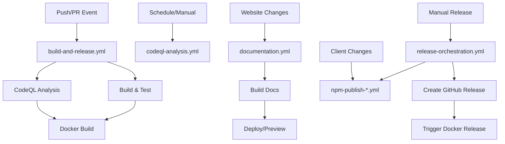

# GitHub Actions Workflows

This directory contains the CI/CD workflows for the Conduit project.

## Active Workflows

### 🔨 Build and Release (`build-and-release.yml`)
The main CI/CD workflow that handles building, testing, and releasing Docker images.

**Triggers:**
- Push to `master` or `dev` branches
- Pull requests to `master` or `dev` branches
- Release events

**Features:**
- ✅ .NET package caching for faster builds
- ✅ Matrix strategy for parallel Docker builds
- ✅ Multi-platform Docker images (amd64, arm64)
- ✅ CodeQL security scanning with quality gates
- ✅ Test result reporting with coverage
- ✅ Concurrency controls to prevent race conditions
- ✅ Comprehensive job summaries

**Jobs:**
1. **CodeQL Analysis** - Security scanning with high severity checks
2. **Build and Test** - .NET build with test reporting
3. **Docker Build** - Parallel multi-platform image builds
4. **Summary** - Final build status report

### 🔒 CodeQL Scheduled Scan (`codeql-analysis.yml`)
Weekly security scanning for vulnerabilities.

**Triggers:**
- Weekly schedule (Sundays at midnight)
- Manual workflow dispatch with branch selection

**Features:**
- ✅ Multi-language support (C#, JavaScript)
- ✅ Customizable query filters
- ✅ SARIF result archiving
- ✅ Security issue summaries by severity
- ✅ Branch selection for manual runs

### 📚 Documentation (`documentation.yml`)
Deploys Docusaurus documentation to GitHub Pages.

**Triggers:**
- Push to `master` (website changes)
- Pull requests to `master` (website changes)

**Features:**
- ✅ Artifact-based deployment (no duplicate builds)
- ✅ PR preview deployments via Netlify
- ✅ Build statistics and summaries
- ✅ Automatic PR comments with preview URLs
- ✅ GitHub Pages environment tracking

### 📦 NPM Publishing (`npm-publish-admin-client.yml`, `npm-publish-core-client.yml`)
Publishes Node.js client packages to NPM.

**Triggers:**
- Push to `dev` or `master` (client code changes)
- Manual workflow dispatch with version control

**Features:**
- ✅ Automated version management with timestamps
- ✅ NPM provenance attestation
- ✅ Dry run mode for testing
- ✅ Package quality checks
- ✅ GitHub release creation with changelogs
- ✅ Failure notifications via GitHub issues
- ✅ Concurrency controls for version bumps

### 🚀 Release Orchestration (`release-orchestration.yml`)
Unified release workflow for coordinating all components.

**Triggers:**
- Manual workflow dispatch only

**Features:**
- ✅ Coordinated multi-component releases
- ✅ Selective component releasing
- ✅ Automated version calculation
- ✅ Comprehensive release notes generation
- ✅ Dry run mode for validation
- ✅ Sequential NPM → Docker release order

## Deprecated Workflows

Deprecated workflows have been moved to `.github/workflows/deprecated/`:
- `publish-docker.yml` - Replaced by Docker publishing in `build-and-release.yml`
- `docker-release.yml` - Replaced by Docker publishing in `build-and-release.yml`
- `codeql-local.yml` - Replaced by CodeQL integration in `build-and-release.yml`

## Workflow Dependencies

## Best Practices Implemented

1. **Security First**: CodeQL scanning blocks deployments on high severity issues
2. **Caching**: Extensive caching for dependencies and Docker layers
3. **Concurrency**: Prevents race conditions in version bumps and deployments
4. **Parallelization**: Matrix strategies for faster builds
5. **Visibility**: Comprehensive job summaries and status reporting
6. **Reliability**: Failure notifications and retry mechanisms
7. **Flexibility**: Dry run modes and manual triggers for testing

## Required Secrets

- `GITHUB_TOKEN`: Automatically provided by GitHub Actions
- `NPM_TOKEN`: Required for NPM publishing
- `NETLIFY_AUTH_TOKEN`: Optional, for documentation previews
- `NETLIFY_SITE_ID`: Optional, for documentation previews

## Monitoring and Maintenance

1. **Weekly Tasks**:
   - Review CodeQL scan results
   - Check for workflow failures

2. **Monthly Tasks**:
   - Update action versions
   - Review and optimize caching strategies
   - Clean up old workflow runs

3. **Quarterly Tasks**:
   - Audit workflow permissions
   - Review deprecation notices
   - Optimize build times

## Troubleshooting

### Common Issues

1. **NPM Publish Failures**
   - Check NPM_TOKEN is valid
   - Verify package.json has all required fields
   - Ensure no version conflicts

2. **Docker Build Failures**
   - Check Docker Hub rate limits
   - Verify Dockerfile syntax
   - Ensure base images are available

3. **Concurrent Version Bumps**
   - Workflows use concurrency groups to prevent this
   - If issues persist, check git history for conflicts

### Getting Help

- Create an issue in the repository
- Check GitHub Actions documentation
- Review workflow run logs for detailed errors