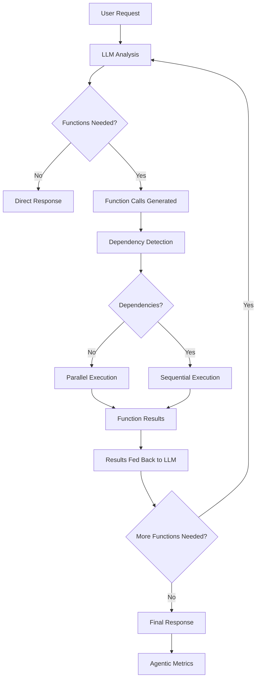

# Agents Guide

*Last Updated: 2025-11-25*

Comprehensive guide for building and deploying AI agents using ConduitLLM's agentic workflows and function calling capabilities.

## Table of Contents
- [Overview](#overview)
- [Agent Architecture](#agent-architecture)
- [Configuration](#configuration)
- [Building Agents](#building-agents)
- [Deployment & Operations](#deployment--operations)
- [Examples & Templates](#examples--templates)
- [Advanced Features](#advanced-features)
- [Troubleshooting](#troubleshooting)
- [Related Documentation](#related-documentation)

---

## Overview

### What are Agents in ConduitLLM?

In ConduitLLM, **agents** are AI systems that can autonomously execute functions and tools to accomplish complex tasks. Unlike simple chat completions, agents can:

- **Make decisions** about when to call functions
- **Execute multiple functions** in a single workflow
- **Handle dependencies** between function calls
- **Iterate** on results until a task is complete
- **Provide real-time feedback** during execution

### Agentic Mode vs Manual Function Calling

ConduitLLM supports two approaches to function calling:

#### Manual Function Calling
- Your application receives `tool_calls` from the LLM
- You decide which functions to execute and how
- You control the flow and iteration logic
- Full control but more complex implementation

#### Agentic Mode (Recommended for Agents)
- Conduit automatically executes requested functions
- Handles dependency detection and parallel/sequential execution
- Manages iteration limits and cost tracking
- Provides real-time streaming events for progress
- Simplifies agent development significantly

### Use Cases

Agents are ideal for:
- **Data analysis workflows** (query databases, process results, generate reports)
- **API integration** (call external services, transform data, take actions)
- **Content creation pipelines** (research, draft, edit, publish)
- **Customer service automation** (lookup records, take actions, respond)
- **Development assistants** (read code, run tests, suggest fixes)

---

## Agent Architecture

### Agentic Workflow Flow



### Core Components

#### 1. AgenticOrchestrationService
The brain of agent execution:
- **Function Discovery**: Maps function names to configurations
- **Dependency Analysis**: Detects when functions depend on each other
- **Execution Strategy**: Chooses parallel vs sequential execution
- **Cost Tracking**: Monitors costs across all function calls
- **Error Handling**: Manages failures and retries

#### 2. Function Configuration
Functions are configured via the Admin API:
```json
{
  "name": "get_customer_data",
  "description": "Retrieves customer information from the database",
  "parameters": {
    "type": "object",
    "properties": {
      "customer_id": {
        "type": "string",
        "description": "The customer ID to lookup"
      }
    },
    "required": ["customer_id"]
  },
  "endpoint": "https://api.example.com/customers/{customer_id}",
  "method": "GET",
  "headers": {
    "Authorization": "Bearer {API_KEY}"
  }
}
```

#### 3. Virtual Keys
Agents use virtual keys for:
- **Authentication**: Secure access to Conduit APIs
- **Cost Tracking**: All function calls billed to the virtual key
- **Rate Limiting**: Per-agent rate limits and quotas
- **Access Control**: Restrict which functions agents can call

### Execution Modes

#### Parallel Execution
- Used when functions have no dependencies
- All functions execute simultaneously
- Faster completion for independent tasks
- Example: Get user profile AND get order history

#### Sequential Execution
- Used when functions depend on each other
- Functions execute one after another
- Ensures data availability for dependent calls
- Example: Get customer ID → Get customer details → Update CRM

---

## Configuration

### Global Agentic Settings

Configure global defaults via the Admin API or database:

```sql
-- Maximum iterations per request
INSERT INTO "GlobalSettings" ("Key", "Value", "Description")
VALUES ('Agentic.MaxIterations', '5', 'Maximum agentic loop iterations (1-100)');

-- Minimum iterations (rarely used)
INSERT INTO "GlobalSettings" ("Key", "Value", "Description")
VALUES ('Agentic.MinIterations', '1', 'Minimum agentic iterations (1-100)');

-- Default agentic mode state
INSERT INTO "GlobalSettings" ("Key", "Value", "Description")
VALUES ('Agentic.DefaultEnabled', 'true', 'Enable agentic mode by default');
```

### Virtual Key Configuration

Create virtual keys specifically for agents:

```bash
# Create virtual key for agent
curl -X POST http://localhost:5002/api/virtual-keys \
  -H "Authorization: Bearer YOUR_ADMIN_KEY" \
  -H "Content-Type: application/json" \
  -d '{
    "name": "customer-service-agent",
    "budget_limit": 100.00,
    "allowed_models": ["gpt-4", "claude-3-sonnet"],
    "function_configuration_ids": [1, 2, 3],
    "max_requests_per_minute": 60
  }'
```

### Function Configuration

#### HTTP Functions
```json
{
  "name": "send_email",
  "description": "Sends an email to a recipient",
  "parameters": {
    "type": "object",
    "properties": {
      "to": {"type": "string", "description": "Recipient email"},
      "subject": {"type": "string", "description": "Email subject"},
      "body": {"type": "string", "description": "Email body"}
    },
    "required": ["to", "subject", "body"]
  },
  "endpoint": "https://api.emailservice.com/send",
  "method": "POST",
  "headers": {
    "Authorization": "Bearer {EMAIL_API_KEY}",
    "Content-Type": "application/json"
  }
}
```

#### Database Functions
```json
{
  "name": "query_database",
  "description": "Executes a SQL query on the customer database",
  "parameters": {
    "type": "object",
    "properties": {
      "query": {"type": "string", "description": "SQL query to execute"}
    },
    "required": ["query"]
  },
  "endpoint": "internal://database/query",
  "method": "POST"
}
```

### Provider Selection for Agents

Choose providers based on agent requirements:

| Provider | Best For | Function Calling | Speed | Cost |
|----------|----------|------------------|-------|------|
| OpenAI GPT-4 | Complex reasoning | Excellent | Medium | High |
| Anthropic Claude | Analysis tasks | Excellent | Medium | High |
| Groq Llama | Fast responses | Good | Very Fast | Low |
| Cerebras | Ultra-fast inference | Good | Ultra Fast | Medium |

---

## Building Agents

### Function Design Patterns

#### 1. Atomic Functions
Keep functions focused and single-purpose:
```json
{
  "name": "get_customer_by_id",
  "description": "Retrieves a single customer by their ID"
}
```

#### 2. Composite Functions
For complex operations, use multiple simple functions:
```json
{
  "name": "get_customer_profile",
  "description": "Gets complete customer profile including orders and preferences"
}
// Agent will call:
// - get_customer_by_id
// - get_customer_orders
// - get_customer_preferences
```

#### 3. Validation Functions
Include validation in your function chain:
```json
{
  "name": "validate_customer_data",
  "description": "Validates customer data before processing"
}
```

### Error Handling Patterns

#### 1. Graceful Degradation
```json
{
  "name": "get_customer_data",
  "description": "Retrieves customer data with fallback to cache"
}
// Agent logic:
// Try primary database → If fails, try cache → Return partial data
```

#### 2. Retry Logic
Configure retry policies in function definitions:
```json
{
  "retry_policy": {
    "max_attempts": 3,
    "backoff_strategy": "exponential",
    "delay_ms": 1000
  }
}
```

#### 3. Error Recovery
Provide functions that can recover from errors:
```json
{
  "name": "reset_customer_session",
  "description": "Resets customer session after errors"
}
```

### Streaming with Real-time Feedback

Enable enhanced streaming for agent progress:

```typescript
import { ConduitCoreClient } from '@knn_labs/conduit-gateway-client';

const client = new ConduitCoreClient({
  apiKey: 'condt_your_agent_key',
  baseURL: 'http://localhost:5000'
});

const stream = await client.chat.create({
  model: 'gpt-4',
  messages: [{ role: 'user', content: 'Analyze customer churn risk' }],
  stream: true,
  agentic_mode: true,
  function_configuration_ids: ['customer-analysis-functions'],
  onToolExecuting: (event) => {
    console.log(`Executing ${event.function_name}...`);
    // Update UI with progress
  },
  onToolResult: (event) => {
    console.log(`Function ${event.tool_call_id} completed`);
    // Update UI with results
  }
});

for await (const event of stream) {
  if (event.type === 'content') {
    // Display LLM reasoning
    console.log(event.choices[0]?.delta?.content);
  } else if (event.type === 'final_metrics') {
    // Show final agent metrics
    console.log(`Total cost: $${event.total_cost}`);
    console.log(`Functions called: ${event.total_function_calls}`);
  }
}
```

### Best Practices

#### Function Naming
- Use descriptive, action-oriented names
- Be consistent with naming conventions
- Include the data source in the name: `get_user_from_db`, `query_crm_api`

#### Parameter Design
- Use clear parameter names and descriptions
- Provide reasonable defaults where possible
- Validate parameters at the function level
- Use JSON Schema for type safety

#### Response Format
- Return structured, consistent data
- Include metadata (timestamps, sources, confidence)
- Handle errors gracefully with informative messages
- Consider response size for performance

#### Security
- Never expose sensitive data in function descriptions
- Use parameter validation to prevent injection attacks
- Implement proper authentication for external APIs
- Log function calls for audit trails

---

## Deployment & Operations

### Scaling Considerations

#### Horizontal Scaling
- Deploy multiple Conduit instances behind a load balancer
- Use Redis for distributed caching and session management
- Configure RabbitMQ for reliable message queuing
- Monitor queue depths and processing times

#### Function Execution Scaling
```yaml
# docker-compose.yml for high-throughput agents
services:
  conduit-http:
    image: ghcr.io/knnlabs/conduit-http:latest
    environment:
      CONDUIT_FUNCTION_EXECUTION_CONCURRENCY: 50
      CONDUIT_FUNCTION_TIMEOUT_SECONDS: 30
      CONDUIT_ENABLE_PARALLEL_EXECUTION: "true"
    deploy:
      replicas: 3
```

#### Database Scaling
- Use connection pooling for function database access
- Consider read replicas for data-intensive functions
- Monitor database query performance
- Optimize function queries with proper indexing

### Monitoring Agent Performance

#### Key Metrics
- **Function Call Latency**: Average time per function execution
- **Agentic Iteration Count**: How many loops per request
- **Cost per Request**: Track agent costs over time
- **Error Rates**: Function failure and retry rates
- **Concurrent Agents**: Number of simultaneous agent workflows

#### Monitoring Setup
```yaml
# Prometheus configuration for agent metrics
scrape_configs:
  - job_name: 'conduit-agents'
    static_configs:
      - targets: ['conduit-http:8080']
    metrics_path: '/metrics'
    scrape_interval: 15s
```

#### Grafana Dashboard
Create dashboards to visualize:
- Agent request volume and success rates
- Function execution performance
- Cost tracking by virtual key
- Error analysis and alerting

### Cost Management

#### Budget Controls
```bash
# Set budget limits per agent
curl -X PUT http://localhost:5002/api/virtual-keys/{key_id}/budget \
  -H "Authorization: Bearer YOUR_ADMIN_KEY" \
  -H "Content-Type: application/json" \
  -d '{
    "daily_limit": 50.00,
    "monthly_limit": 1000.00,
    "alert_threshold": 0.80
  }'
```

#### Cost Optimization Strategies
1. **Model Selection**: Use faster, cheaper models for simple tasks
2. **Function Caching**: Cache expensive function results
3. **Batch Operations**: Combine multiple operations in single functions
4. **Early Termination**: Set reasonable iteration limits
5. **Provider Failover**: Switch to cheaper providers when possible

### Security Considerations

#### Function Security
- Validate all function inputs
- Sanitize outputs before returning to LLM
- Use principle of least privilege for API access
- Implement rate limiting per function

#### Agent Isolation
- Use separate virtual keys for different agent types
- Network segmentation for external function calls
- Audit logging for all function executions
- Regular security reviews of function configurations

#### Data Protection
- Encrypt sensitive data in function parameters
- Use secure connections for external APIs
- Implement data retention policies
- Consider privacy implications of agent data access

---

## Examples & Templates

### Simple Customer Service Agent

#### Configuration
```json
{
  "name": "customer-service-agent",
  "functions": [
    "get_customer_by_id",
    "get_customer_orders",
    "update_customer_address",
    "create_support_ticket"
  ],
  "model": "gpt-4",
  "max_iterations": 3,
  "budget_limit": 10.00
}
```

#### Implementation
```typescript
const customerServiceAgent = {
  async handleRequest(customerQuery: string) {
    const response = await conduitClient.chat.create({
      model: 'gpt-4',
      messages: [
        {
          role: 'system',
          content: `You are a helpful customer service agent. 
          Use the available functions to assist customers.
          Always verify customer information before making changes.`
        },
        {
          role: 'user',
          content: customerQuery
        }
      ],
      agentic_mode: true,
      function_configuration_ids: ['customer-service-functions'],
      stream: true,
      max_iterations: 3
    });

    return response;
  }
};
```

### Data Analysis Agent

#### Function Definitions
```json
{
  "functions": [
    {
      "name": "query_database",
      "description": "Execute SQL queries on the analytics database"
    },
    {
      "name": "generate_chart",
      "description": "Create charts from data"
    },
    {
      "name": "export_to_csv",
      "description": "Export data to CSV format"
    },
    {
      "name": "send_report",
      "description": "Email analysis report to stakeholders"
    }
  ]
}
```

#### Usage Example
```python
# Python example using OpenAI SDK with Conduit
from openai import OpenAI

client = OpenAI(
    api_key="condt_data_analysis_key",
    base_url="https://conduit.yourcompany.com/v1"
)

def analyze_sales_data(request: str):
    response = client.chat.completions.create(
        model="gpt-4",
        messages=[
            {"role": "system", "content": "You are a data analyst. Use functions to query data, create visualizations, and generate reports."},
            {"role": "user", "content": request}
        ],
        tools=function_definitions,
        agentic_mode=True,
        max_iterations=5,
        stream=True
    )
    
    return response
```

### Multi-Provider Agent Strategy

#### Provider Configuration
```json
{
  "agent_strategy": {
    "simple_queries": {
      "provider": "groq",
      "model": "llama-3.1-8b-instant",
      "max_cost": 0.01
    },
    "complex_analysis": {
      "provider": "openai", 
      "model": "gpt-4",
      "max_cost": 0.50
    },
    "code_generation": {
      "provider": "anthropic",
      "model": "claude-3-sonnet",
      "max_cost": 0.30
    }
  }
}
```

#### Implementation
```typescript
class SmartAgent {
  async processRequest(request: string, complexity: 'simple' | 'complex' | 'code') {
    const config = this.agent_strategy[complexity];
    
    return await conduitClient.chat.create({
      model: config.model,
      provider: config.provider,
      messages: [{ role: 'user', content: request }],
      agentic_mode: true,
      cost_limit: config.max_cost
    });
  }
}
```

### Agent Template Library

#### Research Agent
```typescript
const researchAgentTemplate = {
  system_prompt: "You are a research assistant. Find, analyze, and synthesize information from multiple sources.",
  functions: ["search_web", "fetch_document", "extract_text", "summarize_content", "cite_sources"],
  max_iterations: 5,
  requirements: ["web_access", "document_processing"]
};
```

#### E-commerce Agent
```typescript
const ecommerceAgentTemplate = {
  system_prompt: "You are an e-commerce assistant. Help customers with shopping, orders, and support.",
  functions: ["search_products", "get_product_details", "check_inventory", "process_order", "track_shipment"],
  max_iterations: 4,
  requirements: ["product_catalog", "order_management", "inventory_system"]
};
```

---

## Advanced Features

### Custom Orchestration

#### Override Default Behavior
```typescript
const customAgent = await conduitClient.chat.create({
  model: 'gpt-4',
  messages: [{ role: 'user', content: 'Complex task' }],
  agentic_mode: true,
  orchestration_config: {
    execution_strategy: 'sequential', // Force sequential
    dependency_detection: false,      // Disable auto-detection
    custom_timeout: 60,               // 60 second timeout
    retry_policy: {
      max_retries: 2,
      backoff: 'linear'
    }
  }
});
```

#### Custom Function Execution
```csharp
// Implement custom function execution logic
public class CustomOrchestrationService : IAgenticOrchestrationService
{
    public async Task<AgenticExecutionResult> ExecuteToolCallsAsync(
        List<ToolCall> toolCalls,
        int virtualKeyId,
        // ... parameters
    )
    {
        // Custom execution logic
        // - Add caching
        // - Implement custom retry logic
        // - Add monitoring hooks
        // - Custom error handling
    }
}
```

### Agent Memory Management

#### Context Persistence
```typescript
const memoryAgent = {
  async conversationWithMemory(userId: string, message: string) {
    // Load conversation history
    const history = await this.loadConversationHistory(userId);
    
    const response = await conduitClient.chat.create({
      model: 'gpt-4',
      messages: [
        ...history,
        { role: 'user', content: message }
      ],
      agentic_mode: true,
      memory_config: {
        store_context: true,
        max_context_length: 10000,
        summarization_threshold: 8000
      }
    });
    
    // Save updated conversation
    await this.saveConversationHistory(userId, response);
    
    return response;
  }
};
```

#### State Management
```json
{
  "agent_state": {
    "conversation_id": "uuid",
    "user_preferences": {},
    "previous_actions": [],
    "context_summary": "Brief summary of long conversation",
    "next_steps": ["pending_action_1", "pending_action_2"]
  }
}
```

### Performance Optimization

#### Function Caching
```json
{
  "cache_config": {
    "enabled": true,
    "ttl_seconds": 300,
    "cache_key_strategy": "parameters_hash",
    "max_cache_size": "100MB"
  }
}
```

#### Batch Processing
```typescript
const batchAgent = {
  async processBatch(requests: string[]) {
    const results = await Promise.all(
      requests.map(request => 
        conduitClient.chat.create({
          model: 'gpt-4',
          messages: [{ role: 'user', content: request }],
          agentic_mode: true,
          batch_mode: true
        })
      )
    );
    
    return results;
  }
};
```

#### Connection Pooling
```yaml
# Optimize for high-throughput agent scenarios
environment:
  CONDUIT_HTTP_CLIENT_POOL_SIZE: 100
  CONDUIT_FUNCTION_EXECUTION_POOL_SIZE: 50
  CONDUIT_ENABLE_KEEP_ALIVE: "true"
  CONDUIT_CONNECTION_TIMEOUT_SECONDS: 30
```

---

## Troubleshooting

### Common Issues

#### Agent Gets Stuck in Loops
**Symptoms**: Agent exceeds iteration limits, repetitive function calls

**Solutions**:
1. Check function descriptions for clarity
2. Add validation functions to prevent redundant calls
3. Reduce `max_iterations` setting
4. Review LLM responses for confusion

```typescript
// Add iteration monitoring
const response = await conduitClient.chat.create({
  agentic_mode: true,
  max_iterations: 3,
  onIteration: (iteration, context) => {
    if (iteration > 2) {
      console.warn('Agent approaching iteration limit');
      // Optionally intervene or modify behavior
    }
  }
});
```

#### Function Execution Timeouts
**Symptoms**: Functions fail with timeout errors, incomplete agent workflows

**Solutions**:
1. Increase function timeout settings
2. Optimize slow function implementations
3. Add progress callbacks for long-running functions
4. Implement function-specific retry policies

```json
{
  "function_config": {
    "timeout_seconds": 60,
    "retry_policy": {
      "max_attempts": 3,
      "backoff_strategy": "exponential"
    }
  }
}
```

#### High Costs
**Symptoms**: Unexpectedly high API costs, rapid budget depletion

**Solutions**:
1. Monitor function call patterns
2. Implement cost limits per request
3. Use cheaper models for simple tasks
4. Add function result caching

```typescript
const costControlledAgent = await conduitClient.chat.create({
  agentic_mode: true,
  cost_limit: 0.50, // Maximum cost per request
  onCostUpdate: (currentCost) => {
    if (currentCost > 0.40) {
      console.warn('Approaching cost limit');
    }
  }
});
```

#### Function Dependency Issues
**Symptoms**: Functions fail due to missing data, incorrect execution order

**Solutions**:
1. Review function parameter requirements
2. Ensure data flow between functions
3. Use explicit function sequencing when needed
4. Add data validation functions

```typescript
// Force sequential execution for dependent functions
const response = await conduitClient.chat.create({
  agentic_mode: true,
  execution_strategy: 'sequential', // Override parallel execution
  functions: ['get_user_id', 'get_user_data', 'process_user_data']
});
```

### Debugging Tools

#### Enable Detailed Logging
```yaml
# Development environment
environment:
  CONDUIT_LOG_LEVEL: Debug
  CONDUIT_ENABLE_FUNCTION_LOGGING: "true"
  CONDUIT_ENABLE_AGENT_TRACING: "true"
```

#### Agent Execution Traces
```typescript
const response = await conduitClient.chat.create({
  agentic_mode: true,
  enable_tracing: true,
  trace_config: {
    include_function_inputs: true,
    include_function_outputs: true,
    include_llm_reasoning: true
  }
});

// Access execution trace
console.log(response.execution_trace);
```

#### Function Testing
```bash
# Test individual functions
curl -X POST http://localhost:5002/api/functions/test \
  -H "Authorization: Bearer YOUR_ADMIN_KEY" \
  -H "Content-Type: application/json" \
  -d '{
    "function_id": 123,
    "test_parameters": {
      "customer_id": "test-123"
    }
  }'
```

### Performance Tuning

#### Monitor Key Metrics
```bash
# Check agent performance
curl http://localhost:5000/metrics | grep agent_

# Key metrics to watch:
# - agent_requests_total
# - agent_iterations_total  
# - agent_function_calls_total
# - agent_cost_total
# - agent_duration_seconds
```

#### Optimization Checklist
- [ ] Function responses are optimized for size
- [ ] Parallel execution used where possible
- [ ] Appropriate models selected for tasks
- [ ] Caching enabled for expensive operations
- [ ] Connection pooling configured
- [ ] Database queries optimized
- [ ] Error handling doesn't cause excessive retries

---

## Related Documentation

- [Function Calling Guide](docs/api-guides/features/function-calling.md) - Technical details for function calling
- [Streaming with Tools](docs/api-guides/streaming-with-tools.md) - Real-time agent progress tracking
- [Gateway API Reference](docs/api-reference/core-api-reference.md) - Complete API documentation
- [Virtual Keys](docs/Virtual-Keys.md) - Authentication and cost tracking
- [Provider Integration](docs/Provider-Integration.md) - Multi-provider configuration
- [Architecture Overview](docs/architecture/README.md) - System design and patterns
- [Operations Documentation](docs/operations/README.md) - Deployment and monitoring

---

*This guide is a living document. For the latest updates and examples, check the ConduitLLM documentation and GitHub repository.*
