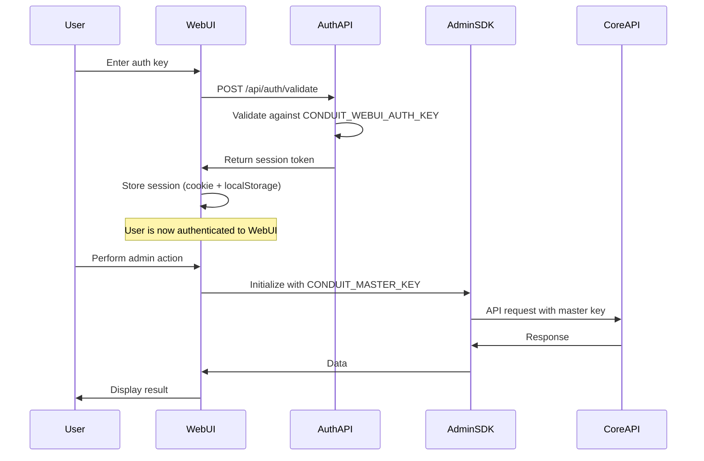

# WebUI Authentication Pattern

## Overview

Conduit uses a two-tier authentication model that separates WebUI user authentication from API authentication. This guide explains the authentication pattern and how to implement it in custom WebUI applications.

## Two-Tier Authentication Model

### 1. WebUI Authentication (User Login)
- **Key**: `CONDUIT_WEBUI_AUTH_KEY`
- **Purpose**: Authenticates administrators to access the WebUI dashboard
- **Scope**: WebUI access only
- **Storage**: Session cookies and localStorage

### 2. API Authentication (SDK Operations)
- **Key**: `CONDUIT_MASTER_KEY`
- **Purpose**: Authenticates API requests to the Core API
- **Scope**: All LLM operations (chat, completions, embeddings)
- **Usage**: Used by the Admin SDK for all API calls

## Authentication Flow



## Implementation Guide

### 1. Environment Configuration

```bash
# WebUI authentication key (for admin login)
CONDUIT_WEBUI_AUTH_KEY=your-secure-webui-key

# Master key for API operations (used by SDK)
CONDUIT_MASTER_KEY=your-master-api-key

# Admin API URL
CONDUIT_ADMIN_API_URL=http://localhost:3001/api
```

### 2. WebUI Authentication Endpoint

```typescript
// /api/auth/validate/route.ts
import { webUIAuthHelpers } from '@conduit/admin/utils/webui-auth';

export async function POST(request: Request) {
  const { authKey } = await request.json();
  const configuredKey = process.env.CONDUIT_WEBUI_AUTH_KEY;

  if (!configuredKey) {
    return Response.json({ error: 'Server not configured' }, { status: 500 });
  }

  // Validate the provided key
  const isValid = webUIAuthHelpers.validateAuthKey(authKey, configuredKey);

  if (!isValid) {
    return Response.json({ error: 'Invalid authentication key' }, { status: 401 });
  }

  // Create a session
  const session = webUIAuthHelpers.createSession({
    role: 'admin',
  });

  // Return session data
  return Response.json({
    success: true,
    session,
  });
}
```

### 3. Session Management

```typescript
// Store session after successful authentication
const storeSession = (session: SessionData) => {
  // Store in httpOnly cookie
  document.cookie = `conduit-session=${JSON.stringify(session)}; ${
    webUIAuthHelpers.getCookieOptions().path
  }`;
  
  // Also store in localStorage for client-side access
  localStorage.setItem('conduit-session', JSON.stringify(session));
};

// Check session validity
const checkSession = (): boolean => {
  const sessionStr = localStorage.getItem('conduit-session');
  if (!sessionStr) return false;

  const session = webUIAuthHelpers.parseSessionCookie(sessionStr);
  if (!session) return false;

  return !webUIAuthHelpers.isSessionExpired(session);
};
```

### 4. SDK Initialization

```typescript
// Initialize Admin SDK with master key (after WebUI auth)
import { ConduitAdminClient } from '@conduit/admin';

const adminClient = new ConduitAdminClient({
  masterKey: process.env.CONDUIT_MASTER_KEY!,
  adminApiUrl: process.env.CONDUIT_ADMIN_API_URL!,
});

// Now use the SDK for all API operations
const virtualKeys = await adminClient.virtualKeys.list();
```

## Security Best Practices

### 1. Key Management
- **Never use the same value** for `CONDUIT_WEBUI_AUTH_KEY` and `CONDUIT_MASTER_KEY`
- Use strong, randomly generated keys (minimum 32 characters)
- Rotate keys periodically
- Store keys in environment variables, never in code

### 2. Session Security
- Use httpOnly cookies for session storage
- Implement CSRF protection
- Set appropriate session expiration (24 hours recommended)
- Clear sessions on logout

### 3. HTTPS Requirements
- Always use HTTPS in production
- Set secure cookie flags
- Implement proper CORS policies

### 4. Rate Limiting
- Implement rate limiting on authentication endpoints
- Track failed authentication attempts
- Temporarily block IPs after multiple failures

## Helper Utilities

The Admin SDK provides optional helper utilities for WebUI authentication:

```typescript
import { WebUIAuthHelpers } from '@conduit/admin/utils/webui-auth';

// Create an instance with custom configuration
const authHelpers = new WebUIAuthHelpers({
  sessionDurationMs: 12 * 60 * 60 * 1000, // 12 hours
  hashAlgorithm: 'sha256',
  tokenLength: 32,
});

// Available methods:
authHelpers.validateAuthKey(providedKey, configuredKey);
authHelpers.generateSessionToken();
authHelpers.createSession(user, metadata);
authHelpers.parseSessionCookie(cookieValue);
authHelpers.isSessionExpired(session);
authHelpers.extendSession(session);
authHelpers.getCookieOptions(secure);
authHelpers.hashSessionToken(token);
```

## Common Patterns

### 1. Authentication Hook (React)

```typescript
const useAuth = () => {
  const [isAuthenticated, setIsAuthenticated] = useState(false);
  const [isLoading, setIsLoading] = useState(true);

  useEffect(() => {
    const session = localStorage.getItem('conduit-session');
    if (session) {
      const parsed = webUIAuthHelpers.parseSessionCookie(session);
      if (parsed && !webUIAuthHelpers.isSessionExpired(parsed)) {
        setIsAuthenticated(true);
      }
    }
    setIsLoading(false);
  }, []);

  const login = async (authKey: string) => {
    const response = await fetch('/api/auth/validate', {
      method: 'POST',
      headers: { 'Content-Type': 'application/json' },
      body: JSON.stringify({ authKey }),
    });

    if (response.ok) {
      const { session } = await response.json();
      storeSession(session);
      setIsAuthenticated(true);
      return true;
    }
    return false;
  };

  const logout = () => {
    localStorage.removeItem('conduit-session');
    document.cookie = 'conduit-session=; expires=Thu, 01 Jan 1970 00:00:00 UTC; path=/;';
    setIsAuthenticated(false);
  };

  return { isAuthenticated, isLoading, login, logout };
};
```

### 2. Protected Route Component

```typescript
const ProtectedRoute: React.FC<{ children: React.ReactNode }> = ({ children }) => {
  const { isAuthenticated, isLoading } = useAuth();
  const router = useRouter();

  useEffect(() => {
    if (!isLoading && !isAuthenticated) {
      router.push('/login');
    }
  }, [isAuthenticated, isLoading, router]);

  if (isLoading) return <LoadingSpinner />;
  if (!isAuthenticated) return null;

  return <>{children}</>;
};
```

### 3. API Middleware

```typescript
const requireAuth = (handler: NextApiHandler): NextApiHandler => {
  return async (req, res) => {
    const session = req.cookies['conduit-session'];
    
    if (!session) {
      return res.status(401).json({ error: 'Not authenticated' });
    }

    const parsed = webUIAuthHelpers.parseSessionCookie(session);
    if (!parsed || webUIAuthHelpers.isSessionExpired(parsed)) {
      return res.status(401).json({ error: 'Session expired' });
    }

    // Attach session to request for handler use
    (req as any).session = parsed;
    
    return handler(req, res);
  };
};
```

## Troubleshooting

### Common Issues

1. **"Invalid authentication key" error**
   - Verify `CONDUIT_WEBUI_AUTH_KEY` is set correctly
   - Check for whitespace or special characters in the key
   - Ensure you're not using the `CONDUIT_MASTER_KEY` for WebUI login

2. **Session expires immediately**
   - Check system time synchronization
   - Verify cookie settings (secure flag on HTTP)
   - Check session duration configuration

3. **SDK calls fail after WebUI auth**
   - Ensure `CONDUIT_MASTER_KEY` is configured
   - Verify the Admin API URL is correct
   - Check network connectivity to the API

### Debug Checklist

- [ ] Both authentication keys are configured
- [ ] Keys are different values
- [ ] HTTPS is used in production
- [ ] Cookies are being set correctly
- [ ] Session storage is working
- [ ] Admin SDK is initialized with master key
- [ ] API endpoints are accessible

## Summary

The two-tier authentication model provides:
- **Security**: Separate keys for different access levels
- **Flexibility**: WebUI auth can be customized without affecting API security
- **Clarity**: Clear separation between user authentication and API authentication

Remember: The WebUI auth key (`CONDUIT_WEBUI_AUTH_KEY`) gates access to the admin interface, while the master key (`CONDUIT_MASTER_KEY`) is used for all API operations through the SDK.