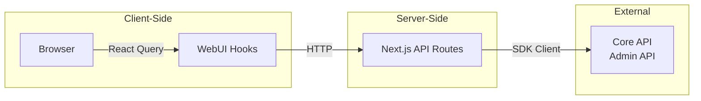
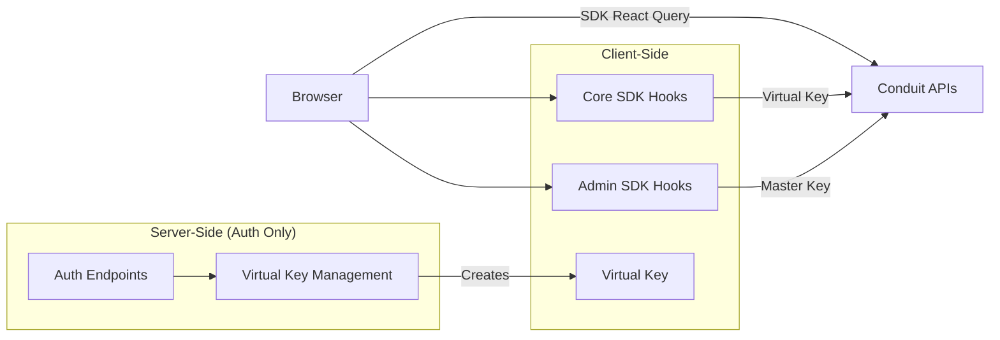
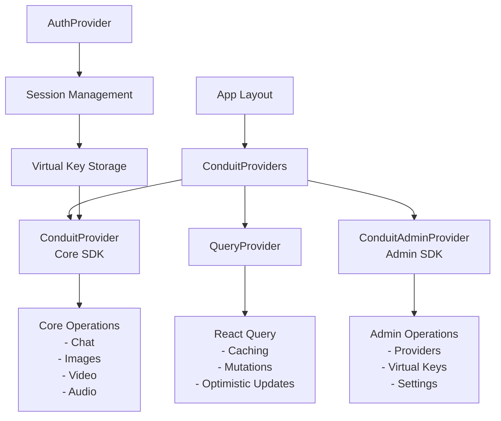
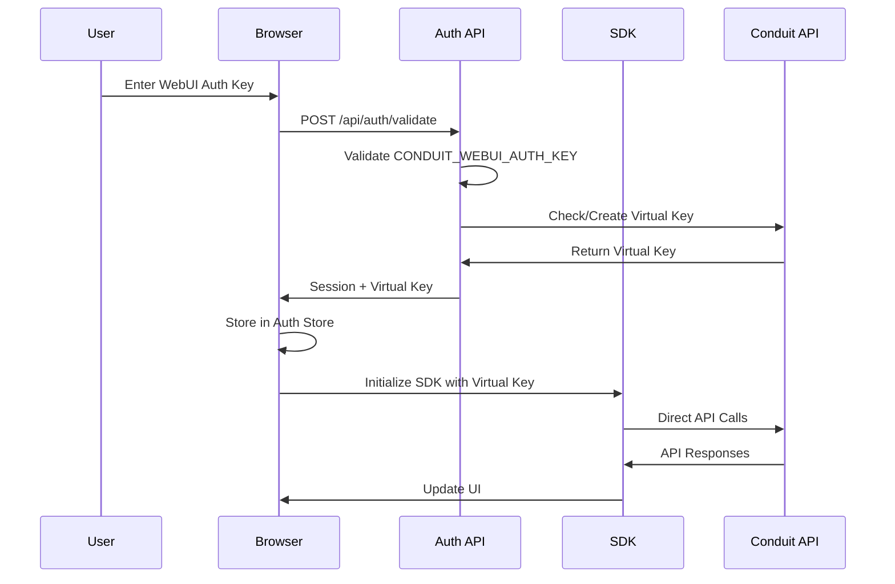
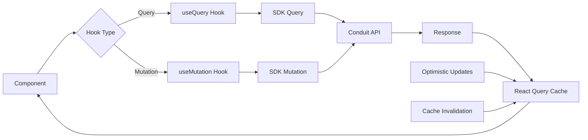
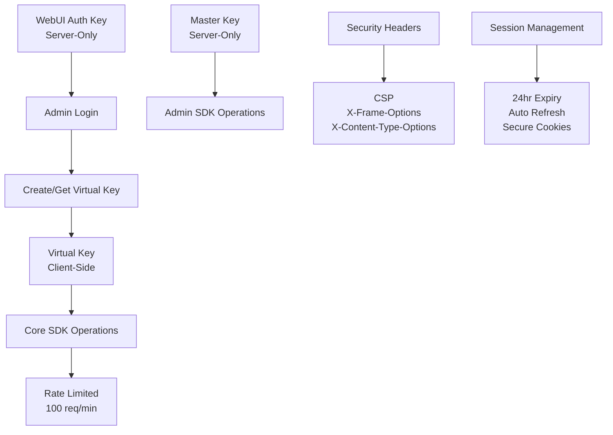
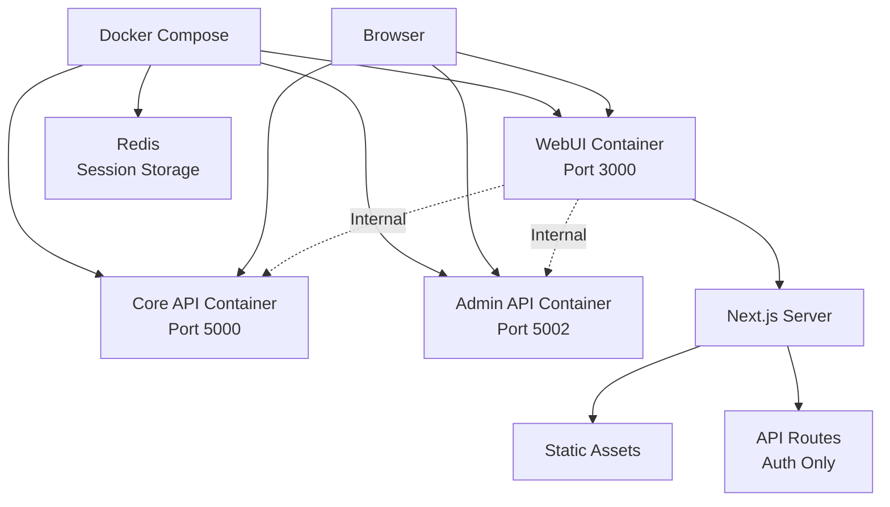

# Conduit WebUI Architecture

## Overview

The Conduit WebUI has been migrated from a proxy-based architecture to direct SDK usage, significantly simplifying the codebase and improving performance.

## Architecture Evolution

### Previous Architecture (Proxy-Based)

### Current Architecture (Direct SDK)

## Component Architecture

## Authentication Flow

## Data Flow

## Key Components

### 1. SDK Providers
Located in `/lib/providers/ConduitProviders.tsx`
- Wraps the application with SDK contexts
- Provides virtual key to Core SDK
- Provides master key to Admin SDK (server-side)

### 2. Authentication
- `/stores/useAuthStore.ts` - Manages auth state and virtual key
- `/lib/auth/` - Authentication utilities and validation
- `/app/api/auth/` - Minimal auth endpoints

### 3. SDK Hooks
- Core SDK: Chat, Images, Video, Audio operations
- Admin SDK: Providers, Virtual Keys, Model Mappings

### 4. Real-time Updates
- SignalR integration for live updates
- Navigation state, generation progress
- Virtual key spend tracking

## Security Architecture

## Deployment Architecture

## Benefits of New Architecture

1. **Performance**
   - Eliminated proxy layer reduces latency
   - Direct API calls from browser
   - Better caching with React Query

2. **Simplicity**
   - 80% reduction in API route code
   - Direct SDK usage as designed
   - Less code to maintain

3. **Developer Experience**
   - Better TypeScript support
   - Easier debugging
   - Standard React Query patterns

4. **Security**
   - Virtual keys scoped for WebUI
   - Rate limiting per key
   - Automatic key management