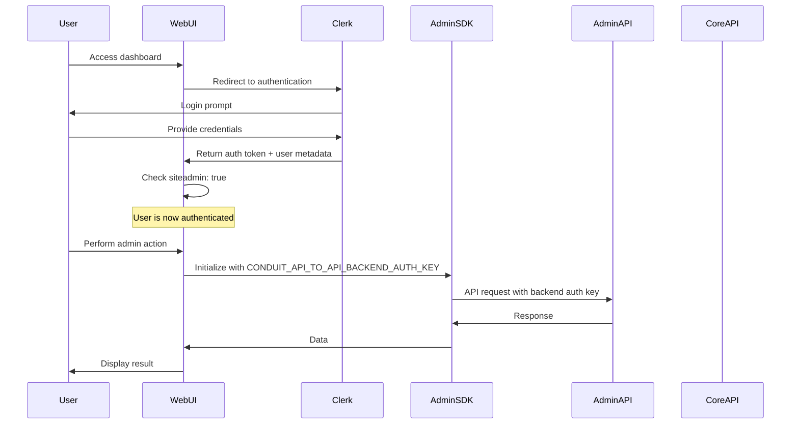

# WebUI Authentication with Clerk

## Overview

The Conduit WebUI uses Clerk for user authentication. Human administrators authenticate through Clerk to access the WebUI dashboard. Server-to-server communication between the WebUI backend and other services (Core API, Admin API) uses the `CONDUIT_API_TO_API_BACKEND_AUTH_KEY`.

## Authentication Model

### 1. Human Administrator Authentication (Clerk)
- **Provider**: Clerk (https://clerk.com)
- **Purpose**: Authenticates administrators to access the WebUI dashboard
- **Scope**: WebUI access only
- **Requirements**: Users must have `siteadmin: true` in their Clerk public metadata

### 2. Backend Service Authentication
- **Key**: `CONDUIT_API_TO_API_BACKEND_AUTH_KEY`
- **Purpose**: Authenticates server-to-server requests between WebUI backend and APIs
- **Scope**: Backend service communication only
- **Usage**: Configured on the WebUI service for API calls

## Authentication Flow



## Implementation Guide

### 1. Environment Configuration

```bash
# Clerk authentication (required)
NEXT_PUBLIC_CLERK_PUBLISHABLE_KEY=pk_test_your-clerk-key
CLERK_SECRET_KEY=sk_test_your-clerk-secret

# Backend service authentication
CONDUIT_API_TO_API_BACKEND_AUTH_KEY=your-backend-auth-key

# API endpoints
CONDUIT_API_BASE_URL=http://api:8080
CONDUIT_ADMIN_API_BASE_URL=http://admin:8080

# Optional: Redirect URL for users without admin access
ACCESS_DENIED_REDIRECT=https://your-main-site.com
```

### 2. Clerk Configuration

1. **Create a Clerk Application**:
   - Sign up at https://clerk.com
   - Create a new application
   - Configure authentication methods (email, OAuth, etc.)

2. **Set User Metadata**:
   Users must have `siteadmin: true` in their public metadata to access the WebUI:
   
   ```javascript
   // Using Clerk Dashboard or API
   await clerkClient.users.updateUser(userId, {
     publicMetadata: {
       siteadmin: true
     }
   });
   ```

3. **Configure Middleware**:
   ```typescript
   // middleware.ts
   import { authMiddleware } from "@clerk/nextjs";

   export default authMiddleware({
     publicRoutes: ["/api/health"],
   });

   export const config = {
     matcher: ["/((?!.+\\.[\\w]+$|_next).*)", "/", "/(api|trpc)(.*)"],
   };
   ```

### 3. Access Control

```typescript
// Check admin access in server components
import { currentUser } from "@clerk/nextjs";

export async function checkAdminAccess() {
  const user = await currentUser();
  
  if (!user) {
    return { hasAccess: false, reason: 'Not authenticated' };
  }

  const isAdmin = user.publicMetadata?.siteadmin === true;
  
  if (!isAdmin) {
    return { hasAccess: false, reason: 'Not an administrator' };
  }

  return { hasAccess: true };
}
```

### 4. Backend API Integration

```typescript
// Initialize Admin SDK with backend auth key
import { ConduitAdminClient } from '@conduit/admin';

const adminClient = new ConduitAdminClient({
  masterKey: process.env.CONDUIT_API_TO_API_BACKEND_AUTH_KEY!,
  adminApiUrl: process.env.CONDUIT_ADMIN_API_BASE_URL!,
});

// Use in API routes
export async function GET(request: Request) {
  // Clerk handles user authentication
  const { userId } = auth();
  if (!userId) {
    return new Response('Unauthorized', { status: 401 });
  }

  // Backend uses service auth key
  const virtualKeys = await adminClient.virtualKeys.list();
  return Response.json(virtualKeys);
}
```

## Security Best Practices

### 1. Clerk Configuration
- Enable appropriate authentication methods
- Configure session lifetime appropriately
- Use webhook endpoints to sync user changes
- Enable Clerk's security features (bot protection, etc.)

### 2. Backend Authentication
- Store `CONDUIT_API_TO_API_BACKEND_AUTH_KEY` securely
- Rotate the backend auth key periodically
- Never expose the backend auth key to the frontend
- Use environment variables, never hardcode keys

### 3. Access Control
- Always verify `siteadmin: true` in public metadata
- Implement proper RBAC if needed
- Log admin actions for audit trails
- Monitor for suspicious access patterns

## Common Patterns

### 1. Protected Page Component

```typescript
import { currentUser } from "@clerk/nextjs";
import { redirect } from "next/navigation";

export default async function AdminPage() {
  const user = await currentUser();
  
  if (!user || user.publicMetadata?.siteadmin !== true) {
    redirect(process.env.ACCESS_DENIED_REDIRECT || '/access-denied');
  }

  return <AdminDashboard />;
}
```

### 2. Client-Side Access Check

```typescript
import { useUser } from "@clerk/nextjs";

export function useAdminAccess() {
  const { user, isLoaded } = useUser();
  
  const isAdmin = user?.publicMetadata?.siteadmin === true;
  
  return {
    isAdmin,
    isLoading: !isLoaded,
    user
  };
}
```

### 3. API Route Protection

```typescript
import { auth } from "@clerk/nextjs";
import { NextResponse } from "next/server";

export async function requireAdmin() {
  const { userId, sessionClaims } = auth();
  
  if (!userId) {
    return NextResponse.json(
      { error: "Unauthorized" },
      { status: 401 }
    );
  }

  const user = await clerkClient.users.getUser(userId);
  if (user.publicMetadata?.siteadmin !== true) {
    return NextResponse.json(
      { error: "Forbidden - Admin access required" },
      { status: 403 }
    );
  }

  return null; // Access granted
}
```

## Troubleshooting

### Common Issues

1. **"Unauthorized" errors**
   - Verify Clerk keys are configured correctly
   - Check that the user is signed in
   - Ensure cookies are enabled

2. **"Access Denied" for admin users**
   - Verify `siteadmin: true` is set in public metadata
   - Check metadata is synchronized
   - Clear browser cache and re-authenticate

3. **Backend API calls failing**
   - Ensure `CONDUIT_API_TO_API_BACKEND_AUTH_KEY` is set
   - Verify API URLs are correct
   - Check network connectivity between services

### Debug Checklist

- [ ] Clerk publishable and secret keys are configured
- [ ] User has `siteadmin: true` in public metadata
- [ ] Backend auth key is configured for API calls
- [ ] Middleware is properly configured
- [ ] API routes check for admin access
- [ ] Environment variables are loaded correctly

## Migration from Password-Based Auth

If migrating from the old `CONDUIT_ADMIN_LOGIN_PASSWORD` system:

1. Set up Clerk authentication
2. Add `siteadmin: true` to existing admin users
3. Remove all password-based authentication code
4. Update environment variables
5. Test thoroughly before removing old system

## Summary

The Conduit WebUI uses:
- **Clerk** for human administrator authentication
- **Public metadata** (`siteadmin: true`) for access control  
- **Backend auth key** for server-to-server API communication

This provides a secure, scalable authentication system with proper separation between user authentication and service authentication.