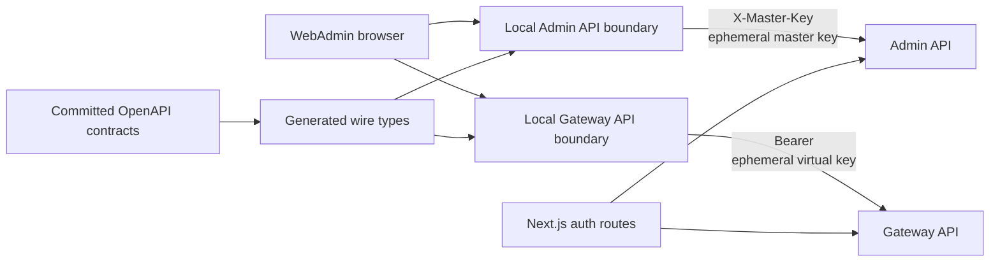

# Conduit WebAdmin Architecture

## Overview

WebAdmin owns focused TypeScript boundaries for the ConduitLLM Admin and Gateway APIs. Application
code does not import the published Node SDK packages or source files from `SDKs/Node`.

## API boundaries

- `src/lib/admin-api` contains the local Admin client and service models.
- `src/lib/gateway-api` contains the focused Gateway client used by chat, discovery, functions,
  image generation, video generation, and media uploads.
- `src/lib/conduit-common` contains the shared HTTP, validation, formatting, and error primitives
  required by those local clients.
- `src/generated/admin-api.ts` and `src/generated/gateway-api.ts` are generated from the committed
  OpenAPI JSON contracts. They describe wire shapes; UI-facing models may adapt those shapes.

The public Common and Gateway SDK packages remain available for external consumers. They are not a
WebAdmin runtime or build dependency. The former public Admin SDK is retired; existing registry
versions remain available but no new versions are published.

## Authentication flow

Admin operations request a fresh, single-use ephemeral master key through
`/api/auth/ephemeral-master-key`. The local Admin client sends it in `X-Master-Key` and disables
retries because a retried request would need a new key.

Gateway operations request a short-lived ephemeral virtual key through `/api/auth/ephemeral-key`.
The server obtains the WebAdmin virtual key from the Admin API and asks the Gateway to mint the
ephemeral key. Browser Gateway requests send that opaque key as `Authorization: Bearer ...`.

## Streaming and long-running work

Chat completions use the local SSE parser. Video generation starts an asynchronous Gateway task,
uses SignalR for progress when available, and polls as a fallback. Media uploads use the browser's
upload progress events.

## Contract workflow

Run `npm run generate:offline` from `SDKs/Node/scripts` to export both service contracts and
regenerate the Admin/Gateway WebAdmin wire types plus the retained Gateway SDK wire type. CI repeats
generation, validates both contracts, and fails on drift.

The boundary invariant is available as `npm run check:admin-boundary` from `WebAdmin`.

## Docker development

The WebAdmin image installs only `WebAdmin/package.json` and its lockfile. Compose Watch syncs the
WebAdmin tree and rebuilds only for WebAdmin manifest, lockfile, or Dockerfile changes; SDK workspace
changes no longer trigger a WebAdmin rebuild.
