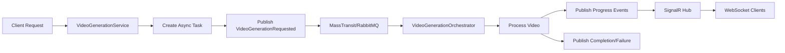

# Event-Driven Video Generation Architecture

## Overview

Conduit implements a comprehensive event-driven architecture for video generation, leveraging MassTransit with RabbitMQ for distributed processing. This architecture ensures scalability, reliability, and real-time progress tracking across multiple service instances.

## Architecture Components

### 1. Domain Events

The system uses the following domain events for video generation:

- **VideoGenerationRequested**: Published when a video generation request is submitted
- **VideoGenerationStarted**: Published when processing begins
- **VideoGenerationProgress**: Published for progress updates
- **VideoGenerationCompleted**: Published when generation succeeds
- **VideoGenerationFailed**: Published when generation fails
- **VideoGenerationCancelled**: Published when a task is cancelled

### 2. Event Flow



### 3. Partitioned Processing

Events are partitioned by VirtualKeyId to ensure:
- **Ordered Processing**: Events for the same virtual key are processed in order
- **Race Condition Prevention**: No concurrent processing of tasks for the same key
- **Fair Resource Distribution**: Different virtual keys can process in parallel

## Configuration

### MassTransit with RabbitMQ

```csharp
// Configure partitioned endpoints for video generation
cfg.Send<VideoGenerationRequested>(x =>
{
    x.UsePartitioner(p => p.Message.VirtualKeyId);
});

cfg.ReceiveEndpoint("video-generation", e =>
{
    e.ConfigurePartitioner<VideoGenerationRequested>(
        context, 
        p => p.Message.VirtualKeyId);
    
    e.ConfigureConsumer<VideoGenerationOrchestrator>(context);
    
    // Retry policy for transient failures
    e.UseMessageRetry(r => r.Intervals(
        TimeSpan.FromSeconds(30),
        TimeSpan.FromMinutes(2),
        TimeSpan.FromMinutes(10)
    ));
    
    e.ConcurrentMessageLimit = 5; // Limit concurrent video generations
});
```

### Environment Variables

```bash
# RabbitMQ Configuration
CONDUITLLM__RABBITMQ__HOST=rabbitmq
CONDUITLLM__RABBITMQ__PORT=5672
CONDUITLLM__RABBITMQ__USERNAME=conduit
CONDUITLLM__RABBITMQ__PASSWORD=<secure-password>
CONDUITLLM__RABBITMQ__VHOST=/
CONDUITLLM__RABBITMQ__PREFETCHCOUNT=10
CONDUITLLM__RABBITMQ__PARTITIONCOUNT=10

# Video Generation Retry Configuration
VideoGeneration__MaxRetries=3
VideoGeneration__BaseDelaySeconds=30
VideoGeneration__MaxDelaySeconds=3600
VideoGeneration__EnableRetries=true
```

## Components

### VideoGenerationService

The service publishes events instead of directly processing:

```csharp
// Publish event for async processing
await PublishEventAsync(
    new VideoGenerationRequested
    {
        RequestId = taskId,
        Model = request.Model,
        Prompt = request.Prompt,
        VirtualKeyId = virtualKeyInfo.Id.ToString(),
        IsAsync = true,
        Parameters = new VideoGenerationParameters
        {
            Size = request.Size,
            Duration = request.Duration,
            Fps = request.Fps
        }
    });
```

### VideoGenerationOrchestrator

Consumes `VideoGenerationRequested` events and orchestrates the generation process:

```csharp
public class VideoGenerationOrchestrator : 
    IConsumer<VideoGenerationRequested>,
    IConsumer<VideoGenerationCancelled>
{
    public async Task Consume(ConsumeContext<VideoGenerationRequested> context)
    {
        // Process video generation
        // Publish progress events
        // Handle completion/failure
    }
}
```

### VideoGenerationBackgroundService

Processes pending tasks from the database and publishes events:

```csharp
// Lease next pending task
var leasedTask = await asyncTaskRepository.LeaseNextPendingTaskAsync(
    _instanceId,
    TimeSpan.FromMinutes(10),
    "video_generation",
    cancellationToken);

// Publish event for processing
await publishEndpoint.Publish(videoRequest, cancellationToken);
```

## Real-Time Updates via SignalR

### VideoGenerationHub

Provides WebSocket-based real-time updates:

```csharp
[Authorize]
public class VideoGenerationHub : Hub
{
    public async Task SubscribeToTask(string taskId)
    {
        await Groups.AddToGroupAsync(Context.ConnectionId, $"task-{taskId}");
        
        // Send current status immediately
        var status = await _taskService.GetTaskStatusAsync(taskId);
        await Clients.Caller.SendAsync("TaskStatus", status);
    }
}
```

### Event Handlers with SignalR

Progress events are forwarded to connected clients:

```csharp
// In VideoGenerationProgressHandler
await _hubContext.Clients
    .Group($"task-{message.RequestId}")
    .SendAsync("ProgressUpdate", new
    {
        taskId = message.RequestId,
        progress = message.ProgressPercentage,
        status = message.Status
    });
```

## Client Integration

### JavaScript/TypeScript Client

```typescript
// Connect to SignalR hub
const connection = new signalR.HubConnectionBuilder()
    .withUrl("/hubs/video-generation", {
        accessTokenFactory: () => virtualKey
    })
    .build();

// Subscribe to task updates
await connection.invoke("SubscribeToTask", taskId);

// Handle progress updates
connection.on("ProgressUpdate", (data) => {
    console.log(`Progress: ${data.progress}% - ${data.status}`);
});

// Handle completion
connection.on("TaskCompleted", (data) => {
    console.log(`Video ready: ${data.videoUrl}`);
});
```

## Benefits

### 1. Scalability
- Horizontal scaling with multiple worker instances
- Partitioned processing prevents bottlenecks
- Queue-based load distribution

### 2. Reliability
- Automatic retry with exponential backoff
- Dead letter queue for failed messages
- Graceful degradation when event bus unavailable

### 3. Real-Time Experience
- WebSocket-based progress updates
- Immediate notifications on completion/failure
- No polling required

### 4. Resource Management
- Concurrent task limiting
- Fair processing across virtual keys
- Lease-based task ownership

## Monitoring

### Key Metrics

1. **Task Processing Time**
   - Average time from request to completion
   - Provider-specific generation times

2. **Retry Rates**
   - Percentage of tasks requiring retry
   - Success rate by retry attempt

3. **Queue Depth**
   - Number of pending tasks
   - Processing throughput

4. **WebSocket Connections**
   - Active connections per task
   - Connection duration

### Logging

```log
[Information] Processing async video generation task task_abc123 for model minimax-video-01
[Information] Published VideoGenerationRequested event for task task_abc123
[Information] Video generation progress for request task_abc123: 25% - processing_frames
[Information] Video generation completed for request task_abc123
```

## Failure Handling

### Retry Strategy

```csharp
// Exponential backoff with jitter
var delaySeconds = BaseDelaySeconds * Math.Pow(2, retryCount);
var jitter = new Random().NextDouble() * 0.4 - 0.2;
delaySeconds = delaySeconds * (1 + jitter);
```

### Error Classification

Retryable errors:
- Network timeouts
- Rate limits
- Service unavailability
- Connection failures

Non-retryable errors:
- Invalid credentials
- Validation failures
- Unsupported features

## Migration from Direct Processing

### Before (Anti-Pattern)
```csharp
// Direct processing - doesn't scale
_ = Task.Run(async () =>
{
    await ProcessVideoGeneration(request);
});
```

### After (Event-Driven)
```csharp
// Publish event for distributed processing
await _publishEndpoint.Publish(new VideoGenerationRequested
{
    RequestId = taskId,
    // ... other properties
});
```

## Best Practices

1. **Always use partitioning** for ordered processing per virtual key
2. **Set appropriate concurrency limits** based on provider capabilities
3. **Monitor retry rates** to identify systemic issues
4. **Use SignalR groups** for efficient message routing
5. **Implement graceful shutdown** to complete in-flight tasks
6. **Log correlation IDs** for distributed tracing

## Troubleshooting

### Common Issues

1. **Tasks not processing**
   - Check RabbitMQ connectivity
   - Verify consumer registration
   - Check for poison messages

2. **Progress updates not received**
   - Verify SignalR connection
   - Check group subscriptions
   - Validate authentication

3. **High retry rates**
   - Review provider rate limits
   - Check network stability
   - Analyze error patterns

### Debug Commands

```bash
# Check RabbitMQ queues
rabbitmqctl list_queues name messages consumers

# Monitor event processing
dotnet counters monitor -n ConduitLLM.Http

# View task status
curl -H "Authorization: Bearer $KEY" \
  https://api.conduit.com/v1/videos/generations/tasks/{taskId}
```

## Future Enhancements

1. **Saga Pattern** for complex multi-step workflows
2. **Circuit Breaker** for provider health management
3. **Priority Queues** for premium customers
4. **Distributed Tracing** with OpenTelemetry
5. **Event Sourcing** for complete audit trail