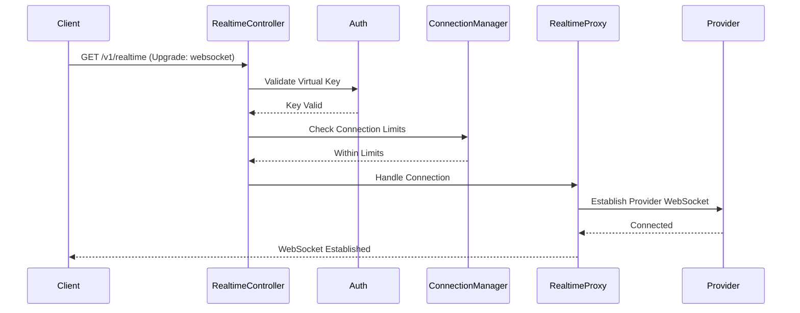
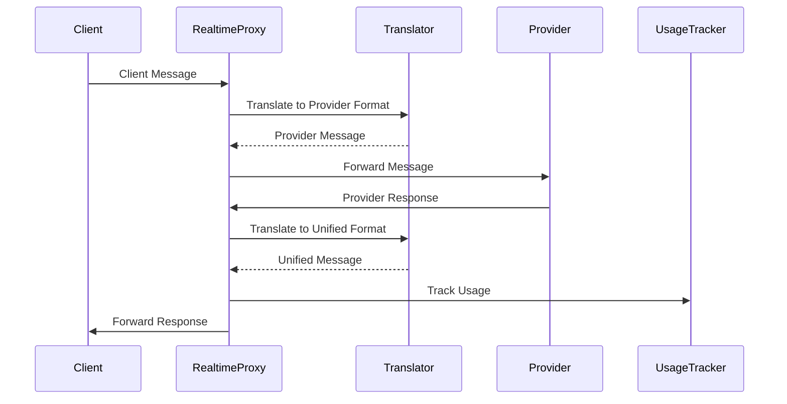

# Real-time Architecture

This document describes the WebSocket-based real-time audio streaming architecture in Conduit, which enables bidirectional audio conversations with AI models.

## Overview

The real-time architecture provides a WebSocket proxy that bridges client applications with provider-specific real-time APIs. It handles protocol translation, connection management, usage tracking, and provides a unified interface regardless of the underlying provider.

## Architecture Components

### Core Components

```
┌─────────────┐     WebSocket      ┌──────────────────┐     WebSocket      ┌──────────────┐
│   Client    │◄──────────────────►│  Conduit Proxy   │◄─────────────────►│   Provider   │
│ Application │                     │                  │                    │ (OpenAI, etc)│
└─────────────┘                     └──────────────────┘                    └──────────────┘
                                            │
                                            ▼
                                    ┌──────────────────┐
                                    │Message Translator│
                                    └──────────────────┘
```

### 1. RealtimeController

The entry point for real-time connections:

```csharp
[ApiController]
[Route("v1")]
public class RealtimeController : ControllerBase
{
    [HttpGet("realtime")]
    public async Task ConnectRealtime(
        [FromQuery] string model = "gpt-4o-realtime-preview")
    {
        if (HttpContext.WebSockets.IsWebSocketRequest)
        {
            var webSocket = await HttpContext.WebSockets.AcceptWebSocketAsync();
            await _proxyService.HandleConnectionAsync(webSocket, model, virtualKey);
        }
    }
}
```

### 2. RealtimeProxyService

The core proxy service that manages bidirectional message flow:

```csharp
public interface IRealtimeProxyService
{
    Task HandleConnectionAsync(
        WebSocket clientSocket,
        string model,
        VirtualKey virtualKey,
        CancellationToken cancellationToken = default);
}
```

Key responsibilities:
- Establish connection to provider
- Proxy messages bidirectionally
- Handle connection lifecycle
- Track usage in real-time

### 3. RealtimeConnectionManager

Manages active connections and enforces limits:

```csharp
public interface IRealtimeConnectionManager
{
    Task<bool> TryAddConnectionAsync(string keyId, string connectionId);
    Task RemoveConnectionAsync(string keyId, string connectionId);
    int GetActiveConnectionCount(string keyId);
    int GetTotalActiveConnections();
    Task<Dictionary<string, int>> GetConnectionCountsByKeyAsync();
}
```

Features:
- Per-key connection limits
- System-wide connection limits
- Connection tracking
- Stale connection cleanup

### 4. Message Translators

Each provider has a specific translator that converts between Conduit's unified format and provider protocols:

```csharp
public interface IRealtimeMessageTranslator
{
    RealtimeMessage TranslateToProvider(RealtimeMessage message);
    RealtimeMessage TranslateFromProvider(string providerMessage);
    Dictionary<string, string> GetProviderHeaders();
    string[] GetProviderSubprotocols();
    object TransformSessionConfig(RealtimeSessionConfig config);
}
```

## Message Format

### Unified Message Structure

Conduit uses a unified message format that all providers translate to/from:

```csharp
public abstract class RealtimeMessage
{
    public string Type { get; set; }
    public string? EventId { get; set; }
}

// Example message types
public class SessionUpdateMessage : RealtimeMessage
{
    public SessionConfig Session { get; set; }
}

public class AudioMessage : RealtimeMessage
{
    public string Audio { get; set; } // Base64 encoded
    public int? SampleRate { get; set; }
    public int? Channels { get; set; }
}

public class TranscriptMessage : RealtimeMessage
{
    public string Text { get; set; }
    public string? Language { get; set; }
    public double? Confidence { get; set; }
}
```

### Provider-Specific Translation

Each provider translator handles the conversion:

#### OpenAI Translator
```csharp
public class OpenAIRealtimeTranslatorV2 : IRealtimeMessageTranslator
{
    // Translates OpenAI's event-based protocol
    // Handles session.update, audio.append, response.create, etc.
}
```

#### ElevenLabs Translator
```csharp
public class ElevenLabsRealtimeTranslator : IRealtimeMessageTranslator
{
    // Translates ElevenLabs conversational protocol
    // Manages voice settings and conversation flow
}
```

## Connection Lifecycle

### 1. Connection Establishment



### 2. Message Flow



### 3. Connection Termination

- Client disconnection triggers provider disconnection
- Provider disconnection triggers client notification
- Connection removed from manager
- Final usage calculated and recorded

## Usage Tracking

### Real-time Usage Metrics

The `RealtimeUsageTracker` monitors:

```csharp
public class RealtimeUsageTracker : IRealtimeUsageTracker
{
    public Task StartTrackingAsync(string connectionId, VirtualKey virtualKey);
    public Task UpdateUsageAsync(string connectionId, RealtimeUsageUpdate update);
    public Task<RealtimeUsageSummary> StopTrackingAsync(string connectionId);
}
```

Tracked metrics:
- Session duration (seconds)
- Audio input duration
- Audio output duration
- Input tokens (for text)
- Output tokens (for text)
- Total messages exchanged

### Cost Calculation

Real-time costs are calculated based on:
- Audio minutes (input/output)
- Token usage (if applicable)
- Session duration
- Provider-specific pricing

## Security and Limits

### Authentication

- Virtual key required before WebSocket upgrade
- Key must have `CanUseRealtimeAudio` permission
- Provider API key retrieved from secure storage

### Connection Limits

```csharp
public class RealtimeConnectionOptions
{
    public int MaxConnectionsPerKey { get; set; } = 5;
    public int MaxTotalConnections { get; set; } = 1000;
    public TimeSpan ConnectionTimeout { get; set; } = TimeSpan.FromMinutes(30);
    public TimeSpan StaleConnectionCheckInterval { get; set; } = TimeSpan.FromMinutes(5);
}
```

### Message Limits

- Maximum message size: 1MB (configurable)
- Rate limiting: 100 messages per second per connection
- Automatic disconnection on limit violations

## Error Handling

### Connection Errors

```csharp
public enum RealtimeErrorType
{
    ConnectionFailed,
    AuthenticationFailed,
    RateLimitExceeded,
    MessageTooLarge,
    ProviderError,
    InternalError
}
```

Error handling strategies:
- Graceful disconnection with error message
- Automatic reconnection (client-side)
- Error logging and monitoring
- User-friendly error messages

### Provider Errors

Provider-specific errors are mapped to common error types:
- Rate limits → Retry with backoff
- Authentication → Clear error message
- Service unavailable → Failover (if configured)

## Monitoring and Observability

### Health Monitoring

```csharp
public class RealtimeHealthCheck : IHealthCheck
{
    public Task<HealthCheckResult> CheckHealthAsync(
        HealthCheckContext context,
        CancellationToken cancellationToken)
    {
        // Check connection manager health
        // Verify provider connectivity
        // Monitor resource usage
    }
}
```

### Metrics

Key metrics tracked:
- Active connections by provider
- Connection duration distribution
- Message throughput
- Error rates by type
- Usage patterns

### Logging

Comprehensive logging includes:
- Connection lifecycle events
- Message flow (configurable verbosity)
- Errors and exceptions
- Performance metrics
- Usage updates

## Configuration

### Provider Configuration

```json
{
  "Realtime": {
    "Providers": {
      "openai": {
        "WebSocketUrl": "wss://api.openai.com/v1/realtime",
        "Models": ["gpt-4o-realtime-preview"],
        "Subprotocols": ["realtime.openai.com"],
        "Headers": {
          "OpenAI-Beta": "realtime=v1"
        }
      },
      "elevenlabs": {
        "WebSocketUrl": "wss://api.elevenlabs.io/v1/convai/conversation",
        "Models": ["conversational-v1"]
      }
    }
  }
}
```

### Session Configuration

Default session configuration can be customized:

```csharp
public class RealtimeSessionConfig
{
    public string? Voice { get; set; }
    public string? Language { get; set; }
    public string? SystemPrompt { get; set; }
    public double? Temperature { get; set; }
    public string? ResponseFormat { get; set; }
    public Dictionary<string, object>? ProviderSpecific { get; set; }
}
```

## Testing Real-time Connections

### Integration Testing

```csharp
[Fact]
public async Task Realtime_ShouldEstablishConnection()
{
    // Arrange
    var client = _factory.WithWebHostBuilder(builder =>
    {
        builder.ConfigureServices(services =>
        {
            services.AddSingleton<IRealtimeProxyService, MockRealtimeProxy>();
        });
    }).CreateClient();

    // Act
    var ws = await client.WebSocketAsync("/v1/realtime");
    
    // Assert
    Assert.Equal(WebSocketState.Open, ws.State);
}
```

### Load Testing

Considerations for load testing:
- Concurrent connection limits
- Message throughput
- Resource utilization
- Provider rate limits

## Best Practices

### Client Implementation

1. **Handle Reconnection**: Implement exponential backoff
2. **Process Messages Asynchronously**: Don't block on message handling
3. **Implement Heartbeat**: Detect stale connections
4. **Buffer Audio**: Smooth audio playback
5. **Handle Errors Gracefully**: Provide user feedback

### Server Configuration

1. **Set Appropriate Limits**: Based on infrastructure capacity
2. **Monitor Resource Usage**: CPU, memory, connections
3. **Configure Timeouts**: Prevent resource leaks
4. **Enable Detailed Logging**: For debugging
5. **Test Failover**: Ensure reliability

## Future Enhancements

Planned improvements:

1. **Connection Pooling**: Reuse provider connections
2. **Advanced Routing**: Route based on capabilities
3. **Recording**: Optional session recording
4. **Transcription**: Real-time transcription display
5. **Analytics**: Detailed conversation analytics
6. **Multi-provider**: Simultaneous multi-provider support