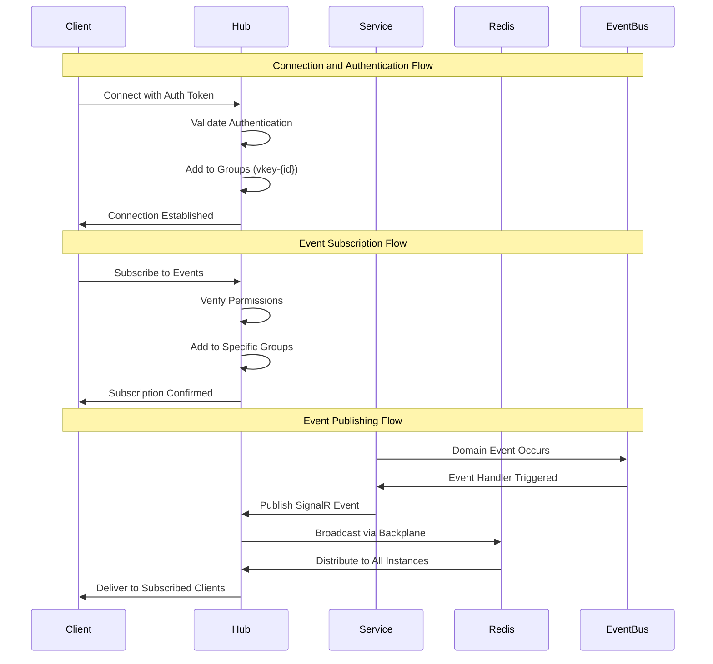
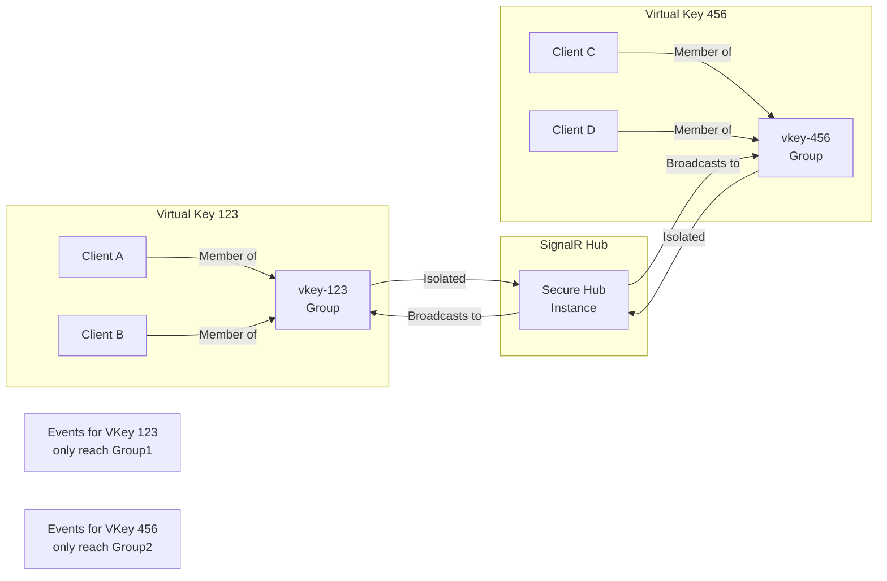
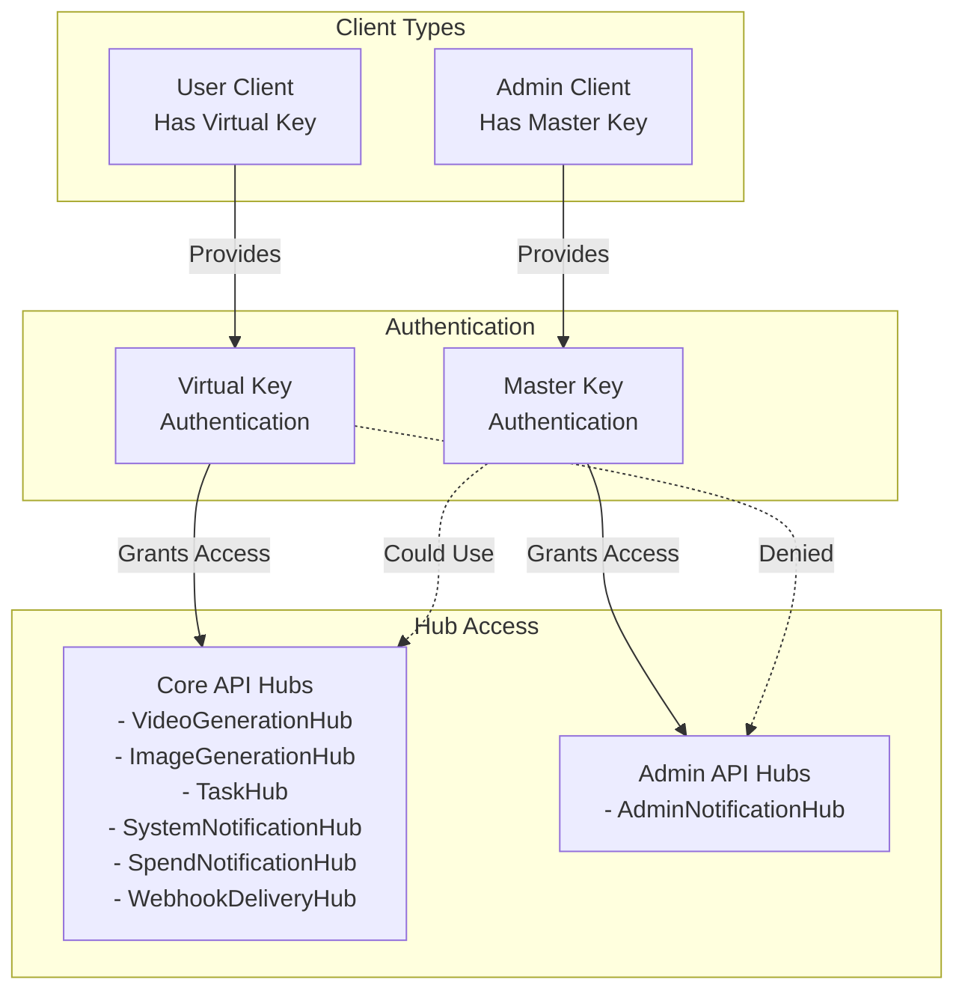
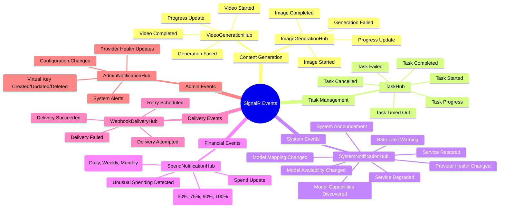
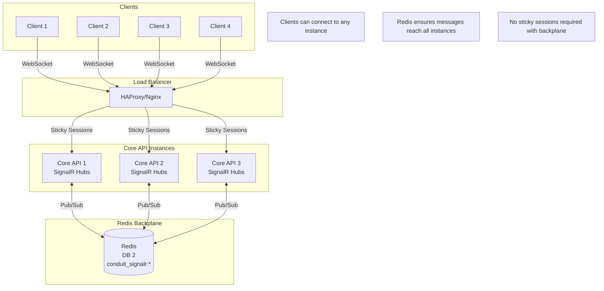

# SignalR Hub Architecture Diagram

## System Architecture

```mermaid
graph TB
    subgraph "Client Applications"
        WebUI[WebUI<br/>Blazor App]
        AdminUI[Admin UI<br/>Management]
        SDK[External SDK<br/>Clients]
    end
    
    subgraph "SignalR Hubs - Core API"
        subgraph "Base Classes"
            BaseHub[BaseHub<br/>No Auth]
            SecureHub[SecureHub<br/>Virtual Key Auth]
        end
        
        subgraph "Content Generation"
            VideoHub[VideoGenerationHub<br/>/hubs/video-generation]
            ImageHub[ImageGenerationHub<br/>/hubs/image-generation]
        end
        
        subgraph "Task Management"
            TaskHub[TaskHub<br/>/hubs/tasks]
        end
        
        subgraph "Notifications"
            SystemHub[SystemNotificationHub<br/>/hubs/notifications]
            SpendHub[SpendNotificationHub<br/>/hubs/spend]
            WebhookHub[WebhookDeliveryHub<br/>/hubs/webhooks]
        end
    end
    
    subgraph "SignalR Hubs - Admin API"
        AdminHub[AdminNotificationHub<br/>/hubs/admin-notifications<br/>Master Key Auth]
    end
    
    subgraph "Backend Services"
        VideoService[Video Generation<br/>Service]
        ImageService[Image Generation<br/>Service]
        TaskService[Task Processing<br/>Service]
        SpendService[Spend Tracking<br/>Service]
        WebhookService[Webhook Delivery<br/>Service]
        HealthService[Provider Health<br/>Service]
        AdminService[Admin Services]
    end
    
    subgraph "Infrastructure"
        Redis[(Redis Backplane<br/>DB 2)]
        MassTransit[MassTransit<br/>Event Bus]
    end
    
    %% Client connections
    WebUI -->|Virtual Key| VideoHub
    WebUI -->|Virtual Key| ImageHub
    WebUI -->|Virtual Key| TaskHub
    WebUI -->|Virtual Key| SystemHub
    WebUI -->|Virtual Key| SpendHub
    WebUI -->|Virtual Key| WebhookHub
    
    AdminUI -->|Master Key| AdminHub
    
    SDK -->|Virtual Key| TaskHub
    SDK -->|Virtual Key| SystemHub
    
    %% Inheritance
    SecureHub -.->|inherits| BaseHub
    VideoHub -.->|inherits| SecureHub
    ImageHub -.->|inherits| SecureHub
    TaskHub -.->|inherits| SecureHub
    SystemHub -.->|inherits| SecureHub
    SpendHub -.->|inherits| SecureHub
    WebhookHub -.->|inherits| SecureHub
    
    %% Service to Hub connections
    VideoService -->|publishes| VideoHub
    ImageService -->|publishes| ImageHub
    TaskService -->|publishes| TaskHub
    SpendService -->|publishes| SpendHub
    WebhookService -->|publishes| WebhookHub
    HealthService -->|publishes| SystemHub
    HealthService -->|publishes| AdminHub
    AdminService -->|publishes| AdminHub
    
    %% Infrastructure connections
    VideoHub -.->|scales via| Redis
    ImageHub -.->|scales via| Redis
    TaskHub -.->|scales via| Redis
    SystemHub -.->|scales via| Redis
    SpendHub -.->|scales via| Redis
    WebhookHub -.->|scales via| Redis
    AdminHub -.->|scales via| Redis
    
    MassTransit -->|triggers| VideoService
    MassTransit -->|triggers| ImageService
    MassTransit -->|triggers| SpendService
    MassTransit -->|triggers| HealthService
```

## Data Flow Diagram

```mermaid
sequenceDiagram
    participant Client
    participant Hub
    participant Service
    participant Redis
    participant EventBus
    
    Note over Client,EventBus: Connection and Authentication Flow
    Client->>Hub: Connect with Auth Token
    Hub->>Hub: Validate Authentication
    Hub->>Hub: Add to Groups (vkey-{id})
    Hub->>Client: Connection Established
    
    Note over Client,EventBus: Event Subscription Flow
    Client->>Hub: Subscribe to Events
    Hub->>Hub: Verify Permissions
    Hub->>Hub: Add to Specific Groups
    Hub->>Client: Subscription Confirmed
    
    Note over Client,EventBus: Event Publishing Flow
    Service->>EventBus: Domain Event Occurs
    EventBus->>Service: Event Handler Triggered
    Service->>Hub: Publish SignalR Event
    Hub->>Redis: Broadcast via Backplane
    Redis->>Hub: Distribute to All Instances
    Hub->>Client: Deliver to Subscribed Clients
```

## Group Isolation Diagram

```mermaid
graph LR
    subgraph "Virtual Key 123"
        Client1[Client A]
        Client2[Client B]
        Group1[vkey-123<br/>Group]
    end
    
    subgraph "Virtual Key 456"
        Client3[Client C]
        Client4[Client D]
        Group2[vkey-456<br/>Group]
    end
    
    subgraph "SignalR Hub"
        Hub[Secure Hub<br/>Instance]
    end
    
    Client1 -->|Member of| Group1
    Client2 -->|Member of| Group1
    Client3 -->|Member of| Group2
    Client4 -->|Member of| Group2
    
    Group1 -->|Isolated| Hub
    Group2 -->|Isolated| Hub
    
    Hub -->|Broadcasts to| Group1
    Hub -->|Broadcasts to| Group2
    
    Note1[Events for VKey 123<br/>only reach Group1]
    Note2[Events for VKey 456<br/>only reach Group2]
```

## Authentication Flow

```mermaid
graph TD
    subgraph "Client Types"
        UserClient[User Client<br/>Has Virtual Key]
        AdminClient[Admin Client<br/>Has Master Key]
    end
    
    subgraph "Authentication"
        VKeyAuth[Virtual Key<br/>Authentication]
        MasterAuth[Master Key<br/>Authentication]
    end
    
    subgraph "Hub Access"
        CoreHubs[Core API Hubs<br/>- VideoGenerationHub<br/>- ImageGenerationHub<br/>- TaskHub<br/>- SystemNotificationHub<br/>- SpendNotificationHub<br/>- WebhookDeliveryHub]
        AdminHubs[Admin API Hubs<br/>- AdminNotificationHub]
    end
    
    UserClient -->|Provides| VKeyAuth
    AdminClient -->|Provides| MasterAuth
    
    VKeyAuth -->|Grants Access| CoreHubs
    MasterAuth -->|Grants Access| AdminHubs
    
    VKeyAuth -.->|Denied| AdminHubs
    MasterAuth -.->|Could Use| CoreHubs
```

## Event Categories by Hub

```mermaid
mindmap
  root((SignalR Events))
    Content Generation
      VideoGenerationHub
        Video Started
        Progress Update
        Video Completed
        Generation Failed
      ImageGenerationHub
        Image Started
        Progress Update
        Image Completed
        Generation Failed
    Task Management
      TaskHub
        Task Started
        Task Progress
        Task Completed
        Task Failed
        Task Cancelled
        Task Timed Out
    System Events
      SystemNotificationHub
        Provider Health Changed
        Rate Limit Warning
        System Announcement
        Service Degraded
        Service Restored
        Model Mapping Changed
        Model Capabilities Discovered
        Model Availability Changed
    Financial Events
      SpendNotificationHub
        Spend Update
        Budget Alert (50%, 75%, 90%, 100%)
        Spend Summary (Daily, Weekly, Monthly)
        Unusual Spending Detected
    Delivery Events
      WebhookDeliveryHub
        Delivery Attempted
        Delivery Succeeded
        Delivery Failed
        Retry Scheduled
    Admin Events
      AdminNotificationHub
        Virtual Key Created/Updated/Deleted
        Provider Health Updates
        System Alerts
        Configuration Changes
```

## Scaling Architecture

```mermaid
graph TB
    subgraph "Load Balancer"
        LB[HAProxy/Nginx]
    end
    
    subgraph "Core API Instances"
        API1[Core API 1<br/>SignalR Hubs]
        API2[Core API 2<br/>SignalR Hubs]
        API3[Core API 3<br/>SignalR Hubs]
    end
    
    subgraph "Redis Backplane"
        Redis[(Redis<br/>DB 2<br/>conduit_signalr:*)]
    end
    
    subgraph "Clients"
        C1[Client 1]
        C2[Client 2]
        C3[Client 3]
        C4[Client 4]
    end
    
    C1 -->|WebSocket| LB
    C2 -->|WebSocket| LB
    C3 -->|WebSocket| LB
    C4 -->|WebSocket| LB
    
    LB -->|Sticky Sessions| API1
    LB -->|Sticky Sessions| API2
    LB -->|Sticky Sessions| API3
    
    API1 <-->|Pub/Sub| Redis
    API2 <-->|Pub/Sub| Redis
    API3 <-->|Pub/Sub| Redis
    
    Note1[Clients can connect to any instance]
    Note2[Redis ensures messages reach all instances]
    Note3[No sticky sessions required with backplane]
```