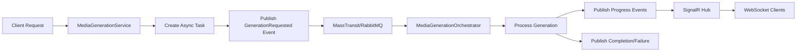

# Async Media Generation Architecture

This document describes the comprehensive asynchronous media generation architecture for video and image generation in ConduitLLM, including event-driven processing, retry mechanisms, and real-time progress tracking.

## Table of Contents

1. [Overview](#overview)
2. [Core Architecture](#core-architecture)
3. [Video Generation](#video-generation)
4. [Image Generation](#image-generation)
5. [Event-Driven Processing](#event-driven-processing)
6. [Retry Mechanism](#retry-mechanism)
7. [Task Management](#task-management)
8. [Provider Integration](#provider-integration)
9. [API Endpoints](#api-endpoints)
10. [Client Integration](#client-integration)
11. [Best Practices](#best-practices)

---

## Overview

ConduitLLM supports asynchronous generation of both images and videos, allowing long-running generation tasks to be processed in the background while providing immediate feedback to clients. This architecture is especially beneficial for:

- Multiple image generation requests (N > 1)
- High-quality/HD image generation
- Video generation (which can take minutes to complete)
- Slower providers like DALL-E 3 or MiniMax
- Better user experience with real-time progress tracking

### Key Benefits

1. **Scalability**: Horizontal scaling with multiple worker instances
2. **Reliability**: Automatic retry with exponential backoff
3. **Real-Time Experience**: WebSocket-based progress updates via SignalR
4. **Resource Management**: Concurrent task limiting and fair processing
5. **User Experience**: No blocking, immediate feedback, progress tracking

---

## Core Architecture

The async media generation system uses:

1. **Redis Streams** for distributed task queue
2. **MassTransit with RabbitMQ** for event-driven processing
3. **Background Services** for task processing
4. **SignalR** for real-time progress updates
5. **Polling endpoints** for fallback status checking

### Architecture Components

#### Domain Events

The system uses domain events throughout the media generation lifecycle:

**Image Events:**
- `ImageGenerationRequested` - Task submitted to queue
- `ImageGenerationProgress` - Progress updates during processing
- `ImageGenerationCompleted` - Task completed with results
- `ImageGenerationFailed` - Task failed with error

**Video Events:**
- `VideoGenerationRequested` - Published when a video generation request is submitted
- `VideoGenerationStarted` - Published when processing begins
- `VideoGenerationProgress` - Published for progress updates
- `VideoGenerationCompleted` - Published when generation succeeds
- `VideoGenerationFailed` - Published when generation fails
- `VideoGenerationCancelled` - Published when a task is cancelled

#### Event Flow



#### Partitioned Processing

Events are partitioned by VirtualKeyId to ensure:
- **Ordered Processing**: Events for the same virtual key are processed in order
- **Race Condition Prevention**: No concurrent processing of tasks for the same key
- **Fair Resource Distribution**: Different virtual keys can process in parallel

---

## Video Generation

### Video Models and DTOs

#### Video Generation Request
```csharp
public class VideoGenerationRequest
{
    public string Prompt { get; set; }
    public string? Model { get; set; }
    public int? Duration { get; set; } // In seconds
    public string? Size { get; set; } // e.g., "1920x1080", "1280x720"
    public int? Fps { get; set; } // Frames per second
    public string? Style { get; set; }
    public string? ResponseFormat { get; set; } // "url" or "b64_json"
}
```

#### Video Generation Response
```csharp
public class VideoGenerationResponse
{
    public long Created { get; set; }
    public List<VideoData> Data { get; set; }
}

public class VideoData
{
    public string? Url { get; set; }
    public string? B64Json { get; set; }
    public VideoMetadata? Metadata { get; set; }
}

public class VideoMetadata
{
    public int Width { get; set; }
    public int Height { get; set; }
    public int Duration { get; set; } // In seconds
    public int Fps { get; set; }
    public string? Codec { get; set; }
    public long FileSizeBytes { get; set; }
}
```

### Video-Capable Providers

- **MiniMax**: Video generation support
- **OpenAI**: GPT-4 Vision (future video support)
- **Google Gemini**: Video understanding
- **Anthropic Claude**: Video understanding (future)
- **Replicate**: Various video generation models

### Provider Capabilities Extension

```csharp
public class ModelCapabilities
{
    // Existing...
    public bool VideoGeneration { get; set; }
    public bool VideoUnderstanding { get; set; }
    public VideoCapabilityDetails? VideoDetails { get; set; }
}

public class VideoCapabilityDetails
{
    public int? MaxDurationSeconds { get; set; }
    public List<string> SupportedSizes { get; set; }
    public List<int> SupportedFps { get; set; }
    public List<string> SupportedCodecs { get; set; }
    public long? MaxFileSizeBytes { get; set; }
}
```

---

## Image Generation

### Async Image Generation Flow

```csharp
public class ImageGenerationController : ControllerBase
{
    [HttpPost("generations/async")]
    public async Task<IActionResult> GenerateImageAsync(ImageGenerationRequest request)
    {
        // 1. Create async task
        var taskId = await _taskService.CreateTaskAsync("image_generation", request);

        // 2. Queue image generation job
        await _imageGenerationService.QueueGenerationAsync(taskId, request);

        // 3. Return task ID for polling
        return Accepted(new { task_id = taskId });
    }
}
```

### Image Generation Use Cases

- Multiple image generation requests (N > 1)
- High-quality/HD image generation
- Slower providers like DALL-E 3
- Better user experience with progress tracking

---

## Event-Driven Processing

### MassTransit Configuration with RabbitMQ

```csharp
// Configure partitioned endpoints for video generation
cfg.Send<VideoGenerationRequested>(x =>
{
    x.UsePartitioner(p => p.Message.VirtualKeyId);
});

cfg.ReceiveEndpoint("video-generation", e =>
{
    e.ConfigurePartitioner<VideoGenerationRequested>(
        context,
        p => p.Message.VirtualKeyId);

    e.ConfigureConsumer<VideoGenerationOrchestrator>(context);

    // Retry policy for transient failures
    e.UseMessageRetry(r => r.Intervals(
        TimeSpan.FromSeconds(30),
        TimeSpan.FromMinutes(2),
        TimeSpan.FromMinutes(10)
    ));

    e.ConcurrentMessageLimit = 5; // Limit concurrent video generations
});
```

### Environment Variables

```bash
# RabbitMQ Configuration
CONDUITLLM__RABBITMQ__HOST=rabbitmq
CONDUITLLM__RABBITMQ__PORT=5672
CONDUITLLM__RABBITMQ__USERNAME=conduit
CONDUITLLM__RABBITMQ__PASSWORD=<secure-password>
CONDUITLLM__RABBITMQ__VHOST=/
CONDUITLLM__RABBITMQ__PREFETCHCOUNT=10
CONDUITLLM__RABBITMQ__PARTITIONCOUNT=10

# Image Generation Configuration
CONDUITLLM__IMAGEGENERATION__MAXCONCURRENCY=5

# Redis connection for task queue (required for multi-instance)
CONDUITLLM__REDIS__CONNECTIONSTRING=localhost:6379
```

### Video Generation Service

The service publishes events instead of directly processing:

```csharp
// Publish event for async processing
await PublishEventAsync(
    new VideoGenerationRequested
    {
        RequestId = taskId,
        Model = request.Model,
        Prompt = request.Prompt,
        VirtualKeyId = virtualKeyInfo.Id.ToString(),
        IsAsync = true,
        Parameters = new VideoGenerationParameters
        {
            Size = request.Size,
            Duration = request.Duration,
            Fps = request.Fps
        }
    });
```

### Media Generation Orchestrators

Consume generation events and orchestrate the generation process:

```csharp
public class VideoGenerationOrchestrator :
    IConsumer<VideoGenerationRequested>,
    IConsumer<VideoGenerationCancelled>
{
    public async Task Consume(ConsumeContext<VideoGenerationRequested> context)
    {
        // Process video generation
        // Publish progress events
        // Handle completion/failure
    }
}
```

### Background Service

Processes pending tasks from the database and publishes events:

```csharp
// Lease next pending task
var leasedTask = await asyncTaskRepository.LeaseNextPendingTaskAsync(
    _instanceId,
    TimeSpan.FromMinutes(10),
    "video_generation",
    cancellationToken);

// Publish event for processing
await publishEndpoint.Publish(videoRequest, cancellationToken);
```

---

## Retry Mechanism

### Database Schema

The `AsyncTask` entity includes retry-related fields:

```csharp
public class AsyncTask
{
    // ... existing fields ...

    /// <summary>
    /// Number of retry attempts made for this task.
    /// </summary>
    public int RetryCount { get; set; } = 0;

    /// <summary>
    /// Maximum number of retry attempts allowed for this task.
    /// </summary>
    public int MaxRetries { get; set; } = 3;

    /// <summary>
    /// Whether the task is retryable if it fails.
    /// </summary>
    public bool IsRetryable { get; set; } = true;

    /// <summary>
    /// When the task should be retried next (null if not scheduled for retry).
    /// </summary>
    public DateTime? NextRetryAt { get; set; }
}
```

### Retry Configuration

```csharp
public class MediaGenerationRetryConfiguration
{
    public int MaxRetries { get; set; } = 3;
    public int BaseDelaySeconds { get; set; } = 30;
    public int MaxDelaySeconds { get; set; } = 3600;
    public bool EnableRetries { get; set; } = true;
    public int RetryCheckIntervalSeconds { get; set; } = 30;
}
```

Configure via environment variables:
```bash
export VideoGeneration__MaxRetries=5
export VideoGeneration__BaseDelaySeconds=60
export VideoGeneration__MaxDelaySeconds=1800
export VideoGeneration__EnableRetries=true
export VideoGeneration__RetryCheckIntervalSeconds=30
```

### Retry Logic Flow

1. **Failure Detection** (MediaGenerationOrchestrator)
   - When a generation task fails, the orchestrator determines if the error is retryable
   - Retryable errors include: timeouts, network errors, rate limits, service unavailability
   - Non-retryable errors include: validation errors, authentication failures

2. **Retry Scheduling**
   - If retryable and retry count < max retries:
     - Calculate delay using exponential backoff with jitter
     - Set task state back to `Pending`
     - Set `NextRetryAt` to current time + calculated delay
     - Increment `RetryCount`

3. **Retry Execution** (Background Service)
   - Background worker queries pending tasks where `NextRetryAt <= now`
   - Task lease mechanism ensures only one worker processes the retry
   - Task is processed normally with updated retry metadata

4. **Manual Retry** (API Endpoint)
   - Endpoint: `POST /v1/{media-type}/generations/tasks/{taskId}/retry`
   - Validates task is failed and hasn't exceeded max retries
   - Resets task to pending state for immediate retry

### Exponential Backoff Algorithm

```csharp
public int CalculateRetryDelay(int retryCount)
{
    // Exponential backoff: BaseDelay * 2^retryCount
    var delay = BaseDelaySeconds * Math.Pow(2, retryCount);

    // Add jitter (±20% randomization)
    var jitter = new Random().NextDouble() * 0.4 - 0.2;
    delay = delay * (1 + jitter);

    // Cap at maximum delay
    return (int)Math.Min(delay, MaxDelaySeconds);
}
```

Example delays with 30s base:
- Retry 1: ~30s (24-36s with jitter)
- Retry 2: ~60s (48-72s with jitter)
- Retry 3: ~120s (96-144s with jitter)

### Orchestrator Failure Handling

```csharp
catch (Exception ex)
{
    var isRetryable = IsRetryableError(ex);
    var retryCount = taskStatus?.RetryCount ?? 0;
    var maxRetries = _retryConfiguration.MaxRetries;

    if (isRetryable && retryCount < maxRetries)
    {
        var delaySeconds = _retryConfiguration.CalculateRetryDelay(retryCount);
        var nextRetryAt = DateTime.UtcNow.AddSeconds(delaySeconds);

        // Schedule retry
        await _taskService.UpdateTaskStatusAsync(
            request.RequestId,
            TaskState.Pending,
            error: $"Retry {retryCount + 1}/{maxRetries} scheduled: {ex.Message}");

        // Publish retry event
        await _publishEndpoint.Publish(new VideoGenerationFailed
        {
            RequestId = request.RequestId,
            IsRetryable = true,
            RetryCount = retryCount,
            MaxRetries = maxRetries,
            NextRetryAt = nextRetryAt
        });
    }
}
```

### Error Classification

**Retryable errors:**
- Network timeouts
- Rate limits
- Service unavailability
- Connection failures

**Non-retryable errors:**
- Invalid credentials
- Validation failures
- Unsupported features

---

## Task Management

### Task States

- `pending` - Task created but not started (or scheduled for retry)
- `running` - Task is being processed
- `completed` - Task finished successfully
- `failed` - Task failed with error
- `cancelled` - Task was cancelled by user

### Cost Tracking

Media generation costs are automatically:
- Calculated based on provider and model
- Tracked via `SpendUpdateRequested` events
- Applied to virtual key budgets

### Multi-Instance Deployment

For production deployments with multiple Core API instances:

1. **Redis Required**: Redis must be configured for the task queue
2. **Background Service**: Each instance runs its own background service
3. **Load Distribution**: Tasks are automatically distributed across instances
4. **Task Recovery**: Orphaned tasks are recovered if an instance goes down

---

## Provider Integration

### Video Storage and Processing

#### IVideoStorageService
```csharp
public interface IVideoStorageService : IMediaStorageService
{
    // Additional video-specific methods
    Task<string> GenerateStreamingUrlAsync(string storageKey, StreamingOptions options);
    Task<VideoMetadata> GetVideoMetadataAsync(string storageKey);
    Task<string> CreateThumbnailAsync(string videoStorageKey, int timeSeconds);
}
```

#### IVideoProcessor
```csharp
public interface IVideoProcessor
{
    Task<VideoMetadata> ExtractMetadataAsync(Stream videoStream);
    Task<Stream> TranscodeAsync(Stream videoStream, VideoTranscodeOptions options);
    Task<List<string>> ExtractFramesAsync(Stream videoStream, FrameExtractionOptions options);
    Task<Stream> GenerateThumbnailAsync(Stream videoStream, int timeSeconds);
}
```

---

## API Endpoints

### Video Generation

#### Create Async Video Generation Task

```
POST /v1/videos/generations/async
Authorization: Bearer {api_key}

{
  "prompt": "A serene ocean sunset with waves",
  "model": "minimax-video-01",
  "duration": 5,
  "size": "1280x720",
  "fps": 30
}
```

Response:
```json
{
  "taskId": "550e8400-e29b-41d4-a716-446655440000",
  "status": "queued",
  "statusUrl": "/v1/videos/generations/550e8400-e29b-41d4-a716-446655440000/status",
  "created": "2024-01-15T10:30:00Z"
}
```

#### Check Task Status

```
GET /v1/videos/generations/{taskId}/status
Authorization: Bearer {api_key}
```

Response (Processing):
```json
{
  "taskId": "550e8400-e29b-41d4-a716-446655440000",
  "status": "running",
  "created": "2024-01-15T10:30:00Z",
  "updated": "2024-01-15T10:30:05Z",
  "progress": 50,
  "retryCount": 0,
  "maxRetries": 3
}
```

Response (Completed):
```json
{
  "taskId": "550e8400-e29b-41d4-a716-446655440000",
  "status": "completed",
  "created": "2024-01-15T10:30:00Z",
  "updated": "2024-01-15T10:31:00Z",
  "progress": 100,
  "result": {
    "videoUrl": "https://api.conduit.com/v1/media/video/abc123.mp4",
    "duration": 60.5,
    "cost": 0.20,
    "provider": "minimax",
    "model": "minimax-video-01"
  }
}
```

#### Manual Retry

```
POST /v1/videos/generations/tasks/{taskId}/retry
Authorization: Bearer {virtual-key}

Response: 200 OK
{
  "taskId": "task_abc123",
  "status": "pending",
  "error": "Retry 1/3 scheduled"
}
```

#### Cancel Task

```
DELETE /v1/videos/generations/{taskId}
Authorization: Bearer {api_key}
```

### Image Generation

#### Create Async Image Generation Task

```
POST /v1/images/generations/async
Content-Type: application/json
Authorization: Bearer {api_key}

{
  "prompt": "A beautiful sunset over mountains",
  "model": "dall-e-3",
  "n": 2,
  "size": "1024x1024",
  "quality": "hd"
}
```

Response:
```json
{
  "taskId": "550e8400-e29b-41d4-a716-446655440000",
  "status": "queued",
  "statusUrl": "/v1/images/generations/550e8400-e29b-41d4-a716-446655440000/status",
  "created": "2024-01-15T10:30:00Z"
}
```

---

## Client Integration

### JavaScript/TypeScript Example (Image Generation)

```javascript
async function generateImageAsync(prompt, model = 'dall-e-3') {
  // Start async generation
  const response = await fetch('/v1/images/generations/async', {
    method: 'POST',
    headers: {
      'Authorization': `Bearer ${apiKey}`,
      'Content-Type': 'application/json'
    },
    body: JSON.stringify({ prompt, model })
  });

  const { taskId, statusUrl } = await response.json();

  // Poll for status
  let status = 'queued';
  while (status === 'queued' || status === 'running') {
    await new Promise(resolve => setTimeout(resolve, 2000)); // 2s delay

    const statusResponse = await fetch(statusUrl, {
      headers: { 'Authorization': `Bearer ${apiKey}` }
    });

    const statusData = await statusResponse.json();
    status = statusData.status;

    if (status === 'completed') {
      return statusData.result;
    } else if (status === 'failed') {
      throw new Error(statusData.error);
    }
  }
}
```

### SignalR Real-Time Updates

```typescript
// Connect to SignalR hub
const connection = new signalR.HubConnectionBuilder()
    .withUrl("/hubs/video-generation", {
        accessTokenFactory: () => virtualKey
    })
    .build();

// Subscribe to task updates
await connection.invoke("SubscribeToTask", taskId);

// Handle progress updates
connection.on("ProgressUpdate", (data) => {
    console.log(`Progress: ${data.progress}% - ${data.status}`);
});

// Handle completion
connection.on("TaskCompleted", (data) => {
    console.log(`Video ready: ${data.videoUrl}`);
});
```

---

## Best Practices

### Configuration

1. **Set Appropriate Max Retries**
   - Default of 3 retries works for most cases
   - Consider provider-specific limits

2. **Set Appropriate Concurrency Limits**
   - Based on provider capabilities
   - Monitor resource usage

3. **Use Redis for Multi-Instance Deployments**
   - Required for distributed task queue
   - Enables horizontal scaling

### Monitoring

1. **Monitor Retry Patterns**
   - High retry rates may indicate infrastructure issues
   - Adjust delays based on provider recovery times

2. **Track Key Metrics**
   - Task processing time
   - Retry success rate
   - Queue depth
   - WebSocket connections

3. **Use Webhook Notifications**
   - Get real-time updates on task status
   - Implement client-side retry UX

### Error Handling

1. **Handle Non-Retryable Errors**
   - Validation errors should fail immediately
   - Clear error messages help users fix issues

2. **Implement Graceful Degradation**
   - Automatic retry with backoff for transient errors
   - Rate limit handling with appropriate delays
   - Task timeout protection (5 minutes default)

### Troubleshooting

#### Progress Not Updating

**Symptoms:**
- Progress bar stays at 0%
- No status messages appear
- Video generation completes without progress updates

**Diagnostic Steps:**

1. **Check SignalR Connection Status**
   ```typescript
   // In browser console
   const client = window.__conduitClient;
   console.log('SignalR connected:', client.signalR?.isConnected());
   ```

2. **Verify WebSocket Support**
   ```javascript
   // Check if WebSockets are available
   console.log('WebSocket support:', 'WebSocket' in window);
   ```

3. **Check Browser Network Tab**
   - Look for WebSocket connection to `/hubs/video-generation`
   - Status should be 101 (Switching Protocols)
   - Check for any connection errors

**Solutions:**

1. **Enable Fallback to Polling**
   ```typescript
   const { generateVideo } = useVideoGeneration({
     useProgressTracking: true,
     fallbackToPolling: true  // Enable automatic fallback
   });
   ```

2. **Check Firewall/Proxy Settings**
   - Ensure WebSocket connections are allowed
   - Port 443 (HTTPS/WSS) should be open
   - Proxy must support WebSocket upgrade

3. **Force Polling Mode**
   ```typescript
   // Disable SignalR temporarily
   const client = new ConduitCoreClient({
     apiKey: 'your-key',
     signalR: { enabled: false }
   });
   ```

#### Duplicate Progress Events

**Symptoms:**
- Same progress percentage shown multiple times
- Console shows duplicate events
- Progress appears to jump backwards

**Cause:**
This is normal behavior when both SignalR and polling are active. The SDK automatically deduplicates events within a 500ms window.

**Solutions:**
- No action needed - SDK handles deduplication automatically
- Progress will never go backwards
- Enable debug logging to see deduplication in action:
  ```typescript
  const client = new ConduitCoreClient({
    apiKey: 'your-key',
    debug: true
  });
  ```

#### Progress Jumping or Irregular Updates

**Symptoms:**
- Progress jumps from 20% to 80%
- Updates arrive in bursts
- Long periods without updates

**Causes:**
1. **Network Latency**: Updates queued during disconnection
2. **Provider Behavior**: Some providers send infrequent updates
3. **SignalR Reconnection**: Bulk updates after reconnect

**Solutions:**

1. **Smooth Progress Display**
   ```typescript
   // Use animation for smooth transitions
   <Progress
     value={progress}
     animate
     transitionDuration={500}
   />
   ```

2. **Monitor Connection State**
   ```typescript
   const { signalRConnected } = useVideoGeneration();
   if (!signalRConnected) {
     console.warn('SignalR disconnected - using polling');
   }
   ```

#### Generation Fails Immediately

**Symptoms:**
- Task fails with no progress
- Error: "Insufficient GPU resources"
- Error: "Model not available"

**Diagnostic Steps:**

1. **Check Model Availability**
   ```typescript
   const capabilities = client.videos.getModelCapabilities('minimax-video-01');
   console.log('Model capabilities:', capabilities);
   ```

2. **Verify Request Parameters**
   ```typescript
   // Ensure parameters are within limits
   {
     duration: 6,        // Max for minimax-video-01
     size: '1280x720',   // Supported resolution
     fps: 30            // Supported frame rate
   }
   ```

3. **Check Provider Status**
   - Admin panel → Providers → Check health status
   - Verify API keys are valid
   - Check rate limits

#### SignalR Connection Errors

**Error: "Failed to negotiate with the server"**

**Causes:**
- Server doesn't support SignalR
- Authentication failure
- CORS issues

**Solutions:**
1. Verify server URL includes SignalR support
2. Check virtual key is valid
3. Ensure CORS allows your domain

**Error: "Connection closed with error"**

**Causes:**
- Network interruption
- Server restart
- Token expiration

**Solutions:**
1. SDK automatically reconnects - wait a moment
2. Check network connectivity
3. Refresh virtual key if expired

#### Performance Issues

**Slow Progress Updates:**

1. **Check Network Latency**
   ```bash
   # Ping API server
   ping api.conduit.ai
   ```

2. **Monitor Browser Performance**
   - Open DevTools → Performance tab
   - Look for long tasks during updates

3. **Optimize React Renders**
   ```typescript
   // Memoize progress component
   const ProgressBar = React.memo(({ progress }) => (
     <Progress value={progress} />
   ));
   ```

**High Memory Usage:**

1. **Clean Up Completed Tasks**
   ```typescript
   // Remove old tasks from state
   const cleanupOldTasks = () => {
     setTasks(tasks => tasks.filter(
       task => task.status !== 'completed' ||
       Date.now() - task.completedAt < 3600000
     ));
   };
   ```

2. **Limit Queue Size**
   ```typescript
   const MAX_QUEUE_SIZE = 50;
   if (taskQueue.length >= MAX_QUEUE_SIZE) {
     taskQueue.shift(); // Remove oldest
   }
   ```

#### Debug Mode

Enable comprehensive debugging:

```typescript
// Enable all debug features
const client = new ConduitCoreClient({
  apiKey: 'your-key',
  debug: true,
  signalR: {
    logLevel: 'Debug'
  }
});

// Track all events
window.__videoProgressEvents = [];
const { generateVideo } = useVideoGeneration({
  onProgress: (progress) => {
    window.__videoProgressEvents.push({
      time: Date.now(),
      ...progress
    });
  }
});
```

#### Common Error Messages

| Error | Cause | Solution |
|-------|-------|----------|
| "Task not found" | Task ID invalid/expired or belongs to different key | Verify task ID and virtual key |
| "WebSocket connection failed" | Firewall blocking or proxy doesn't support WebSocket | Check firewall settings, enable polling fallback |
| "Progress tracking timed out" | Task exceeded timeout (default 30 min) | Increase timeout or check for network issues |
| "Model not available" | Provider model doesn't exist or is disabled | Check model name and provider status |
| "Insufficient GPU resources" | Provider at capacity | Retry later or use different provider |

#### Best Practices

1. **Always Handle Errors**
   ```typescript
   const { generateVideo, error } = useVideoGeneration();

   if (error) {
     // Show user-friendly error message
     showNotification({
       title: 'Generation Failed',
       message: getErrorMessage(error),
       color: 'red'
     });
   }
   ```

2. **Provide Fallback UI**
   ```typescript
   {!signalRConnected && (
     <Alert>
       Using polling for progress updates.
       Updates may be less frequent.
     </Alert>
   )}
   ```

3. **Test Different Scenarios**
   - Test with SignalR disabled
   - Test with slow network
   - Test with connection interruptions
   - Test with multiple concurrent tasks

### Resource Management

1. **Always use partitioning** for ordered processing per virtual key
2. **Implement graceful shutdown** to complete in-flight tasks
3. **Log correlation IDs** for distributed tracing
4. **Use SignalR groups** for efficient message routing

---

## Configuration Reference

### Video Generation

```json
{
  "ConduitLLM": {
    "Video": {
      "MaxUploadSizeBytes": 104857600,  // 100MB
      "MaxGenerationDurationSeconds": 30,
      "SupportedFormats": ["mp4", "webm", "mov"],
      "StorageProvider": "S3",
      "ProcessingProvider": "Local",  // or "AWS", "Azure"
      "EnableStreaming": true,
      "EnableTranscoding": false
    }
  }
}
```

### Retry Configuration

```bash
# Video Generation Retry Configuration
VideoGeneration__MaxRetries=3
VideoGeneration__BaseDelaySeconds=30
VideoGeneration__MaxDelaySeconds=3600
VideoGeneration__EnableRetries=true
VideoGeneration__RetryCheckIntervalSeconds=30

# Image Generation Configuration
ImageGeneration__MaxRetries=3
ImageGeneration__MaxConcurrency=5
```

---

## Migration from Sync API

The synchronous endpoints (`POST /v1/images/generations`, `POST /v1/videos/generations`) remain available for:
- Backward compatibility
- Simple single-image/video generation
- Clients that prefer blocking behavior

To migrate:
1. Change endpoint to `/v1/{media-type}/generations/async`
2. Implement polling for task status OR use SignalR for real-time updates
3. Handle async response format

---

## Future Enhancements

1. **Provider-Specific Retry Strategies**
   - Different delays per provider
   - Custom retry logic for specific error codes

2. **Circuit Breaker Integration**
   - Prevent retries when provider is down
   - Automatic recovery detection

3. **Retry Budget**
   - Limit total retries per time period
   - Prevent retry storms

4. **Advanced Features**
   - Batch Operations: Submit multiple prompts in one request
   - Priority Queues: Premium tier with faster processing
   - Webhooks: Push notifications when tasks complete
   - Saga Pattern for complex multi-step workflows
   - Distributed Tracing with OpenTelemetry
   - Event Sourcing for complete audit trail

---

## Related Documentation

- [Progress and Notifications](./progress-and-notifications.md) - SignalR real-time progress tracking
- [Provider Architecture](../provider-system/provider-architecture.md) - Provider integration details
- [Background Services](../patterns/background-services-and-workers.md) - Background service patterns
- [Event-Driven Architecture](../../claude/event-driven-architecture.md) - MassTransit events and domain events
