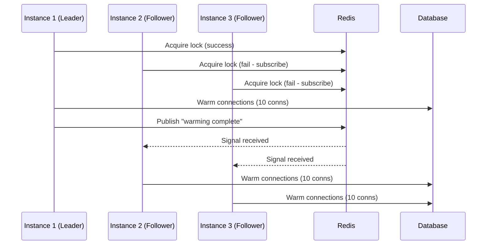
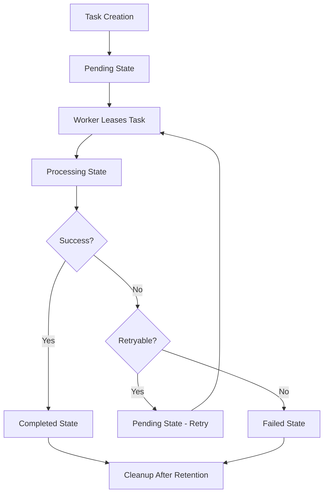

# Background Services and Worker Patterns

This document describes the comprehensive background service patterns used in ConduitLLM for processing asynchronous tasks, including worker patterns, distributed locking, and eventual consistency.

## Table of Contents

1. [Overview](#overview)
2. [Background Service Worker Pattern](#background-service-worker-pattern)
3. [Distributed Locking](#distributed-locking)
4. [Coordinated Startup Warming](#coordinated-startup-warming)
5. [Eventual Consistency](#eventual-consistency)
6. [Task Lifecycle](#task-lifecycle)
7. [Best Practices](#best-practices)
8. [Monitoring and Troubleshooting](#monitoring-and-troubleshooting)

---

## Overview

ConduitLLM implements sophisticated background processing patterns to handle asynchronous tasks reliably and efficiently. These patterns address:

- Long-running operations (video generation, batch processing)
- Distributed processing across multiple instances
- Race condition prevention
- Fault tolerance and recovery
- High availability and scalability

### Core Principles

1. **Queue-Based Processing**: Tasks are queued in durable storage, not fire-and-forget
2. **Lease-Based Exclusivity**: Workers lease tasks to prevent duplicate processing
3. **Eventual Consistency**: Database-first approach with best-effort caching
4. **Self-Healing**: Automatic recovery from failures

---

## Background Service Worker Pattern

### The Problem

The original implementation had fundamental issues:

1. **Background Service Only Did Cleanup**: Workers only performed cleanup instead of processing tasks
2. **Direct Task Processing**: Used `Task.Run` for fire-and-forget execution (anti-pattern)
3. **No Work Queue Processing**: Background service didn't pull tasks from a queue

### The Solution

The background service now implements a proper worker pattern with queue-based processing.

#### 1. Work Queue Consumer

The background service actively polls for pending tasks:

```csharp
private async Task RunVideoGenerationWorkerAsync(CancellationToken cancellationToken)
{
    while (!cancellationToken.IsCancellationRequested)
    {
        // Pull pending tasks from queue
        var pendingTasks = await _taskService.GetPendingTasksAsync("video_generation", limit: 10);

        foreach (var task in pendingTasks)
        {
            // Update status to processing
            await _taskService.UpdateTaskStatusAsync(task.Id, TaskState.Processing);

            // Publish event for processing
            await _publishEndpoint.Publish(videoGenerationRequest);
        }

        await Task.Delay(TimeSpan.FromSeconds(1), cancellationToken);
    }
}
```

#### 2. Queue-Based Task Submission

Tasks are queued in the database with a "Pending" state:

```csharp
// Controller creates task and returns immediately
var taskId = await _taskService.CreateTaskAsync("video_generation", metadata);
return Accepted(new { taskId });

// Background service processes the task asynchronously
```

#### 3. Removal of Task.Run Anti-Pattern

Orchestrators process tasks synchronously within worker threads:

```csharp
// OLD (anti-pattern)
_ = Task.Run(async () => await ProcessVideoAsync(...));

// NEW (proper pattern)
await ProcessVideoAsync(...); // Runs within worker thread
```

### Worker Pattern Components

#### 1. IAsyncTaskService
Extended with `GetPendingTasksAsync` and lease-based methods:

```csharp
public interface IAsyncTaskService
{
    Task<List<AsyncTask>> GetPendingTasksAsync(string taskType, int limit);
    Task<AsyncTask?> LeaseNextPendingTaskAsync(
        string workerId,
        TimeSpan leaseDuration,
        string taskType);
    Task UpdateTaskStatusAsync(string taskId, TaskState state);
}
```

#### 2. Background Service Implementation

```csharp
public class VideoGenerationBackgroundService : BackgroundService
{
    protected override async Task ExecuteAsync(CancellationToken stoppingToken)
    {
        await Task.WhenAll(
            RunVideoGenerationWorkerAsync(stoppingToken),
            RunCleanupWorkerAsync(stoppingToken),
            RunLeaseRecoveryAsync(stoppingToken)
        );
    }
}
```

#### 3. Task Orchestrator

Processes tasks synchronously when called by worker:

```csharp
public class VideoGenerationOrchestrator : IConsumer<VideoGenerationRequested>
{
    public async Task Consume(ConsumeContext<VideoGenerationRequested> context)
    {
        var request = context.Message;
        // Process synchronously - no Task.Run!
        await ProcessVideoGenerationAsync(request);
    }
}
```

### Task States

Tasks progress through the following states:

- `0`: **Pending** - Waiting to be processed
- `1`: **Processing** - Currently being worked on
- `2`: **Completed** - Finished successfully
- `3`: **Failed** - Encountered error
- `4`: **Cancelled** - Cancelled by user
- `5`: **TimedOut** - Exceeded time limit

### Benefits

1. **Resilience**: Tasks survive service restarts
2. **Scalability**: Can run multiple workers
3. **Separation of Concerns**: API just queues, workers process
4. **Resource Management**: Control concurrent processing
5. **Monitoring**: Easy to track queue depth and processing rate

---

## Distributed Locking

### The Problem

Without distributed locking, multiple worker instances can:
- Process the same task simultaneously
- Overwrite each other's progress updates
- Create inconsistent state in the database
- Waste resources on duplicate work

### Task Lease Pattern

Tasks are "leased" to specific workers for a limited time:

```csharp
// Worker attempts to lease a task
var leasedTask = await repository.LeaseNextPendingTaskAsync(
    workerId: "worker-instance-123",
    leaseDuration: TimeSpan.FromMinutes(10),
    taskType: "video_generation");

if (leasedTask != null)
{
    // Worker has exclusive access to process this task
    await ProcessTaskAsync(leasedTask);
}
```

#### Database Schema

```sql
-- Lease columns added to AsyncTasks table
ALTER TABLE AsyncTasks ADD COLUMN LeasedBy VARCHAR(100);
ALTER TABLE AsyncTasks ADD COLUMN LeaseExpiryTime DATETIME;
ALTER TABLE AsyncTasks ADD COLUMN Version INT DEFAULT 0;

-- Index for efficient lease queries
CREATE INDEX IX_AsyncTasks_Lease ON AsyncTasks
    (State, IsArchived, LeaseExpiryTime, CreatedAt);
```

### Distributed Lock Service

For operations requiring exclusive access beyond task leasing:

```csharp
public interface IDistributedLockService
{
    Task<IDistributedLock?> AcquireLockAsync(
        string key,
        TimeSpan expiry,
        CancellationToken cancellationToken = default);
}

// Usage example
using (var lockHandle = await lockService.AcquireLockAsync("critical-operation", TimeSpan.FromSeconds(30)))
{
    if (lockHandle != null)
    {
        // Exclusive access to perform operation
    }
}
```

#### Redis Implementation

Uses Redis SET NX EX for atomic lock acquisition:

```lua
-- Acquire lock
SET lock:key lockValue NX EX 30

-- Release lock (Lua script ensures we only delete our own lock)
if redis.call('GET', KEYS[1]) == ARGV[1] then
    return redis.call('DEL', KEYS[1])
else
    return 0
end
```

### Optimistic Concurrency Control

Version tracking prevents lost updates:

```csharp
// Task has Version property that increments on each update
public async Task<bool> UpdateWithVersionCheckAsync(
    AsyncTask task,
    int expectedVersion)
{
    if (currentVersion != expectedVersion)
    {
        // Another worker updated the task
        return false;
    }

    task.Version = expectedVersion + 1;
    await SaveAsync(task);
    return true;
}
```

### Lease Recovery

Background process recovers tasks from crashed workers:

```csharp
private async Task RunExpiredLeaseRecoveryAsync()
{
    // Find tasks with expired leases
    var expiredTasks = await repository.GetExpiredLeaseTasksAsync();

    foreach (var task in expiredTasks)
    {
        // Reset to pending state for re-processing
        task.State = TaskState.Pending;
        task.LeasedBy = null;
        task.LeaseExpiryTime = null;
        await repository.UpdateAsync(task);
    }
}
```

### Worker Pattern with Leasing

```csharp
// Old pattern (race condition prone)
var pendingTasks = await GetPendingTasksAsync();
foreach (var task in pendingTasks) { /* process */ }

// New pattern (lease-based)
while (!cancellationToken.IsCancellationRequested)
{
    var leasedTask = await LeaseNextPendingTaskAsync(workerId, leaseDuration);
    if (leasedTask != null) { /* process with exclusive access */ }
}
```

---

## Coordinated Startup Warming

When multiple service instances start simultaneously (e.g., during deployment), resource-intensive initialization tasks can cause "thundering herd" problems. The coordinated warming pattern addresses this by ensuring orderly, staggered initialization across instances.

### The Problem

Without coordination, all instances warming resources at once can cause:
- **Database connection spikes**: 10 instances × 50 connections = 500 simultaneous connections
- **Connection pool exhaustion**: Exceeding database connection limits
- **Startup delays**: All instances competing for resources
- **Potential failures**: Cascading timeouts and crashes

### The Solution: Coordinated Warming

Unlike leader election where only one instance runs a service, coordinated warming ensures **all instances** complete initialization, but in a staggered manner:

1. **One instance acquires a distributed lock** (becomes the "leader")
2. **Leader warms its resources first** (e.g., database connection pool)
3. **Leader publishes a signal** via Redis Pub/Sub when complete
4. **Follower instances wait for the signal** (with timeout)
5. **Followers warm their own resources** after receiving the signal



### Implementation: CoordinatedConnectionPoolWarmer

The `CoordinatedConnectionPoolWarmer` implements this pattern for database connection pools:

```csharp
public class CoordinatedConnectionPoolWarmer : IHostedService
{
    public async Task StartAsync(CancellationToken cancellationToken)
    {
        // Try to acquire coordination lock (non-blocking)
        var lockHandle = await _lockService.AcquireLockAsync(
            $"connectionpool:warming:{_serviceType}",
            _options.LockExpiry,
            cancellationToken);

        if (lockHandle != null)
        {
            // Leader path: warm first, then signal others
            await WarmConnectionPoolAsync(cancellationToken);
            await PublishWarmingSignalAsync();
            await lockHandle.ReleaseAsync();
        }
        else
        {
            // Follower path: wait for signal, then warm
            await WaitForSignalOrTimeoutAsync(cancellationToken);
            await WarmConnectionPoolAsync(cancellationToken);
        }
    }
}
```

### Key Design Decisions

#### 1. Service-Type Isolation

Gateway API and Admin API coordinate independently using separate lock keys:
- `connectionpool:warming:CoreAPI`
- `connectionpool:warming:AdminAPI`

This prevents unnecessary delays when different service types deploy at different times.

#### 2. Graceful Degradation

When Redis is unavailable, instances fall back to immediate warming:

```csharp
if (_redis == null || _lockService == null)
{
    // No coordination available - warm immediately
    await WarmConnectionPoolAsync(cancellationToken);
    return;
}
```

#### 3. Timeout-Based Safety

Followers don't wait indefinitely. After `SignalTimeout` (default: 2 minutes):
- If leader crashed mid-warming, followers proceed anyway
- Lock auto-expires, allowing recovery on next deployment

#### 4. Stagger Delay with Jitter

After receiving the signal, followers add a small random delay to prevent a secondary thundering herd:

```csharp
if (signalReceived)
{
    var jitteredDelay = _options.StaggerDelay +
        TimeSpan.FromMilliseconds(Random.Shared.Next(0, 500));
    await Task.Delay(jitteredDelay, cancellationToken);
}
```

### Configuration

Configure coordinated warming in `appsettings.json`:

```json
{
  "ConduitLLM": {
    "ConnectionPoolWarming": {
      "EnableCoordinatedWarming": true,
      "SignalTimeout": "00:02:00",
      "LockExpiry": "00:05:00",
      "StaggerDelay": "00:00:00.500",
      "VerboseLogging": false
    }
  }
}
```

| Option | Default | Description |
|--------|---------|-------------|
| `EnableCoordinatedWarming` | `true` | Enable/disable coordination |
| `SignalTimeout` | 2 min | How long followers wait for signal |
| `LockExpiry` | 5 min | Lock TTL (should exceed warming time) |
| `StaggerDelay` | 500ms | Base delay after signal (jitter added) |
| `VerboseLogging` | `false` | Enable debug-level logging |

### Comparison: Leader Election vs Coordinated Warming

| Aspect | Leader Election | Coordinated Warming |
|--------|-----------------|---------------------|
| **Instances that run** | Only leader | All instances |
| **Use case** | Singleton work (metrics, cleanup) | Per-instance initialization |
| **Non-leader behavior** | Waits/does nothing | Waits, then runs |
| **Signal mechanism** | Leadership change | Pub/Sub completion signal |
| **Example services** | `BusinessMetricsService` | `ConnectionPoolWarmer` |

### Monitoring

Key log messages to monitor:

```
# Leader acquired lock
"Instance {InstanceId} acquired warming lock for {ServiceType}. Warming pool as leader."

# Signal published
"Published warming signal for {ServiceType} to {SubscriberCount} subscribers"

# Follower received signal
"Received warming signal for {ServiceType}. Proceeding with local pool warming."

# Follower timeout (may indicate leader issues)
"Warming signal timeout reached for {ServiceType}. Proceeding with local pool warming."

# Graceful degradation
"Redis unavailable. Warming pool immediately for {ServiceType}."
```

### Edge Cases Handled

| Scenario | Behavior |
|----------|----------|
| Redis unavailable | Immediate warming (graceful degradation) |
| Leader crashes mid-warming | Followers timeout and proceed |
| Signal lost in transit | Followers timeout and proceed |
| All instances start simultaneously | One becomes leader, others wait |
| Lock service unavailable | Immediate warming |

---

## Eventual Consistency

The `HybridAsyncTaskService` implements an eventual consistency model with self-healing mechanisms.

### Architecture

#### Write Path (CreateTaskAsync)

1. **Database First** - Task is persisted to PostgreSQL/SQLite (critical operation)
2. **Best-Effort Cache** - Task status is cached in Redis with retry logic
3. **Best-Effort Events** - AsyncTaskCreated event is published for subscribers

#### Read Path (GetTaskStatusAsync)

1. **Cache First** - Attempt to read from Redis cache
2. **Database Fallback** - On cache miss or failure, read from database
3. **Self-Healing** - Re-populate cache after database read

### Resilience Features

#### 1. Database-First Approach
- Ensures data durability - the task is always persisted
- Database write is the only critical operation that can fail the request
- All other operations are best-effort

#### 2. Cache Resilience
- **Retry Logic**: 3 attempts with exponential backoff (100ms, 200ms, 400ms)
- **Graceful Degradation**: Cache failures don't break the service
- **Self-Healing**: Cache misses automatically repopulate from database
- **Logging**: All cache failures are logged for monitoring

#### 3. Event Publishing Resilience
- **Optional**: Service works without event bus
- **Non-Blocking**: Event failures don't affect task creation
- **Logged**: Failed events are logged for investigation

#### 4. Read Path Self-Healing
- **Cache Failures**: Automatically fallback to database
- **Deserialization Errors**: Fallback to database on corrupt cache data
- **Re-caching**: Successful database reads update the cache
- **Consistency Monitoring**: Logs when cache has invalid data

### Consistency Guarantees

#### What IS Guaranteed
1. **Durability**: Once CreateTaskAsync returns, the task exists in the database
2. **Read Consistency**: GetTaskStatusAsync always returns the latest data (from cache or database)
3. **Self-Healing**: System automatically recovers from cache inconsistencies

#### What is NOT Guaranteed
1. **Immediate Cache Consistency**: Cache may lag behind database briefly
2. **Event Delivery**: Events may be lost if the bus is unavailable
3. **Cross-Service Consistency**: Other services may have stale data until events are processed

### Trade-offs

**Advantages:**
- **High Availability**: Service remains operational despite cache/event failures
- **Performance**: Cache-first reads provide low latency
- **Simplicity**: No complex distributed transaction coordination
- **Self-Healing**: System recovers automatically from most failures

**Disadvantages:**
- **Eventual Consistency**: Brief periods where cache and database differ
- **Event Loss Possible**: Events are fire-and-forget
- **Additional Complexity**: More logging and monitoring required

---

## Task Lifecycle

### Complete Task Flow



### State Transitions

1. **Task Creation**: API endpoint creates task with "Pending" state
2. **Task Discovery**: Background worker polls for pending tasks or leases next task
3. **Task Processing**: Worker updates status to "Processing" and executes work
4. **Task Completion**: Status updated to "Completed" with results or "Failed" with error
5. **Task Cleanup**: Old tasks cleaned up after retention period

### Lease Lifecycle

1. **Lease Acquisition**: Worker atomically claims a task
2. **Lease Maintenance**: Worker processes task within lease duration
3. **Lease Release**: On completion or failure
4. **Lease Recovery**: Expired leases recovered by lease recovery worker

---

## Best Practices

### Configuration

#### Worker Configuration

```csharp
// In Program.cs
builder.Services.AddHostedService<VideoGenerationBackgroundService>();

// Configure worker behavior
builder.Services.Configure<WorkerOptions>(options =>
{
    options.PollInterval = TimeSpan.FromSeconds(1);
    options.BatchSize = 10;
    options.MaxConcurrentTasks = 5;
});
```

#### Task Retention

```csharp
// Configure how long to keep completed tasks
builder.Services.Configure<TaskRetentionOptions>(options =>
{
    options.CompletedTaskRetention = TimeSpan.FromHours(24);
    options.FailedTaskRetention = TimeSpan.FromDays(7);
});
```

#### Distributed Lock Configuration

**Redis Mode (Production):**
```csharp
services.AddSingleton<IConnectionMultiplexer>(sp =>
    ConnectionMultiplexer.Connect(redisConnectionString));
services.AddSingleton<IDistributedLockService, RedisDistributedLockService>();
```

**In-Memory Mode (Development):**
```csharp
services.AddSingleton<IDistributedLockService, InMemoryDistributedLockService>();
```

### Performance Considerations

#### Database Queries
- Lease acquisition uses row-level locking
- Indexed on (State, IsArchived, LeaseExpiryTime, CreatedAt)
- Single query to find and lease task atomically

#### Redis Operations
- Lock acquisition: O(1)
- Lock release: O(1)
- No polling or spinning

#### Scalability
- Supports unlimited worker instances
- No central coordinator bottleneck
- Lease duration configurable per workload

### Operational Best Practices

1. **Monitor Cache Health**: Set up alerts for high cache failure rates
2. **Event Bus Reliability**: Use durable queues for critical event flows
3. **Database Performance**: Ensure database can handle fallback load
4. **Operational Procedures**: Document how to diagnose consistency issues
5. **Lease Duration Tuning**: Set based on expected task processing time

---

## Monitoring and Troubleshooting

### Key Metrics

#### Queue and Processing
1. **Queue Depth**: Number of pending tasks
2. **Processing Rate**: Tasks processed per minute
3. **Failure Rate**: Percentage of failed tasks
4. **Processing Time**: Average time to complete tasks

#### Distributed Locking
1. **Lease acquisition rate**: Tasks leased per minute
2. **Lease conflicts**: Failed acquisition attempts
3. **Expired leases**: Tasks recovered from dead workers
4. **Version conflicts**: Optimistic locking failures
5. **Lock wait time**: Time to acquire distributed locks

#### Cache Performance
1. **Cache Hit Rate** - Should be high (>90%) under normal conditions
2. **Cache Operation Failures** - Should be rare
3. **Event Publishing Failures** - Indicates event bus issues
4. **Database Fallback Rate** - High rate indicates cache problems

### Health Checks

```csharp
public class BackgroundWorkerHealthCheck : IHealthCheck
{
    public Task<HealthCheckResult> CheckHealthAsync(
        HealthCheckContext context,
        CancellationToken cancellationToken)
    {
        // Check if worker is running
        // Monitor task processing rate
        // Alert on high queue depth
    }
}
```

### Key Log Messages

#### Eventual Consistency
- `"Created async task {TaskId} in database"` - Task persisted successfully
- `"Failed to cache task {TaskId}, will self-heal on next read"` - Cache write failed
- `"Failed to publish AsyncTaskCreated event for task {TaskId}"` - Event publish failed
- `"Cache read failed for task {TaskId}, falling back to database"` - Cache read failed
- `"Task {TaskId} cache-database consistency issue detected"` - Cache had invalid data

### Testing Scenarios

#### 1. Concurrent Worker Test
```csharp
// Spawn multiple workers
var workers = Enumerable.Range(1, 5)
    .Select(i => Task.Run(() => RunWorkerAsync($"worker-{i}")))
    .ToArray();

// Verify no duplicate processing
Assert.Equal(tasksCreated, tasksProcessed);
Assert.True(processedTaskIds.Distinct().Count() == processedTaskIds.Count);
```

#### 2. Lease Expiry Test
```csharp
// Lease a task
var task = await LeaseNextPendingTaskAsync("worker-1", TimeSpan.FromSeconds(5));

// Wait for lease to expire
await Task.Delay(TimeSpan.FromSeconds(6));

// Another worker should be able to lease it
var reacquired = await LeaseNextPendingTaskAsync("worker-2", TimeSpan.FromMinutes(10));
Assert.NotNull(reacquired);
```

#### 3. Version Conflict Test
```csharp
// Two workers read same task
var task1 = await GetTaskAsync(taskId);
var task2 = await GetTaskAsync(taskId);

// Both try to update
var result1 = await UpdateWithVersionCheckAsync(task1, task1.Version);
var result2 = await UpdateWithVersionCheckAsync(task2, task2.Version);

// Only one should succeed
Assert.True(result1 ^ result2);
```

---

## Migration Guide

### From Fire-and-Forget to Worker Pattern

1. **Phase 1**: Add queue-based processing
2. **Phase 2**: Remove direct processing from orchestrator
3. **Phase 3**: Add distributed processing support

### Database Schema Migration

1. **Phase 1**: Add lease columns
2. **Phase 2**: Deploy with backward compatibility
3. **Phase 3**: Enable leasing
4. **Phase 4**: Update workers to use lease pattern
5. **Phase 5**: Cleanup old methods

---

## Future Enhancements

### Distributed Processing
For multi-instance deployments:
1. Use distributed locks for task claiming
2. Implement work stealing for load balancing
3. Add instance affinity for certain task types

### Priority Queues
Support for task prioritization:
1. High priority tasks processed first
2. SLA-based scheduling
3. Fair queuing to prevent starvation

### Dead Letter Queue
Handle permanently failed tasks:
1. Retry logic with exponential backoff
2. Move to DLQ after max retries
3. Manual intervention workflow

### Advanced Patterns
While the current approach is sufficient, these patterns could be considered:

1. **Outbox Pattern**: Store events in database for guaranteed delivery
2. **Read-Through Cache**: Automatic cache population on miss
3. **Write-Through Cache**: Update cache and database together
4. **Distributed Tracing**: Correlate operations across services

---

## Related Documentation

- [Async Media Generation](../media-generation/async-media-generation.md) - Media generation using background workers
- [Repository Pattern](./repository-and-data-access.md) - Data access patterns
- [MassTransit Events](../events/masstransit-event-inventory.md) - Event-driven architecture
