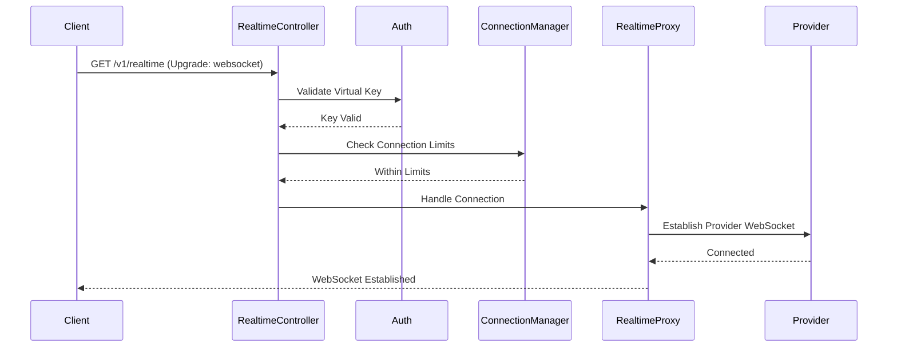
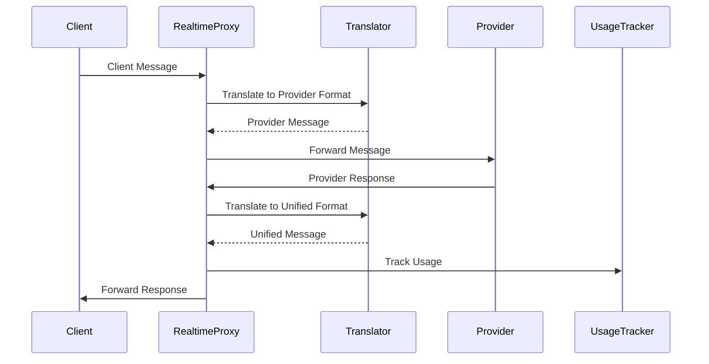

# Streaming and WebSocket Architecture

This document describes ConduitLLM's real-time communication architecture, including WebSocket-based audio streaming, Server-Sent Events (SSE) for chat streaming with performance metrics, and distributed webhook delivery.

## Table of Contents

1. [Overview](#overview)
2. [Real-time Audio Streaming](#real-time-audio-streaming)
3. [Chat Streaming with Performance Metrics](#chat-streaming-with-performance-metrics)
4. [Architecture Components](#architecture-components)
5. [Security and Limits](#security-and-limits)
6. [Monitoring and Observability](#monitoring-and-observability)
7. [Configuration](#configuration)
8. [Testing](#testing)
9. [Best Practices](#best-practices)

---

## Overview

ConduitLLM provides comprehensive real-time communication capabilities:

1. **WebSocket Audio Streaming**: Bidirectional audio conversations with AI models
2. **SSE Chat Streaming**: Text streaming with embedded performance metrics
3. **Real-time Progress Updates**: SignalR for task progress notifications

These systems enable:
- Low-latency conversational AI
- Progressive content delivery
- Real-time performance visibility
- Efficient resource utilization

---

## Real-time Audio Streaming

The real-time audio architecture provides a WebSocket proxy that bridges client applications with provider-specific real-time APIs.

### Architecture Overview

```
┌─────────────┐     WebSocket      ┌──────────────────┐     WebSocket      ┌──────────────┐
│   Client    │◄──────────────────►│  Conduit Proxy   │◄─────────────────►│   Provider   │
│ Application │                     │                  │                    │ (OpenAI, etc)│
└─────────────┘                     └──────────────────┘                    └──────────────┘
                                            │
                                            ▼
                                    ┌──────────────────┐
                                    │Message Translator│
                                    └──────────────────┘
```

### Core Components

#### 1. RealtimeController

The entry point for real-time connections:

```csharp
[ApiController]
[Route("v1")]
public class RealtimeController : ControllerBase
{
    [HttpGet("realtime")]
    public async Task ConnectRealtime(
        [FromQuery] string model = "gpt-4o-realtime-preview")
    {
        if (HttpContext.WebSockets.IsWebSocketRequest)
        {
            var webSocket = await HttpContext.WebSockets.AcceptWebSocketAsync();
            await _proxyService.HandleConnectionAsync(webSocket, model, virtualKey);
        }
    }
}
```

#### 2. RealtimeProxyService

The core proxy service managing bidirectional message flow:

```csharp
public interface IRealtimeProxyService
{
    Task HandleConnectionAsync(
        WebSocket clientSocket,
        string model,
        VirtualKey virtualKey,
        CancellationToken cancellationToken = default);
}
```

Key responsibilities:
- Establish connection to provider
- Proxy messages bidirectionally
- Handle connection lifecycle
- Track usage in real-time

#### 3. RealtimeConnectionManager

Manages active connections and enforces limits:

```csharp
public interface IRealtimeConnectionManager
{
    Task<bool> TryAddConnectionAsync(string keyId, string connectionId);
    Task RemoveConnectionAsync(string keyId, string connectionId);
    int GetActiveConnectionCount(string keyId);
    int GetTotalActiveConnections();
    Task<Dictionary<string, int>> GetConnectionCountsByKeyAsync();
}
```

Features:
- Per-key connection limits
- System-wide connection limits
- Connection tracking
- Stale connection cleanup

#### 4. RealtimeSessionStore

Manages session state with hybrid storage:

```csharp
public interface IRealtimeSessionStore
{
    Task StoreSessionAsync(RealtimeSession session, TimeSpan? ttl = null);
    Task<RealtimeSession?> GetSessionAsync(string sessionId);
    Task<List<RealtimeSession>> GetActiveSessionsAsync();
    Task<List<RealtimeSession>> GetSessionsByVirtualKeyAsync(string virtualKey);
    Task RemoveSessionAsync(string sessionId);
    Task<int> CleanupExpiredSessionsAsync();
}
```

Features:
- Hybrid storage (Redis + in-memory)
- Session indexing by virtual key
- Automatic expiration and cleanup
- Metrics tracking

#### 5. Message Translators

Each provider has a specific translator for protocol conversion:

```csharp
public interface IRealtimeMessageTranslator
{
    RealtimeMessage TranslateToProvider(RealtimeMessage message);
    RealtimeMessage TranslateFromProvider(string providerMessage);
    Dictionary<string, string> GetProviderHeaders();
    string[] GetProviderSubprotocols();
    object TransformSessionConfig(RealtimeSessionConfig config);
}
```

### Message Format

#### Unified Message Structure

```csharp
public abstract class RealtimeMessage
{
    public string Type { get; set; }
    public string? EventId { get; set; }
}

// Example message types
public class SessionUpdateMessage : RealtimeMessage
{
    public SessionConfig Session { get; set; }
}

public class AudioMessage : RealtimeMessage
{
    public string Audio { get; set; } // Base64 encoded
    public int? SampleRate { get; set; }
    public int? Channels { get; set; }
}

public class TranscriptMessage : RealtimeMessage
{
    public string Text { get; set; }
    public string? Language { get; set; }
    public double? Confidence { get; set; }
}
```

### Connection Lifecycle

#### 1. Connection Establishment



#### 2. Message Flow



#### 3. Connection Termination

- Client disconnection triggers provider disconnection
- Provider disconnection triggers client notification
- Connection removed from manager
- Final usage calculated and recorded

### Usage Tracking

The `RealtimeUsageTracker` monitors:

```csharp
public class RealtimeUsageTracker : IRealtimeUsageTracker
{
    public Task StartTrackingAsync(string connectionId, VirtualKey virtualKey);
    public Task UpdateUsageAsync(string connectionId, RealtimeUsageUpdate update);
    public Task<RealtimeUsageSummary> StopTrackingAsync(string connectionId);
}
```

Tracked metrics:
- Session duration (seconds)
- Audio input duration
- Audio output duration
- Input tokens (for text)
- Output tokens (for text)
- Total messages exchanged

Cost calculation based on:
- Audio minutes (input/output)
- Token usage (if applicable)
- Session duration
- Provider-specific pricing

---

## Chat Streaming with Performance Metrics

### Implementation: Enhanced SSE

Conduit delivers streaming chat completions using Server-Sent Events (SSE) with multiple event types for content and performance metrics.

#### Architecture

```
┌─────────────┐     ┌─────────────────┐     ┌──────────────┐
│  WebAdmin   │────▶│  API Gateway    │────▶│  LLM Client  │
│             │     │                 │     │              │
│ ┌─────────┐ │     │ ┌─────────────┐ │     │ ┌──────────┐ │
│ │Content  │◀──SSE──│ │Content      │◀──────│ │Provider  │ │
│ │Display  │ │     │ │Streaming    │ │     │ │Response  │ │
│ └─────────┘ │     │ └─────────────┘ │     │ └──────────┘ │
│             │     │                 │     │              │
│ ┌─────────┐ │     │ ┌─────────────┐ │     │ ┌──────────┐ │
│ │Metrics  │◀──SSE──│ │Metrics      │◀──────│ │Perf      │ │
│ │Display  │ │     │ │Channel      │ │     │ │Tracking  │ │
│ └─────────┘ │     │ └─────────────┘ │     │ └──────────┘ │
└─────────────┘     └─────────────────┘     └──────────────┘
```

### SSE Event Types

#### Content Event
```
event: content
data: {"choices":[{"delta":{"content":"Hello"}}]}
```

#### Metrics Event (Progressive)
```
event: metrics
data: {"ttft":120,"tokens_per_second":45.2,"tokens_generated":15}
```

#### Final Metrics Event
```
event: metrics-final
data: {"total_latency":2500,"total_tokens":127,"avg_tps":50.8}
```

### Implementation Components

#### 1. StreamingMetricsCollector

```csharp
public class StreamingMetricsCollector
{
    public async Task WriteContentEventAsync<T>(T data);
    public async Task WriteMetricsEventAsync<T>(T metrics);
    public async Task WriteFinalMetricsEventAsync<T>(T metrics);
    public async Task WriteDoneEventAsync();
}
```

Tracks per-request metrics during streaming:
- Calculates running statistics (tokens/sec, latencies)
- Thread-safe implementation
- Time to first token (TTFT)
- Inter-token latency
- Tokens per second

#### 2. EnhancedSSEResponseWriter

```csharp
[HttpPost("v1/chat/completions")]
public async Task StreamCompletionWithMetrics(
    ChatCompletionRequest request,
    CancellationToken cancellationToken)
{
    var requestId = Guid.NewGuid().ToString();
    Response.Headers.Add("X-Request-ID", requestId);

    // Start metrics collection
    var metricsCollector = new StreamingMetricsCollector(requestId);

    // Stream content chunks
    await foreach (var chunk in GetCompletionStream(request))
    {
        // Send content event
        await WriteSSEAsync("content", chunk);

        // Periodically send metrics events
        if (metricsCollector.ShouldEmitMetrics())
        {
            await WriteSSEAsync("metrics", metricsCollector.GetMetrics());
        }
    }

    // Send final metrics
    await WriteSSEAsync("metrics-final", metricsCollector.GetFinalMetrics());
}
```

### Data Models

```csharp
public class StreamingMetrics
{
    public string RequestId { get; set; }
    public long ElapsedMs { get; set; }
    public int TokensGenerated { get; set; }
    public double CurrentTokensPerSecond { get; set; }
    public long? TimeToFirstTokenMs { get; set; }
    public double? AvgInterTokenLatencyMs { get; set; }
}

public class StreamingMetricsUpdate
{
    public string EventType { get; set; } // "progress" | "final"
    public StreamingMetrics Metrics { get; set; }
    public DateTimeOffset Timestamp { get; set; }
}
```

### Client-Side Integration

```typescript
interface StreamingClient {
    onContent(handler: (chunk: ChatCompletionChunk) => void): void;
    onMetrics(handler: (metrics: StreamingMetrics) => void): void;
    onFinalMetrics(handler: (metrics: PerformanceMetrics) => void): void;
}
```

### Benefits

1. **Progressive Enhancement**: Works with existing clients, enhanced clients get metrics
2. **Efficient**: Single connection, minimal overhead
3. **Real-time**: Metrics update during streaming
4. **Extensible**: Can add more telemetry types later
5. **Standard Compliant**: Uses standard SSE event types

---

## Architecture Components

### Provider-Specific Translators

#### OpenAI Translator
```csharp
public class OpenAIRealtimeTranslatorV2 : IRealtimeMessageTranslator
{
    // Translates OpenAI's event-based protocol
    // Handles session.update, audio.append, response.create, etc.
}
```

#### ElevenLabs Translator
```csharp
public class ElevenLabsRealtimeTranslator : IRealtimeMessageTranslator
{
    // Translates ElevenLabs conversational protocol
    // Manages voice settings and conversation flow
}
```

---

## Security and Limits

### Authentication

- Virtual key required before WebSocket upgrade
- Key must have `CanUseRealtimeAudio` permission
- Provider API key retrieved from secure storage

### Connection Limits

```csharp
public class RealtimeConnectionOptions
{
    public int MaxConnectionsPerKey { get; set; } = 5;
    public int MaxTotalConnections { get; set; } = 1000;
    public TimeSpan ConnectionTimeout { get; set; } = TimeSpan.FromMinutes(30);
    public TimeSpan StaleConnectionCheckInterval { get; set; } = TimeSpan.FromMinutes(5);
}
```

### Message Limits

- Maximum message size: 1MB (configurable)
- Rate limiting: 100 messages per second per connection
- Automatic disconnection on limit violations

### Request ID Generation

- Cryptographically secure random IDs
- Users can only access their own metrics
- Rate limiting on metrics emission frequency

---

## Monitoring and Observability

### Health Monitoring

```csharp
public class RealtimeHealthCheck : IHealthCheck
{
    public Task<HealthCheckResult> CheckHealthAsync(
        HealthCheckContext context,
        CancellationToken cancellationToken)
    {
        // Check connection manager health
        // Verify provider connectivity
        // Monitor resource usage
    }
}
```

### Key Metrics

#### Real-time Audio
- Active connections by provider
- Connection duration distribution
- Message throughput
- Error rates by type
- Usage patterns

#### Chat Streaming
- Time to first token (TTFT)
- Tokens per second
- Total latency
- Token counts
- Provider response times

### Logging

Comprehensive logging includes:
- Connection lifecycle events
- Message flow (configurable verbosity)
- Errors and exceptions
- Performance metrics
- Usage updates

### Error Handling

#### Connection Errors

```csharp
public enum RealtimeErrorType
{
    ConnectionFailed,
    AuthenticationFailed,
    RateLimitExceeded,
    MessageTooLarge,
    ProviderError,
    InternalError
}
```

Error handling strategies:
- Graceful disconnection with error message
- Automatic reconnection (client-side)
- Error logging and monitoring
- User-friendly error messages

#### Provider Errors

Provider-specific errors are mapped to common error types:
- Rate limits → Retry with backoff
- Authentication → Clear error message
- Service unavailable → Failover (if configured)

---

## Configuration

### Provider Configuration

```json
{
  "Realtime": {
    "Providers": {
      "openai": {
        "WebSocketUrl": "wss://api.openai.com/v1/realtime",
        "Models": ["gpt-4o-realtime-preview"],
        "Subprotocols": ["realtime.openai.com"],
        "Headers": {
          "OpenAI-Beta": "realtime=v1"
        }
      },
      "elevenlabs": {
        "WebSocketUrl": "wss://api.elevenlabs.io/v1/convai/conversation",
        "Models": ["conversational-v1"]
      }
    }
  }
}
```

### Session Configuration

```csharp
public class RealtimeSessionConfig
{
    public string? Voice { get; set; }
    public string? Language { get; set; }
    public string? SystemPrompt { get; set; }
    public double? Temperature { get; set; }
    public string? ResponseFormat { get; set; }
    public Dictionary<string, object>? ProviderSpecific { get; set; }
}
```

---

## Testing

### Integration Testing

```csharp
[Fact]
public async Task Realtime_ShouldEstablishConnection()
{
    // Arrange
    var client = _factory.WithWebHostBuilder(builder =>
    {
        builder.ConfigureServices(services =>
        {
            services.AddSingleton<IRealtimeProxyService, MockRealtimeProxy>();
        });
    }).CreateClient();

    // Act
    var ws = await client.WebSocketAsync("/v1/realtime");

    // Assert
    Assert.Equal(WebSocketState.Open, ws.State);
}
```

### Load Testing

Considerations for load testing:
- Concurrent connection limits
- Message throughput
- Resource utilization
- Provider rate limits

---

## Best Practices

### Client Implementation

1. **Handle Reconnection**: Implement exponential backoff
2. **Process Messages Asynchronously**: Don't block on message handling
3. **Implement Heartbeat**: Detect stale connections
4. **Buffer Audio**: Smooth audio playback
5. **Handle Errors Gracefully**: Provide user feedback

### Server Configuration

1. **Set Appropriate Limits**: Based on infrastructure capacity
2. **Monitor Resource Usage**: CPU, memory, connections
3. **Configure Timeouts**: Prevent resource leaks
4. **Enable Detailed Logging**: For debugging
5. **Test Failover**: Ensure reliability

### Performance Considerations

#### Memory Usage
- Implement sliding window for metrics storage
- Compression for metrics events in large responses
- Cleanup of expired sessions

#### Emission Frequency
- Balance between real-time updates and overhead
- Configure based on use case requirements

---

## Migration Strategy

### SSE Migration

1. **Phase 1**: Deploy server with metrics events (backward compatible)
2. **Phase 2**: Update WebAdmin to consume metrics events
3. **Phase 3**: Add configuration to control metrics frequency
4. **Phase 4**: Extend to other endpoints (embeddings, etc.)

### Alternative: Client-Side Estimation

As a fallback or complement:

```typescript
class ClientSideMetricsEstimator {
    private startTime: number;
    private firstTokenTime?: number;
    private tokenCount: number = 0;
    private lastTokenTime: number;

    onChunkReceived(chunk: ChatCompletionChunk) {
        if (!this.firstTokenTime && chunk.choices[0]?.delta?.content) {
            this.firstTokenTime = Date.now();
        }

        // Count tokens (approximate)
        const content = chunk.choices[0]?.delta?.content || '';
        this.tokenCount += this.estimateTokens(content);
        this.lastTokenTime = Date.now();
    }

    getMetrics(): ClientSideMetrics {
        const elapsed = Date.now() - this.startTime;
        return {
            timeToFirstToken: this.firstTokenTime ? this.firstTokenTime - this.startTime : null,
            estimatedTokensPerSecond: this.tokenCount / (elapsed / 1000),
            tokensGenerated: this.tokenCount
        };
    }
}
```

---

## Future Enhancements

### Real-time Audio
1. **Advanced Analytics**: Detailed conversation analytics and insights
2. **Multi-provider Sessions**: Simultaneous multi-provider support
3. **Session Recording**: Optional recording with compliance controls
4. **Real-time Translation**: Cross-language conversation support
5. **Custom Models**: Support for fine-tuned conversational models
6. **Voice Biometrics**: Speaker identification and verification

### Chat Streaming
1. **Adaptive Metrics**: Dynamic emission frequency based on network conditions
2. **Client-Side Buffering**: Smooth token delivery
3. **Compression**: Optimize data transfer for high-volume streaming

---

## Related Documentation

- [Webhook Delivery](./webhook-delivery.md) - Distributed webhook notification system
- [Progress and Notifications](../media-generation/progress-and-notifications.md) - SignalR progress tracking
- [Background Services](../patterns/background-services-and-workers.md) - Background service patterns
- [Event-Driven Architecture](../../claude/event-driven-architecture.md) - MassTransit events
