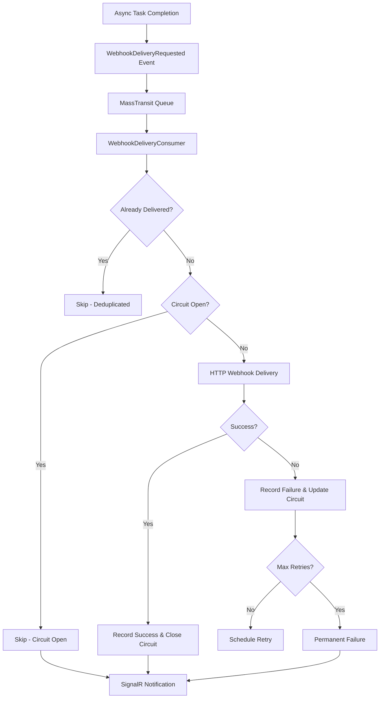

# Distributed Webhook Delivery System

## Overview

The Conduit webhook delivery system provides reliable, distributed webhook notifications for asynchronous tasks such as video generation, image generation, and batch operations. The system uses Redis for distributed state management, circuit breaking, and metrics collection across multiple application instances.

## Architecture Components

### Core Services

#### 1. RedisWebhookCircuitBreaker
- **Purpose**: Distributed circuit breaker preventing repeated failures to problematic webhook endpoints
- **State Storage**: Redis with atomic operations for consistency
- **States**: Closed (normal), Open (failing), Half-Open (testing recovery)
- **Key Pattern**: `webhook:circuit:{urlHash}:*`

#### 2. RedisWebhookMetricsService
- **Purpose**: Centralized metrics collection and aggregation across all instances
- **Metrics Tracked**: Delivery attempts, successes, failures, response times, percentiles
- **Key Patterns**: `webhook:metrics:urls:{urlHash}`, `webhook:metrics:response:{urlHash}`

#### 3. WebhookDeliveryTracker (Hybrid)
- **Implementation**: `CachedWebhookDeliveryTracker` wrapping `RedisWebhookDeliveryTracker`
- **Purpose**: Deduplication of webhook deliveries with L1/L2 caching
- **L1 Cache**: In-memory (5-10 minutes TTL)
- **L2 Cache**: Redis (distributed state)

#### 4. WebhookDeliveryConsumer
- **Framework**: MassTransit consumer
- **Purpose**: Processes webhook delivery requests from message queue
- **Features**: Retry logic, deduplication, circuit breaker integration

#### 5. WebhookDeliveryNotificationService
- **Purpose**: Real-time SignalR notifications for webhook events
- **Events**: Delivery attempts, successes, failures, circuit breaker state changes

## Data Flow



## Redis Key Structure

### Circuit Breaker Keys
```
webhook:circuit:{urlHash}:state      - CircuitState JSON (Closed/Open/HalfOpen)
webhook:circuit:{urlHash}:failures   - Failure counter (expires in 15min)
webhook:circuit:{urlHash}:success    - Success counter (expires in 1hr)
webhook:circuit:{urlHash}:lastfail   - Last failure timestamp (expires in 1hr)
webhook:circuit:{urlHash}:opened     - Circuit opened timestamp (expires with circuit)
```

### Metrics Keys
```
webhook:metrics:urls:{urlHash}       - Hash with metrics (total_attempts, successes, failures, etc.)
webhook:metrics:response:{urlHash}   - Sorted set with response times for percentiles
webhook:events:recent                - Sorted set with recent events (max 1000 entries)
```

### Delivery Tracking Keys
```
webhook:delivered:{deliveryKey}      - Delivery completion flag
webhook:connections:{connectionId}   - Connection tracking for webhooks
```

## Circuit Breaker States

### Closed (Normal Operation)
- All webhook requests are allowed
- Failure counter tracks consecutive failures
- Success resets failure counter

### Open (Failure State)
- All webhook requests are blocked
- State persists for configured duration (default: 5 minutes)
- Automatic transition to Half-Open after duration

### Half-Open (Testing Recovery)
- Single test request allowed
- Success → transition to Closed
- Failure → immediate return to Open
- Only one instance can transition to Half-Open (atomic Redis operation)

## Configuration Options

### Circuit Breaker Settings
```csharp
// Default configuration in Program.CoreServices.cs
failureThreshold: 5,                    // Failures before opening circuit
openDuration: TimeSpan.FromMinutes(5),  // How long circuit stays open
halfOpenTestInterval: TimeSpan.FromSeconds(30) // Test interval in half-open
```

### HTTP Client Settings
```csharp
Timeout = TimeSpan.FromSeconds(10),     // Request timeout
ConnectTimeout = TimeSpan.FromSeconds(5), // Connection timeout
MaxRetries = 3                          // Via MassTransit retry policy
```

### Redis Expiration Times
- Circuit state: Open duration + 5 minutes buffer
- Failure counters: 15 minutes (rolling window)
- Success counters: 1 hour
- URL metrics: 7 days
- Response time data: 1 day
- Recent events: 1 day (max 1000 entries)

## Service Registration

The system uses conditional registration based on Redis availability:

```csharp
// Redis-based when available, fallback to in-memory
builder.Services.AddSingleton<IWebhookCircuitBreaker>(sp =>
{
    var redis = sp.GetService<IConnectionMultiplexer>();
    
    if (redis != null)
    {
        return new RedisWebhookCircuitBreaker(redis, logger, ...);
    }
    else
    {
        return new WebhookCircuitBreaker(memoryCache, logger, ...);
    }
});
```

## Fallback Behavior

### Redis Unavailable
- **Circuit Breaker**: Falls back to in-memory `WebhookCircuitBreaker`
- **Metrics**: Service returns null, notifications handle gracefully
- **Delivery Tracker**: Falls back to no-op implementation
- **Impact**: Per-instance circuit breaking instead of distributed

### Redis Errors During Operation
- **Circuit Breaker**: Assumes "Closed" state to avoid blocking webhooks
- **Metrics**: Logs errors but continues operation
- **Delivery Tracker**: Allows potential duplicates rather than blocking

## Performance Characteristics

### Throughput
- Supports 1,000+ webhook deliveries per minute
- Batch operations for Redis to minimize round trips
- HTTP/2 connection pooling for webhook delivery

### Latency
- L1 cache: Sub-millisecond deduplication checks
- Circuit state check: Single Redis GET operation
- Metrics recording: Fire-and-forget async operations

### Memory Usage
- Hybrid caching reduces Redis load
- Response time data capped at 100 entries per URL
- Recent events capped at 1000 entries globally

## Monitoring and Observability

### Available Metrics
- **Per-URL Statistics**: Success rate, response times, failure counts
- **Circuit Breaker States**: Open/closed status, failure thresholds
- **System-wide Aggregates**: Total deliveries, success rates, averages
- **Real-time Events**: Live delivery attempts and results via SignalR

### Log Categories
- `RedisWebhookCircuitBreaker`: Circuit state transitions
- `RedisWebhookMetricsService`: Metrics collection and aggregation
- `WebhookDeliveryConsumer`: Delivery processing and retries
- `WebhookDeliveryNotificationService`: SignalR notifications

## Integration Points

### MassTransit Events
- `WebhookDeliveryRequested`: Triggers webhook delivery
- `MediaWebhookDeliveryCompleted`: Successful delivery notification
- `MediaWebhookDeliveryFailed`: Failed delivery notification

### SignalR Hub
- **Hub**: `WebhookDeliveryHub`
- **Methods**: `DeliveryAttempt`, `DeliverySuccess`, `DeliveryFailed`, `CircuitBreakerStateChanged`
- **Connection Groups**: Organized by webhook URL for targeted notifications

### HTTP Policies
- **Retry Policy**: Exponential backoff with jitter
- **Circuit Breaker Policy**: Polly-based HTTP-level circuit breaking
- **Timeout Policy**: 10-second request timeout with connection pooling

## Security Considerations

### URL Hashing
- Webhook URLs are hashed using SHA-256 for Redis keys
- Hash truncated to 16 characters for key length optimization
- Consistent hashing ensures same URL maps to same key across instances

### Error Information
- Error messages sanitized in logs to prevent information disclosure
- Circuit breaker states include URL but not sensitive data
- Metrics aggregation does not expose raw webhook URLs in public APIs

## Migration from In-Memory System

### Backward Compatibility
- All interfaces remain unchanged
- Graceful fallback to in-memory implementations
- No breaking changes for existing webhook configurations

### Deployment Strategy
1. Deploy with Redis configuration (optional)
2. Verify Redis connectivity in logs
3. Monitor circuit breaker behavior across instances
4. Gradually increase webhook traffic

### Performance Impact
- Minimal additional latency (1-2ms per webhook)
- Reduced memory usage per instance
- Improved consistency across instances
- Better failure isolation and recovery

## Troubleshooting

### Common Issues

**Circuit Stuck Open**
- Check Redis connectivity and circuit breaker logs
- Verify webhook endpoint is responding properly
- Consider manually resetting circuit state in Redis

**High Memory Usage**
- Monitor response time data accumulation
- Check recent events list size
- Verify TTL settings on Redis keys

**Missing Webhook Deliveries**
- Check MassTransit queue health
- Verify circuit breaker is not blocking deliveries
- Review deduplication logic and delivery keys

**Inconsistent Metrics**
- Ensure all instances connect to same Redis
- Check for Redis key expiration issues
- Verify clock synchronization across instances