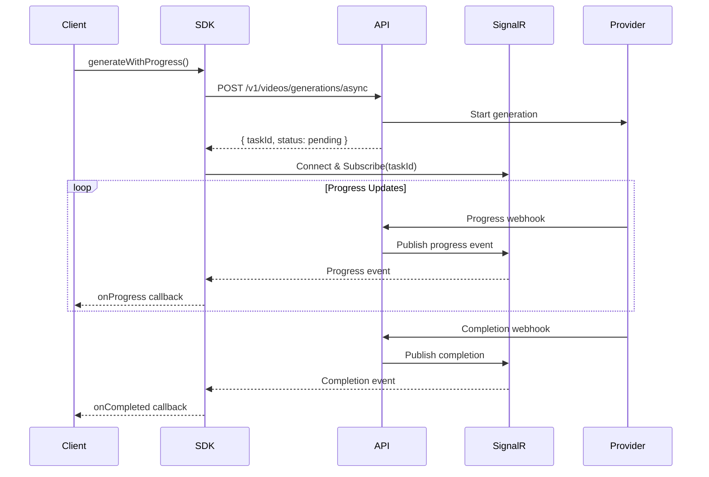

# Video Generation Progress Tracking Architecture

## Overview

The video generation progress tracking system provides real-time progress updates using a dual-mode approach: SignalR for real-time updates with automatic fallback to polling. This ensures reliable progress tracking across different network conditions and client capabilities.

## Components

### Backend Components

#### 1. VideoGenerationNotificationService
- Publishes SignalR events for video generation progress
- Integrates with the event bus to receive progress updates
- Handles client group management for task-specific subscriptions

#### 2. VideoProgressTrackingOrchestrator
- Implements time-based progress estimation for providers without native progress
- Calculates realistic progress based on video duration and complexity
- Publishes progress events at regular intervals

#### 3. Provider Integration
- MiniMax provider sends real progress updates via webhooks
- Other providers use estimated progress tracking
- Supports provider-specific progress metadata

### SDK Components

#### 1. VideoProgressTracker
- Core class managing dual-mode progress tracking
- Handles SignalR connection and event subscription
- Implements automatic fallback to polling
- Provides progress deduplication within 500ms windows

#### 2. SignalR Integration
- Uses Microsoft SignalR client for WebSocket connections
- Supports automatic reconnection with exponential backoff
- Handles connection state management

#### 3. Polling Fallback
- Activates when SignalR is unavailable or disconnected
- Uses exponential backoff for polling intervals
- Seamlessly switches between SignalR and polling

### WebUI Components

#### 1. useVideoGeneration Hook
- React hook providing simplified progress tracking
- Manages video generation state and progress
- Integrates with the SDK's progress tracking

#### 2. Progress Components
- Visual progress bars with smooth animations
- Status messages and time estimates
- Error handling and retry UI

## Progress Flow



## Event Types

### VideoGenerationStarted
```typescript
{
  eventType: 'VideoGenerationStarted',
  taskId: string,
  estimatedTimeToCompletion?: number,
  timestamp: Date
}
```

### VideoGenerationProgress
```typescript
{
  eventType: 'VideoGenerationProgress',
  taskId: string,
  progress: number,        // 0-100
  currentFrame?: number,
  totalFrames?: number,
  message?: string,
  timestamp: Date
}
```

### VideoGenerationCompleted
```typescript
{
  eventType: 'VideoGenerationCompleted',
  taskId: string,
  videoUrl: string,
  duration: number,
  metadata: Record<string, any>,
  timestamp: Date
}
```

### VideoGenerationFailed
```typescript
{
  eventType: 'VideoGenerationFailed',
  taskId: string,
  error: string,
  isRetryable: boolean,
  timestamp: Date
}
```

## Progress Deduplication

The SDK implements deduplication to handle duplicate events from multiple sources:

1. **Time Window**: 500ms deduplication window
2. **Progress Key**: Combination of percentage + status + message
3. **Source Priority**: SignalR events take precedence over polling

## Connection Management

### SignalR Connection Lifecycle

1. **Initial Connection**: Attempted when first progress tracking starts
2. **Reconnection**: Automatic reconnection with exponential backoff
3. **Connection Sharing**: Single connection shared across all tasks
4. **Graceful Degradation**: Falls back to polling on connection failure

### Polling Strategy

1. **Initial Interval**: 2 seconds (configurable)
2. **Exponential Backoff**: Doubles up to max interval (30 seconds)
3. **Smart Polling**: Reduces frequency as task progresses
4. **Immediate Updates**: Polls immediately after status changes

## Performance Considerations

### Client-Side
- Single SignalR connection for all video tasks
- Efficient event filtering by task ID
- Minimal memory footprint with cleanup on completion
- Automatic resource cleanup on task completion

### Server-Side
- Task-specific SignalR groups for targeted messaging
- Efficient event publishing with minimal overhead
- Redis backplane for multi-instance deployments
- Connection pooling for webhook handlers

## Error Handling

### Network Failures
- Automatic reconnection for transient failures
- Fallback to polling when SignalR unavailable
- Exponential backoff to prevent overwhelming servers

### Task Failures
- Clear error messages with retry guidance
- Preservation of partial progress information
- Automatic cleanup of failed task subscriptions

### Provider Errors
- Graceful handling of webhook failures
- Fallback to estimated progress when real progress unavailable
- Error context preservation for debugging

## Security Considerations

- Virtual key authentication for SignalR connections
- Task-specific authorization checks
- Secure webhook validation for provider callbacks
- Rate limiting on progress endpoints

## Configuration

### Client Configuration
```typescript
{
  signalR: {
    enabled: true,
    autoConnect: true,
    reconnectAttempts: 3,
    reconnectInterval: 5000,
    transports: ['webSockets', 'serverSentEvents']
  },
  polling: {
    initialInterval: 2000,
    maxInterval: 30000,
    useExponentialBackoff: true
  }
}
```

### Server Configuration
```json
{
  "SignalR": {
    "EnableDetailedErrors": false,
    "KeepAliveInterval": "00:00:15",
    "ClientTimeoutInterval": "00:00:30",
    "MaximumReceiveMessageSize": 32768
  }
}
```

## Monitoring and Debugging

### Client Metrics
- Connection state changes
- Progress event frequency
- Deduplication statistics
- Fallback activation rate

### Server Metrics
- Active SignalR connections
- Progress event throughput
- Provider webhook latency
- Task completion rates

### Debug Logging
- SignalR connection events
- Progress event details
- Deduplication decisions
- Polling fallback activation