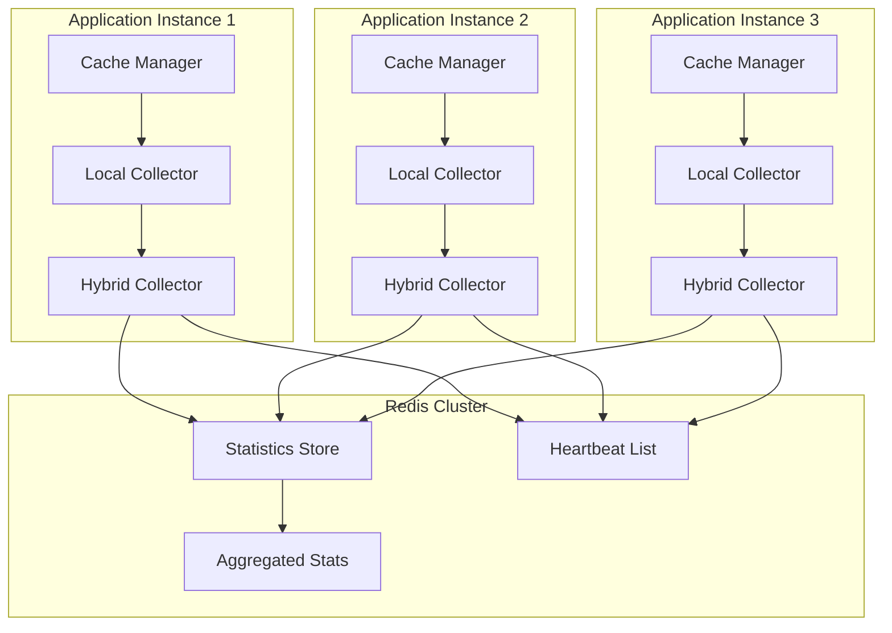

# Distributed Cache Statistics Architecture

## Overview

The Conduit distributed cache statistics system enables accurate cache metrics collection across multiple application instances. This document covers the architecture, configuration, and operational considerations for running cache statistics in a horizontally scaled environment.

## Architecture Overview

### How Statistics are Collected Across Instances

The distributed cache statistics system uses a hybrid approach combining local in-memory collection with Redis-based aggregation:



Each instance:
1. Collects statistics locally using `CacheStatisticsCollector`
2. Periodically flushes local stats to Redis using `RedisCacheStatisticsCollector`
3. Maintains a heartbeat in Redis to indicate it's active
4. Queries aggregated statistics from all active instances

### Redis Storage Structure

Statistics are stored in Redis using the following key structure:

```
# Instance-specific statistics
conduit:cache:stats:{instanceId}:{region} -> Hash
  - hit_count: long
  - miss_count: long
  - size_bytes: long
  - eviction_count: long
  - last_updated: timestamp

# Active instance tracking
conduit:cache:instances -> Sorted Set
  - member: instanceId
  - score: last_heartbeat_timestamp

# Aggregated statistics cache
conduit:cache:stats:aggregated:{region} -> Hash
  - hit_count: long
  - miss_count: long
  - size_bytes: long
  - eviction_count: long
  - last_aggregated: timestamp
  - instance_count: int

# Response time samples
conduit:cache:stats:{instanceId}:{region}:response_times -> List
  - JSON array of response time samples
```

### Aggregation Mechanism

The aggregation process:

1. **Real-time Aggregation**: When statistics are requested, the system:
   - Identifies active instances from the heartbeat list
   - Fetches statistics from each active instance
   - Sums the metrics across all instances
   - Caches the result with a short TTL

2. **Instance Health**: Instances are considered inactive if:
   - No heartbeat for more than 60 seconds
   - Statistics haven't been updated for 5 minutes
   - Instance explicitly deregisters on shutdown

3. **Consistency Model**: The system uses eventual consistency:
   - Local statistics are flushed every 10 seconds
   - Aggregation includes a 1-second grace period
   - Stale data is excluded from aggregation

## Configuration Guide

### Redis Connection Settings

Configure Redis for statistics storage in `appsettings.json`:

```json
{
  "ConnectionStrings": {
    "Redis": "localhost:6379,abortConnect=false,connectTimeout=5000,syncTimeout=5000"
  },
  "CacheStatistics": {
    "Enabled": true,
    "FlushInterval": "00:00:10",
    "AggregationInterval": "00:01:00",
    "RetentionPeriod": "24:00:00",
    "MaxResponseTimeSamples": 1000,
    "EnableBatching": true,
    "BatchSize": 100
  }
}
```

For production environments with Redis Cluster:

```json
{
  "ConnectionStrings": {
    "Redis": "redis-node1:6379,redis-node2:6379,redis-node3:6379,connectRetry=3,abortConnect=false"
  }
}
```

### Instance Identification Setup

Each instance must have a unique identifier:

```csharp
// Option 1: Automatic (uses machine name + process ID)
services.AddCacheManagerWithRedis(redisConnectionString);

// Option 2: Manual configuration
services.Configure<CacheStatisticsOptions>(options =>
{
    options.InstanceId = Environment.GetEnvironmentVariable("INSTANCE_ID") 
        ?? $"{Environment.MachineName}_{Process.GetCurrentProcess().Id}";
});

// Option 3: Kubernetes pod name
services.Configure<CacheStatisticsOptions>(options =>
{
    options.InstanceId = Environment.GetEnvironmentVariable("HOSTNAME") 
        ?? Guid.NewGuid().ToString();
});
```

### TTL and Retention Policies

Configure data retention:

```csharp
services.Configure<CacheStatisticsOptions>(options =>
{
    // How long to keep instance statistics
    options.StatisticsTTL = TimeSpan.FromHours(24);
    
    // How long before an instance is considered dead
    options.InstanceTimeout = TimeSpan.FromMinutes(5);
    
    // How often to clean up stale data
    options.CleanupInterval = TimeSpan.FromHours(1);
    
    // Maximum age for response time samples
    options.ResponseTimeSampleTTL = TimeSpan.FromHours(1);
});
```

## Operations Guide

### Monitoring Statistics Health

Use the built-in health check endpoint:

```bash
# Check overall health
curl http://localhost:5000/health

# Check cache statistics specifically
curl http://localhost:5000/health/cache_statistics
```

Example healthy response:
```json
{
  "status": "Healthy",
  "results": {
    "cache_statistics": {
      "status": "Healthy",
      "data": {
        "ActiveInstances": 3,
        "MissingInstances": 0,
        "RedisConnected": true,
        "AggregationLatencyMs": 45.2,
        "RedisMemoryUsageMB": 124.5,
        "LastSuccessfulAggregation": "2025-01-21T10:30:45Z"
      }
    }
  }
}
```

### Troubleshooting Common Issues

#### Issue: Statistics show zero or incorrect values

**Diagnosis:**
```bash
# Check active instances
redis-cli ZRANGE conduit:cache:instances 0 -1 WITHSCORES

# Verify instance is reporting
redis-cli HGETALL conduit:cache:stats:{instanceId}:ProviderResponses
```

**Solutions:**
1. Verify Redis connectivity from all instances
2. Check instance IDs are unique
3. Ensure statistics are enabled in configuration
4. Review application logs for flush errors

#### Issue: High aggregation latency

**Diagnosis:**
```bash
# Check number of instances
redis-cli ZCARD conduit:cache:instances

# Monitor Redis latency
redis-cli --latency
```

**Solutions:**
1. Enable aggregation caching
2. Reduce number of regions being tracked
3. Optimize Redis configuration (see Performance Tuning)
4. Consider using Redis Cluster for sharding

#### Issue: Memory usage growing unbounded

**Diagnosis:**
```bash
# Check key count
redis-cli DBSIZE

# Find large keys
redis-cli --bigkeys
```

**Solutions:**
1. Verify TTL is being set on keys
2. Enable automatic cleanup
3. Reduce response time sample retention
4. Implement key eviction policies

### Scaling Considerations

#### Vertical Scaling
- Redis memory requirements: ~100KB per instance per region
- CPU usage increases linearly with instance count
- Network bandwidth: ~1KB/s per instance for heartbeats

#### Horizontal Scaling
- Redis can handle 1000+ instances with proper configuration
- Use Redis Cluster for > 100GB statistics data
- Consider regional Redis deployments for geo-distributed apps

#### Scaling Limits
- Maximum recommended instances: 1000 per Redis instance
- Maximum regions: 100 per application
- Aggregation latency target: < 100ms for 100 instances

## Migration Guide

### Moving from In-Memory to Distributed Stats

#### Phase 1: Parallel Operation
```csharp
// Enable both collectors temporarily
services.AddCacheManager(configuration);
services.AddSingleton<IDistributedCacheStatisticsCollector, RedisCacheStatisticsCollector>();
```

#### Phase 2: Verify Distributed Stats
```bash
# Compare local and distributed metrics
curl http://localhost:5000/api/cache/stats/local
curl http://localhost:5000/api/cache/stats/distributed
```

#### Phase 3: Switch to Distributed
```csharp
// Replace configuration
services.AddCacheManagerWithRedis(redisConnectionString);
```

### Zero-Downtime Migration Steps

1. **Deploy with dual collection** (Phase 1)
   - Monitor both metrics for accuracy
   - Verify Redis performance is acceptable

2. **Gradual rollout**
   - Enable on one instance first
   - Monitor for issues
   - Roll out to 10%, 50%, 100% of instances

3. **Cutover**
   - Update all clients to use distributed stats
   - Remove local-only configuration
   - Archive historical local data if needed

### Rollback Procedures

If issues occur during migration:

1. **Immediate rollback**
   ```csharp
   // Revert to local stats
   services.AddCacheManager(configuration);
   ```

2. **Data preservation**
   ```bash
   # Backup Redis statistics
   redis-cli --rdb backup-stats.rdb
   ```

3. **Gradual rollback**
   - Keep Redis stats running
   - Switch reads back to local
   - Debug issues while maintaining service

## Performance Tuning

### Redis Optimization

#### Configuration for Statistics Workload
```
# Redis configuration for statistics
maxmemory 2gb
maxmemory-policy volatile-lru
save ""  # Disable persistence for statistics-only Redis

# Optimize for many small keys
hash-max-ziplist-entries 512
hash-max-ziplist-value 64

# Network optimization
tcp-keepalive 60
timeout 0
```

#### Connection Pool Settings
```csharp
services.AddSingleton<IConnectionMultiplexer>(sp =>
{
    var config = ConfigurationOptions.Parse(connectionString);
    config.ConnectRetry = 3;
    config.ConnectTimeout = 5000;
    config.SyncTimeout = 5000;
    config.AsyncTimeout = 5000;
    config.KeepAlive = 60;
    config.DefaultDatabase = 1; // Separate DB for stats
    
    return ConnectionMultiplexer.Connect(config);
});
```

### Aggregation Caching Strategies

#### Enable Result Caching
```csharp
services.Configure<CacheStatisticsOptions>(options =>
{
    options.EnableAggregationCache = true;
    options.AggregationCacheTTL = TimeSpan.FromSeconds(5);
    options.CacheKeyPrefix = "stats:cache:";
});
```

#### Implement Lazy Aggregation
```csharp
public class LazyAggregationStrategy : IAggregationStrategy
{
    public async Task<CacheStatistics> AggregateAsync(string region)
    {
        // Check cache first
        var cached = await GetCachedAggregation(region);
        if (cached != null) return cached;
        
        // Aggregate in background if needed
        _ = Task.Run(() => RefreshAggregationCache(region));
        
        // Return slightly stale data
        return await GetLastKnownGood(region);
    }
}
```

### Batch Operation Configuration

#### Optimize Batch Sizes
```csharp
services.Configure<CacheStatisticsOptions>(options =>
{
    // Batch Redis operations
    options.EnableBatching = true;
    options.BatchSize = 100;
    options.BatchTimeout = TimeSpan.FromMilliseconds(10);
    
    // Pipeline heartbeats
    options.HeartbeatBatchSize = 50;
});
```

#### Use Redis Pipelining
```csharp
public async Task FlushBatchAsync(IEnumerable<StatisticUpdate> updates)
{
    var batch = _database.CreateBatch();
    var tasks = new List<Task>();
    
    foreach (var update in updates)
    {
        tasks.Add(batch.HashIncrementAsync(
            update.Key, 
            update.Field, 
            update.Increment));
    }
    
    batch.Execute();
    await Task.WhenAll(tasks);
}
```

## Code Examples

### Configuring Distributed Statistics

Basic configuration:
```csharp
public class Startup
{
    public void ConfigureServices(IServiceCollection services)
    {
        // Add distributed cache statistics
        services.AddCacheManagerWithRedis(
            Configuration.GetConnectionString("Redis"),
            options =>
            {
                options.DefaultRegion = CacheRegion.ProviderResponses;
                options.EnableStatistics = true;
            });
        
        // Add monitoring
        services.AddCacheMonitoring(Configuration);
        
        // Add health checks
        services.AddHealthChecks()
            .AddCheck<CacheStatisticsHealthCheckAdapter>("cache_statistics");
    }
}
```

Advanced configuration with custom options:
```csharp
services.Configure<CacheStatisticsOptions>(options =>
{
    options.Enabled = true;
    options.InstanceId = GetInstanceId();
    options.FlushInterval = TimeSpan.FromSeconds(5);
    options.HeartbeatInterval = TimeSpan.FromSeconds(30);
    options.EnableResponseTimeTracking = true;
    options.MaxResponseTimeSamples = 1000;
    
    // Performance optimizations
    options.EnableBatching = true;
    options.BatchSize = 100;
    options.EnableAggregationCache = true;
    options.AggregationCacheTTL = TimeSpan.FromSeconds(10);
});
```

### Querying Aggregated Metrics

#### Basic Usage
```csharp
public class CacheMetricsController : ControllerBase
{
    private readonly ICacheStatisticsCollector _statsCollector;
    
    [HttpGet("cache/stats")]
    public async Task<IActionResult> GetStats()
    {
        var stats = await _statsCollector.GetStatisticsAsync(
            CacheRegion.ProviderResponses);
        
        return Ok(new
        {
            hitRate = stats.HitRate,
            totalRequests = stats.HitCount + stats.MissCount,
            avgResponseTime = stats.AverageGetTime.TotalMilliseconds,
            memorySizeMB = stats.MemoryUsageBytes / (1024.0 * 1024.0)
        });
    }
}
```

#### Advanced Queries
```csharp
public class DetailedMetricsService
{
    private readonly IDistributedCacheStatisticsCollector _distributedStats;
    
    public async Task<CacheHealthReport> GetDetailedHealthAsync()
    {
        var report = new CacheHealthReport();
        
        // Get per-instance statistics
        var perInstance = await _distributedStats.GetPerInstanceStatisticsAsync(
            CacheRegion.ProviderResponses);
        
        report.InstanceCount = perInstance.Count;
        report.HealthyInstances = perInstance.Count(kvp => 
            kvp.Value.LastUpdated > DateTime.UtcNow.AddMinutes(-1));
        
        // Get aggregated stats for all regions
        foreach (var region in Enum.GetValues<CacheRegion>())
        {
            var stats = await _distributedStats.GetAggregatedStatisticsAsync(region);
            report.RegionStats[region] = stats;
        }
        
        // Calculate drift between instances
        report.MaxDriftPercentage = CalculateDrift(perInstance);
        
        return report;
    }
}
```

### Custom Statistics Implementations

#### Extending Statistics Collection
```csharp
public class CustomCacheStatisticsCollector : CacheStatisticsCollector
{
    private readonly IMetricCollector _customMetrics;
    
    protected override async Task OnCacheHitAsync(
        string key, 
        CacheRegion region, 
        TimeSpan responseTime)
    {
        await base.OnCacheHitAsync(key, region, responseTime);
        
        // Add custom metrics
        _customMetrics.RecordCacheHit(region, new
        {
            Key = key,
            ResponseTimeMs = responseTime.TotalMilliseconds,
            Timestamp = DateTime.UtcNow,
            InstanceId = InstanceId
        });
    }
    
    public override async Task<CacheStatistics> GetStatisticsAsync(
        CacheRegion region,
        CancellationToken cancellationToken = default)
    {
        var stats = await base.GetStatisticsAsync(region, cancellationToken);
        
        // Enhance with custom data
        stats.CustomMetrics["p99_response_time"] = 
            await _customMetrics.GetPercentileAsync(region, 99);
        stats.CustomMetrics["error_rate"] = 
            await _customMetrics.GetErrorRateAsync(region);
        
        return stats;
    }
}
```

#### Custom Aggregation Strategy
```csharp
public class WeightedAggregationStrategy : IAggregationStrategy
{
    public async Task<CacheStatistics> AggregateAsync(
        IDictionary<string, CacheStatistics> instanceStats)
    {
        var aggregated = new CacheStatistics();
        var weights = await CalculateInstanceWeights(instanceStats);
        
        foreach (var (instanceId, stats) in instanceStats)
        {
            var weight = weights[instanceId];
            aggregated.HitCount += (long)(stats.HitCount * weight);
            aggregated.MissCount += (long)(stats.MissCount * weight);
            // ... aggregate other metrics with weights
        }
        
        return aggregated;
    }
}
```

### Monitoring Setup

#### Prometheus Integration
```csharp
public class PrometheusStatsExporter : IHostedService
{
    private readonly ICacheStatisticsCollector _stats;
    private readonly Timer _timer;
    
    private readonly Counter _cacheHits = Metrics.CreateCounter(
        "conduit_cache_hits_total", 
        "Total cache hits",
        new[] { "region", "instance" });
    
    private readonly Gauge _hitRate = Metrics.CreateGauge(
        "conduit_cache_hit_rate",
        "Cache hit rate percentage",
        new[] { "region" });
    
    public async Task ExportMetricsAsync()
    {
        foreach (var region in Enum.GetValues<CacheRegion>())
        {
            var stats = await _stats.GetStatisticsAsync(region);
            
            _cacheHits
                .WithLabels(region.ToString(), Environment.MachineName)
                .Inc(stats.HitCount);
            
            _hitRate
                .WithLabels(region.ToString())
                .Set(stats.HitRate);
        }
    }
}
```

#### Custom Health Checks
```csharp
public class CacheStatisticsDriftHealthCheck : IHealthCheck
{
    private readonly IDistributedCacheStatisticsCollector _stats;
    private readonly double _maxDriftPercentage;
    
    public async Task<HealthCheckResult> CheckHealthAsync(
        HealthCheckContext context,
        CancellationToken cancellationToken = default)
    {
        var perInstance = await _stats.GetPerInstanceStatisticsAsync(
            CacheRegion.ProviderResponses, 
            cancellationToken);
        
        var drift = CalculateMaxDrift(perInstance);
        
        if (drift > _maxDriftPercentage)
        {
            return HealthCheckResult.Degraded(
                $"Cache statistics drift ({drift:F1}%) exceeds threshold",
                data: new Dictionary<string, object>
                {
                    ["drift_percentage"] = drift,
                    ["instance_count"] = perInstance.Count
                });
        }
        
        return HealthCheckResult.Healthy();
    }
}
```

## Summary

The distributed cache statistics system provides accurate metrics collection across horizontally scaled applications. Key considerations:

1. **Design for Scale**: The system handles 1000+ instances with proper Redis configuration
2. **Monitor Health**: Use built-in health checks and alerts for operational visibility  
3. **Optimize Performance**: Enable batching, caching, and pipelining for large deployments
4. **Plan Migrations**: Follow the zero-downtime migration guide for smooth transitions
5. **Customize as Needed**: Extend the base implementation for specific requirements

For additional support, consult the monitoring guide at `/monitoring/README.md` or review the implementation in `/ConduitLLM.Core/Services/`.