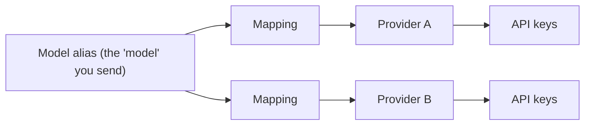

# Conduit core concepts

*Audience: anyone operating or building against a Conduit deployment. This is the mental
model — the objects Conduit is built from and what happens when a request comes in. For the
knobs, see [Configuration](./configuration.md); for what to watch in production, see
[Monitoring](./monitoring.md); for how a provider is chosen, see [Model routing](./routing.md).*

Conduit is an **LLM gateway**: a single, OpenAI-compatible API in front of many upstream
providers. A client authenticates with a **virtual key**, sends a request naming a **model
alias**, and Conduit decides which provider and which account actually serves it, calls
upstream, streams the result back, and bills the request against a prepaid balance. It exists
to give you *one* API, *central* access control and spending limits, and *routing and failover*
across providers you would otherwise juggle by hand.

## Two APIs: data plane and control plane

Conduit is two services with different jobs and different keys:

| | Gateway API | Admin API |
|---|---|---|
| Purpose | Serving inference (chat, embeddings, images, audio, …) | Configuring the system (providers, keys, mappings, costs, limits) |
| Who calls it | Your applications and end users | Operators, and the WebAdmin UI |
| Key | A **virtual key** | The **master key** |
| Default port | 5000 | 5002 |

The **WebAdmin** UI (port 3000) is not a third API tier. Administrators sign in there, and the
browser then talks to the Gateway and Admin APIs directly using short-lived *ephemeral* keys it
mints on demand. Nothing else needs to hold the master key.

### Audio support

Audio is supported through the Gateway API: clients use `/v1/audio/transcriptions` for
speech-to-text and `/v1/audio/speech` for text-to-speech. A model must advertise the matching
`SupportsSpeechToText` or `SupportsTextToSpeech` capability; discovery exposes those flags and
the Gateway rejects an unsupported model before invoking a provider.

WebAdmin deliberately treats audio as API-only. Its chat page does not record, request browser
microphone permission, or upload audio. Administrators can still view and configure the model
capabilities used by API clients.

## The core objects

Everything in Conduit is built from a small set of objects. Understanding how they relate is
most of understanding Conduit.

**Provider** — a configured connection to one upstream account, for example "Production OpenAI"
or "Dev Azure." A provider is identified by its **ID**, not by its type. The *type* only tells
Conduit which API dialect to speak (OpenAI, Anthropic, and so on); you can run several providers
of the same type side by side and Conduit keeps them distinct. When you see "which provider,"
think of a specific instance you configured — never just "OpenAI."

Provider configuration has three deliberately separate owners. The code-level adapter registry
owns immutable protocol defaults such as standard endpoint shapes, authentication behavior, and
the fallback base URL. A provider instance in the database owns operator settings; its `BaseUrl`
overrides the adapter fallback when overrides are supported. OpenAI-compatible/custom providers
always require that database URL. Model and provider-association records own capabilities, because
support varies by model and must not be inferred from a provider-wide code constant.

**Provider key** — the API key or keys Conduit uses to call a provider. A provider can hold
**several** keys so it can spread load and fail over between them. Keys that belong to the same
upstream account are grouped together, so Conduit knows which keys share a rate limit and which
are genuinely independent.

**Model mapping** — the link between a client-facing **alias** (the string you put in the
`model` field) and a concrete provider plus that provider's own model ID. This is the pivotal
object: **many mappings can point the same alias at different providers.** An alias like
`gpt-4o` might map to two OpenAI providers and an Azure one. That one-alias-to-many-providers
fan-out is exactly what makes routing and failover possible — with a single mapping, the alias
simply resolves to that one target.

**Model and cost** — behind a mapping sits the canonical **model** (its capabilities and token
limits) and a **cost** record (how the request is priced). Clients never name these directly;
they are what Conduit uses to validate a request and calculate its bill.

**Virtual key** — the credential your applications send. It controls *who* is calling and *what*
they may do: which models are allowed, rate limits, and so on. A virtual key holds **no money of
its own.**

**Key group (the wallet)** — every virtual key belongs to a group, and the **group** holds the
shared prepaid **balance** and a running **ledger**. Multiple keys in a group draw down one
balance. This is a prepaid, bank-account model — not a per-key monthly budget — as the
[spend section](#how-spend-works) explains.

## How a request flows

When a client calls `POST /v1/chat/completions` (or any Gateway endpoint), the request moves
through a fixed sequence of stages. Each stage has one job, and a request can be turned away at
the early ones before any provider is contacted:

1. **Authenticate** — the virtual key is validated. An invalid or disabled key is rejected here.
   This step only answers "is this a real, active key?" — no spending is checked yet.
2. **Authorize and check balance** — Conduit confirms the requested alias is allowed for this
   key and that the key's group still has a positive balance. A depleted balance returns
   **402 (insufficient balance)** before any provider is called.
3. **Reserve spend (optional)** — depending on configuration, Conduit estimates the request's
   maximum cost and *reserves* it up front, so a burst of concurrent requests cannot overspend a
   balance. This admission step can be turned off, run advisory-only, or strictly enforced.
4. **Resolve the alias** — the alias is looked up to find its candidate mapping or mappings —
   one, or several if the alias fans out to multiple providers.
5. **Select a provider (and prepare to fail over)** — for chat, Conduit *scores* the candidates
   and orders them; for other request types it resolves deterministically to a single mapping.
   If the first choice fails in a retriable way, the next candidate is tried.
   [Model routing](./routing.md) covers the scoring and failover rules in full.
6. **Call the provider** — Conduit calls the chosen provider with that provider's own key and
   model ID, translating the request to and from the provider's dialect.
7. **Return or stream** — the response is returned whole, or streamed back token-by-token over
   Server-Sent Events. Usage (token counts and the like) is captured as it arrives.
8. **Record and bill** — once the response completes, Conduit calculates the cost, writes a
   request log, and **debits the key group's balance**, appending a ledger entry.

The billing step runs even if the client disconnects mid-stream, so usage is never lost.

## How spend works

Conduit's billing is a **prepaid ledger**, and it is worth understanding because it drives the
402s your clients may see:

- **Money lives on the key group, not the individual key.** Credits are added to a group; every
  request its keys make debits that shared balance.
- **The ledger is append-only.** Each debit records the amount and the resulting balance, so you
  get an auditable history rather than a single mutable number.
- **Debits are idempotent.** Conduit records spend through events, and each spend event carries a
  unique identifier, so an at-least-once retry or a reconnect can never charge the same request
  twice.
- **A depleted group returns 402.** When a group's balance reaches zero, its keys start receiving
  402 at stage 2 above until the group is topped up.

This is why a key with plenty of "permissions" can still be refused: authorization (what a key
*may* do) and funding (what its group can *pay for*) are separate concerns.

## What decides which provider serves a request

There are two paths, by request type:

- **Chat completions can be routed.** When an alias fans out to several providers, Conduit scores
  the eligible mappings — balancing cost, speed, and quality, adjusted for provider health and
  prompt-cache affinity — picks the best, and fails over to the next if it stumbles. A global
  switch can disable scored routing and collapse each alias to a single mapping.
- **Everything else resolves deterministically.** Embeddings, images, audio, and the rest resolve
  to a single mapping for the alias, with no scoring and no failover.

The full scoring model, session affinity, and failover and circuit-breaking rules live in
[Model routing](./routing.md).

## Where to go next

- **[Configuration](./configuration.md)** — deploy-time settings (the environment) versus runtime
  settings (managed in the Admin UI), and the knobs behind everything above.
- **[Model routing](./routing.md)** — how a chat request's provider is chosen, and how failover
  behaves.
- **[Monitoring](./monitoring.md)** — health checks, real-time event streams, and spend and
  security alerting.
