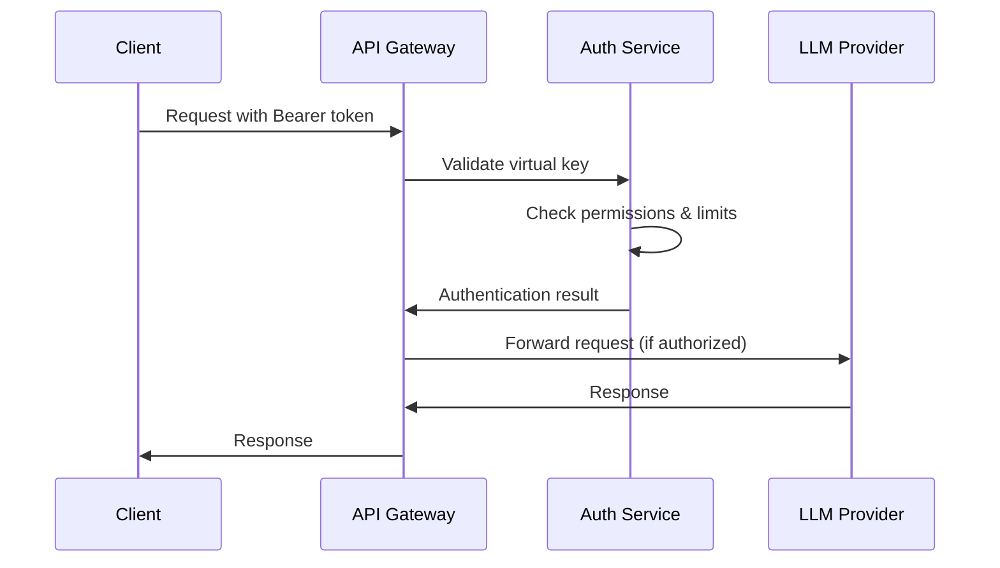

# Security Features and Guidelines

*Last Updated: 2025-08-01*

This guide covers Conduit's comprehensive security features, including authentication, authorization, IP filtering, audit logging, and security monitoring.

## Table of Contents
- [Overview](#overview)
- [Authentication](#authentication)
- [Authorization](#authorization)
- [IP Filtering](#ip-filtering)
- [Audit Logging](#audit-logging)
- [Security Monitoring](#security-monitoring)
- [Data Protection](#data-protection)
- [Best Practices](#best-practices)

## Overview

Conduit implements defense-in-depth security with multiple layers:

- **Authentication**: Virtual keys, master keys, and API authentication
- **Authorization**: Role-based access control and permissions
- **Network Security**: IP filtering and rate limiting
- **Data Protection**: Encryption at rest and in transit
- **Audit Logging**: Comprehensive request and access tracking
- **Monitoring**: Real-time security event detection
- **Content Filtering**: PII detection and content moderation

## Authentication

### Virtual Key Authentication

Virtual keys are the primary authentication method for API access:

```bash
# Create a virtual key
curl -X POST "https://admin.conduit.ai/api/virtual-keys" \
  -H "X-Master-Key: your-master-key" \
  -H "Content-Type: application/json" \
  -d '{
    "name": "My Application Key",
    "spendingLimit": 100.00,
    "canUseTextGeneration": true,
    "canUseAudioTranscription": false,
    "allowedIPs": ["192.168.1.0/24"]
  }'
```

**Virtual Key Features:**
- Scoped permissions (text, audio, image generation)
- Spending limits and budget controls
- IP address restrictions
- Request rate limiting
- Usage tracking and analytics

### Master Key Authentication

Master keys provide administrative access to the Admin API:

```bash
# Set master key in environment
export CONDUIT_MASTER_KEY="your-secure-master-key"

# Use in API calls
curl -X GET "https://admin.conduit.ai/api/providers" \
  -H "X-Master-Key: your-secure-master-key"
```

**Master Key Security:**
- Full administrative access
- Should be rotated regularly
- Stored securely (environment variables, key vaults)
- Logged extensively for audit purposes

### API Authentication Flow



## Authorization

### Permission Model

Virtual keys have granular permissions:

```json
{
  "virtualKeyId": "vk_123",
  "permissions": {
    "canUseTextGeneration": true,
    "canUseImageGeneration": true,
    "canUseAudioTranscription": true,
    "canUseTextToSpeech": false,
    "canUseRealtimeAudio": false,
    "canUseVideoGeneration": false,
    "canAccessAdminFeatures": false
  },
  "limits": {
    "requestsPerMinute": 60,
    "requestsPerHour": 1000,
    "requestsPerDay": 10000,
    "spendingLimit": 100.00,
    "maxConcurrentRequests": 5,
    "maxConcurrentRealtimeSessions": 2
  }
}
```

### Model Access Control

Control which models a virtual key can access:

```bash
# Restrict to specific models
curl -X PUT "https://admin.conduit.ai/api/virtual-keys/vk_123" \
  -H "X-Master-Key: your-master-key" \
  -H "Content-Type: application/json" \
  -d '{
    "allowedModels": ["gpt-4", "gpt-4-turbo", "claude-3-sonnet"],
    "blockedModels": ["gpt-4o", "claude-3-opus"]
  }'
```

### Admin Access Control

Admin API uses role-based authentication:

```csharp
[Authorize(Policy = "MasterKeyOnly")]
[ApiController]
[Route("api/admin")]
public class AdminController : ControllerBase
{
    // Only accessible with valid master key
}

[Authorize(Policy = "VirtualKeyOrMaster")]
[ApiController] 
[Route("api/usage")]
public class UsageController : ControllerBase
{
    // Accessible with virtual key or master key
}
```

## IP Filtering

### Global IP Filtering

Configure system-wide IP access controls:

```bash
# Add global IP rule
curl -X POST "https://admin.conduit.ai/api/security/ip-rules" \
  -H "X-Master-Key: your-master-key" \
  -H "Content-Type: application/json" \
  -d '{
    "name": "Block suspicious IPs",
    "ipAddress": "192.168.100.0/24",
    "action": "Block",
    "priority": 100,
    "isEnabled": true
  }'
```

### Virtual Key IP Restrictions

Restrict virtual keys to specific IP addresses:

```json
{
  "virtualKeyId": "vk_123",
  "ipFiltering": {
    "enabled": true,
    "allowedIPs": [
      "192.168.1.0/24",      // Office network
      "10.0.0.100",          // Specific server
      "203.0.113.0/24"       // External partner
    ],
    "blockedIPs": [
      "198.51.100.50"        // Known bad actor
    ]
  }
}
```

### IP Filtering Implementation

```csharp
public class IPFilteringMiddleware
{
    public async Task InvokeAsync(HttpContext context, RequestDelegate next)
    {
        var clientIP = context.Connection.RemoteIpAddress;
        var virtualKey = await GetVirtualKeyFromRequest(context);
        
        if (virtualKey?.IPFiltering?.Enabled == true)
        {
            if (!IsIPAllowed(clientIP, virtualKey.IPFiltering))
            {
                context.Response.StatusCode = 403;
                await context.Response.WriteAsync("IP address not allowed");
                return;
            }
        }
        
        await next(context);
    }
    
    private bool IsIPAllowed(IPAddress clientIP, IPFilteringConfig config)
    {
        // Check blocked IPs first
        if (config.BlockedIPs.Any(blocked => IsIPInRange(clientIP, blocked)))
            return false;
            
        // Check allowed IPs
        return config.AllowedIPs.Any(allowed => IsIPInRange(clientIP, allowed));
    }
}
```

## Audit Logging

### Request Logging

All API requests are logged with detailed information:

```json
{
  "requestId": "req_abc123",
  "timestamp": "2025-08-01T12:00:00Z",
  "virtualKeyId": "vk_123", 
  "clientIP": "192.168.1.100",
  "userAgent": "MyApp/1.0",
  "method": "POST",
  "path": "/v1/chat/completions",
  "model": "gpt-4",
  "provider": "OpenAI Production",
  "tokensUsed": 150,
  "cost": 0.0045,
  "responseTime": 850,
  "statusCode": 200,
  "errorCode": null
}
```

### Security Event Logging

Security-related events are logged separately:

```json
{
  "eventId": "sec_def456",
  "timestamp": "2025-08-01T12:00:00Z",
  "eventType": "AUTHENTICATION_FAILURE",
  "severity": "WARNING",
  "clientIP": "203.0.113.50",
  "virtualKeyId": "vk_invalid",
  "details": {
    "reason": "Invalid virtual key",
    "userAgent": "curl/7.68.0",
    "path": "/v1/chat/completions"
  },
  "countryCode": "US",
  "isSuspicious": false
}
```

### Audit Query API

Query audit logs through the Admin API:

```bash
# Get security events
curl -X GET "https://admin.conduit.ai/api/security/events" \
  -H "X-Master-Key: your-master-key" \
  -G \
  -d "startDate=2025-08-01T00:00:00Z" \
  -d "endDate=2025-08-01T23:59:59Z" \
  -d "eventType=AUTHENTICATION_FAILURE" \
  -d "limit=100"

# Get usage logs for specific virtual key
curl -X GET "https://admin.conduit.ai/api/usage/logs" \
  -H "X-Master-Key: your-master-key" \
  -G \
  -d "virtualKeyId=vk_123" \
  -d "startDate=2025-08-01" \
  -d "limit=50"
```

## Security Monitoring

### Real-Time Security Events

Security events are broadcast via SignalR for real-time monitoring:

```javascript
// Connect to security monitoring hub
const connection = new signalR.HubConnectionBuilder()
    .withUrl('/hubs/security-monitoring', {
        accessTokenFactory: () => masterKey
    })
    .build();

// Subscribe to security events
connection.on('SecurityAlert', (alert) => {
    console.log('Security Alert:', alert);
    
    if (alert.severity === 'CRITICAL') {
        notifySecurityTeam(alert);
    }
});
```

### Anomaly Detection

Automated detection of suspicious patterns:

```json
{
  "anomalyId": "anom_789",
  "type": "UNUSUAL_REQUEST_PATTERN",
  "severity": "HIGH",
  "description": "Virtual key vk_123 made 1000 requests in 5 minutes",
  "virtualKeyId": "vk_123",
  "metrics": {
    "requestsPerMinute": 200,
    "normalBaseline": 10,
    "deviationScore": 95.5
  },
  "recommendedAction": "RATE_LIMIT_TIGHTENING",
  "autoMitigated": true
}
```

### Security Metrics Dashboard

Key security metrics to monitor:

- **Authentication Failures**: Failed login attempts
- **Rate Limit Violations**: Requests exceeding limits  
- **IP Filtering Blocks**: Blocked request attempts
- **Unusual Usage Patterns**: Anomalous request behavior
- **Cost Threshold Breaches**: Spending limit violations
- **Geographic Anomalies**: Requests from unexpected locations

## Data Protection

### Encryption

**In Transit:**
- TLS 1.3 for all HTTPS connections
- WebSocket Secure (WSS) for real-time connections
- Certificate pinning for critical connections

**At Rest:**
- AES-256 encryption for API keys
- Database-level encryption for sensitive data
- Encrypted backups and logs

### PII Detection and Filtering

Automatic detection of personally identifiable information:

```json
{
  "contentFiltering": {
    "enabled": true,
    "piiDetection": {
      "enabled": true,
      "types": ["email", "phone", "ssn", "credit_card"],
      "action": "REDACT", // REDACT, BLOCK, ALERT
      "alertOnDetection": true
    },
    "customPatterns": [
      {
        "name": "Internal Employee ID",
        "pattern": "EMP\\d{6}",
        "action": "REDACT"
      }
    ]
  }
}
```

### Content Moderation

Filter inappropriate content in requests and responses:

```json
{
  "contentModeration": {
    "enabled": true,
    "categories": {
      "profanity": "BLOCK",
      "hate_speech": "BLOCK", 
      "violence": "ALERT",
      "adult_content": "REDACT"
    },
    "customBlocklist": [
      "sensitive-term-1",
      "sensitive-term-2"
    ]
  }
}
```

### Data Retention

Configure data retention policies:

```json
{
  "dataRetention": {
    "requestLogs": "90 days",
    "auditLogs": "2 years",
    "securityEvents": "1 year",
    "usageMetrics": "13 months",
    "encryptedApiKeys": "indefinite"
  }
}
```

## Security Monitoring Implementation

### Security Event Types

```csharp
public enum SecurityEventType
{
    AuthenticationFailure,
    AuthorizationDenied,
    RateLimitExceeded,
    IPBlocked,
    SuspiciousPattern,
    UnusualUsage,
    CostThresholdBreached,
    ContentFiltered,
    APIKeyCompromised,
    GeographicAnomaly
}
```

### Event Detection Service

```csharp
public class SecurityEventMonitoringService
{
    public async Task<SecurityEvent> DetectAndLogEventAsync(
        HttpContext context, 
        VirtualKey virtualKey, 
        SecurityEventType eventType)
    {
        var securityEvent = new SecurityEvent
        {
            EventType = eventType,
            Timestamp = DateTime.UtcNow,
            ClientIP = context.Connection.RemoteIpAddress?.ToString(),
            VirtualKeyId = virtualKey?.Id,
            UserAgent = context.Request.Headers["User-Agent"],
            Path = context.Request.Path,
            Severity = DetermineSeverity(eventType),
            Details = ExtractEventDetails(context, eventType)
        };
        
        await _repository.LogSecurityEventAsync(securityEvent);
        await _notificationService.NotifySecurityTeamAsync(securityEvent);
        
        return securityEvent;
    }
}
```

### Automated Response System

```csharp
public class SecurityResponseService
{
    public async Task<SecurityResponse> RespondToEventAsync(SecurityEvent securityEvent)
    {
        var response = new SecurityResponse();
        
        switch (securityEvent.EventType)
        {
            case SecurityEventType.RateLimitExceeded:
                await TightenRateLimitsAsync(securityEvent.VirtualKeyId);
                response.Action = "Rate limits tightened";
                break;
                
            case SecurityEventType.SuspiciousPattern:
                await TemporarilyDisableKeyAsync(securityEvent.VirtualKeyId);
                response.Action = "Virtual key temporarily disabled";
                break;
                
            case SecurityEventType.IPBlocked:
                await AddIPToBlocklistAsync(securityEvent.ClientIP);
                response.Action = "IP added to blocklist";
                break;
        }
        
        return response;
    }
}
```

## Best Practices

### Virtual Key Security

1. **Principle of Least Privilege**: Grant minimal required permissions
2. **Regular Rotation**: Rotate keys every 90 days
3. **Environment Separation**: Use different keys for dev/staging/prod
4. **IP Restrictions**: Limit access to known IP ranges
5. **Spending Limits**: Set appropriate budget controls
6. **Monitor Usage**: Track unusual patterns and anomalies

### Network Security

1. **IP Allowlisting**: Restrict access to trusted networks
2. **Rate Limiting**: Configure appropriate request limits
3. **TLS Configuration**: Use TLS 1.3 with strong cipher suites
4. **Certificate Management**: Regular certificate rotation
5. **DDoS Protection**: Implement rate limiting and traffic filtering

### Operational Security

1. **Security Monitoring**: Enable real-time security alerts
2. **Audit Logging**: Log all security-relevant events
3. **Incident Response**: Have procedures for security incidents
4. **Regular Reviews**: Periodic access and configuration reviews
5. **Security Training**: Keep team updated on security best practices

### API Security

1. **Input Validation**: Validate all API inputs
2. **Output Sanitization**: Sanitize responses to prevent data leakage
3. **Error Handling**: Don't expose sensitive information in errors
4. **Request Signing**: Consider HMAC signing for high-security scenarios
5. **Content Filtering**: Enable PII detection and content moderation

## Security Configuration Examples

### High-Security Environment

```json
{
  "securityConfig": {
    "authentication": {
      "requireStrongKeys": true,
      "keyRotationDays": 30,
      "maxFailedAttempts": 3,
      "lockoutDurationMinutes": 15
    },
    "network": {
      "ipFiltering": {
        "enabled": true,
        "defaultAction": "BLOCK",
        "allowedNetworks": ["10.0.0.0/8", "192.168.0.0/16"]
      },
      "rateLimiting": {
        "requestsPerMinute": 30,
        "burstLimit": 10,
        "penaltyDurationMinutes": 5
      }
    },
    "monitoring": {
      "realTimeAlerts": true,
      "anomalyDetection": true,
      "geoLocationTracking": true,
      "contentFiltering": true
    },
    "audit": {
      "logLevel": "VERBOSE",
      "retentionDays": 730,
      "encryptLogs": true,
      "immutableStorage": true
    }
  }
}
```

### Development Environment

```json
{
  "securityConfig": {
    "authentication": {
      "requireStrongKeys": false,
      "keyRotationDays": 90,
      "maxFailedAttempts": 10
    },
    "network": {
      "ipFiltering": {
        "enabled": false
      },
      "rateLimiting": {
        "requestsPerMinute": 100,
        "burstLimit": 50
      }
    },
    "monitoring": {
      "realTimeAlerts": false,
      "anomalyDetection": false,
      "contentFiltering": false
    },
    "audit": {
      "logLevel": "STANDARD", 
      "retentionDays": 30
    }
  }
}
```

## Incident Response

### Security Incident Workflow

1. **Detection**: Automated monitoring or manual reporting
2. **Assessment**: Evaluate severity and potential impact
3. **Containment**: Immediate actions to limit damage
4. **Investigation**: Root cause analysis and evidence collection
5. **Recovery**: Restore normal operations
6. **Lessons Learned**: Update procedures and controls

### Automated Incident Response

```csharp
public class IncidentResponseService
{
    public async Task HandleIncidentAsync(SecurityIncident incident)
    {
        // Immediate containment
        switch (incident.Severity)
        {
            case Severity.Critical:
                await DisableAffectedKeysAsync(incident.AffectedKeys);
                await BlockSuspiciousIPsAsync(incident.SuspiciousIPs);
                await NotifySecurityTeamAsync(incident, urgent: true);
                break;
                
            case Severity.High:
                await TightenSecurityControlsAsync(incident.AffectedKeys);
                await NotifySecurityTeamAsync(incident, urgent: false);
                break;
        }
        
        // Document incident
        await _incidentRepository.LogIncidentAsync(incident);
        
        // Schedule follow-up actions
        await ScheduleIncidentReviewAsync(incident);
    }
}
```

## Compliance and Standards

### SOC 2 Compliance

Conduit implements SOC 2 Type II controls:

- **Security**: Access controls, encryption, monitoring
- **Availability**: High availability, disaster recovery
- **Processing Integrity**: Data validation, error handling
- **Confidentiality**: Data classification, access restrictions
- **Privacy**: PII handling, consent management

### GDPR Compliance

For EU data processing:

- **Data Minimization**: Collect only necessary data
- **Consent Management**: Track and respect user consent
- **Right to Erasure**: Support data deletion requests
- **Data Portability**: Export user data on request
- **Breach Notification**: 72-hour breach reporting

### Industry Standards

- **OWASP Top 10**: Protection against common web vulnerabilities
- **NIST Cybersecurity Framework**: Risk management approach
- **ISO 27001**: Information security management
- **PCI DSS**: Payment card data protection (if applicable)

## Related Documentation

- [Virtual Keys Guide](../user-guides/virtual-keys.md)
- [IP Filtering Configuration](../admin-api/security-endpoints.md)
- [Audit Logging Setup](../monitoring-setup.md)
- [Admin API Security](../EPIC-Admin-API-Security-Features.md)
- [SignalR Authentication](../features/signalr/authentication.md)

---

*This security guide consolidates information from multiple security-related documents. For specific implementation details, see the individual feature documentation.*