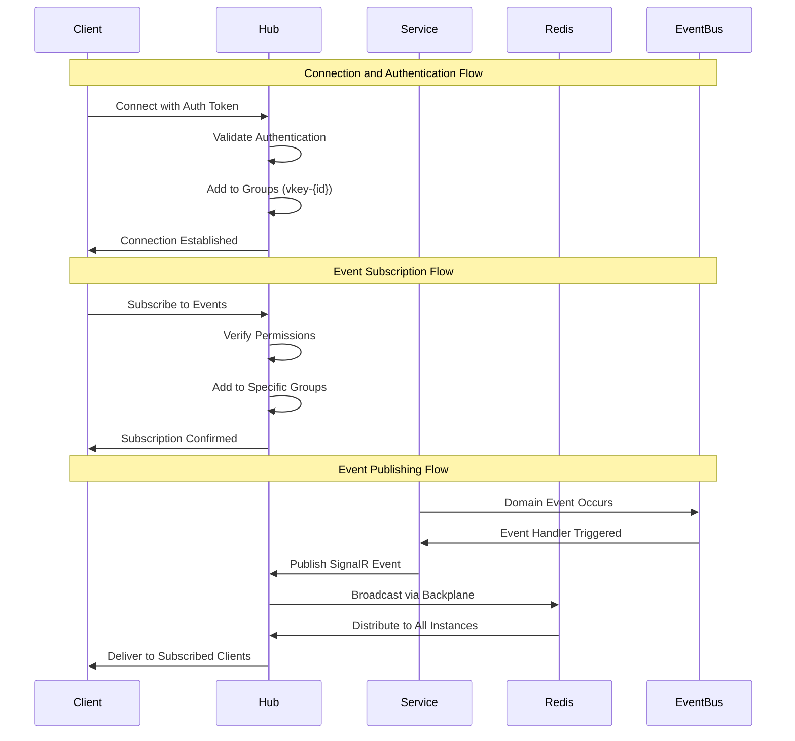
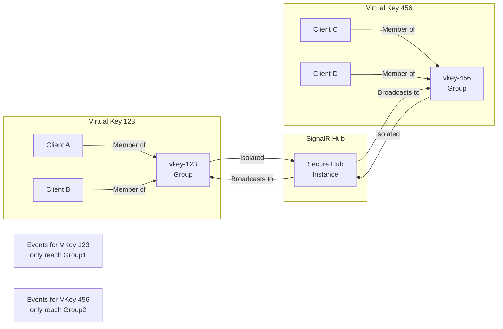
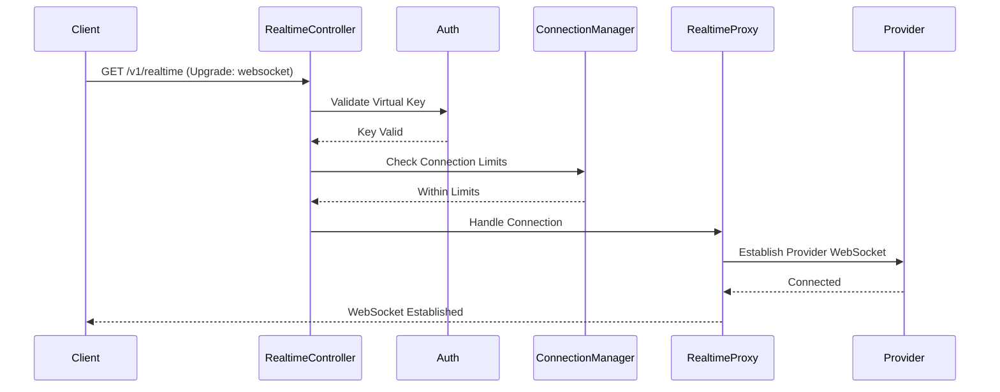
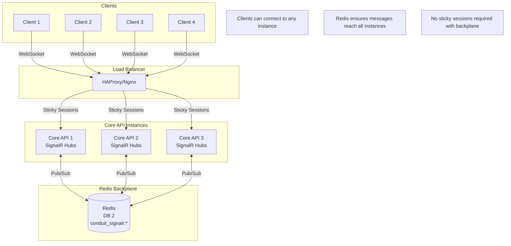
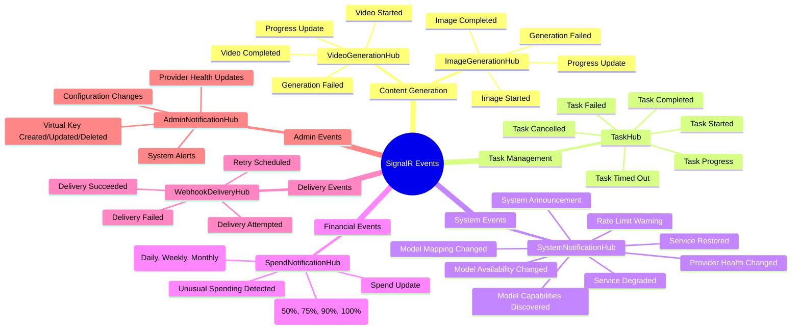
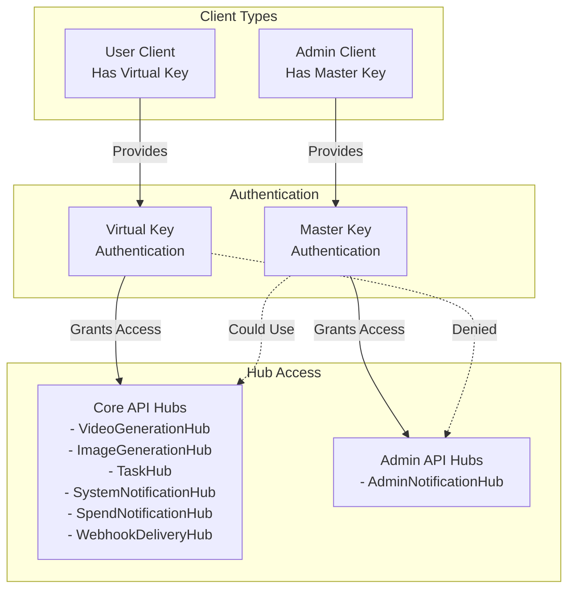

# SignalR Architecture

This document provides a comprehensive overview of the SignalR architecture in Conduit, covering system architecture, hub design, connection management, data flow patterns, and scaling considerations.

## Table of Contents

- [System Architecture Overview](#system-architecture-overview)
- [Hub Architecture](#hub-architecture)
- [Data Flow Patterns](#data-flow-patterns)
- [Connection Management Architecture](#connection-management-architecture)
- [Real-time Connection Architecture](#real-time-connection-architecture)
- [Redis Backplane Architecture](#redis-backplane-architecture)
- [Event-Driven Patterns](#event-driven-patterns)
- [Authentication and Security](#authentication-and-security)
- [Scaling Architecture](#scaling-architecture)
- [Best Practices](#best-practices)

## System Architecture Overview

```mermaid
graph TB
    subgraph "Client Applications"
        WebUI[WebUI<br/>Blazor App]
        AdminUI[Admin UI<br/>Management]
        SDK[External SDK<br/>Clients]
    end
    
    subgraph "SignalR Hubs - Core API"
        subgraph "Base Classes"
            BaseHub[BaseHub<br/>No Auth]
            SecureHub[SecureHub<br/>Virtual Key Auth]
        end
        
        subgraph "Content Generation"
            VideoHub[VideoGenerationHub<br/>/hubs/video-generation]
            ImageHub[ImageGenerationHub<br/>/hubs/image-generation]
        end
        
        subgraph "Task Management"
            TaskHub[TaskHub<br/>/hubs/tasks]
        end
        
        subgraph "Notifications"
            SystemHub[SystemNotificationHub<br/>/hubs/notifications]
            SpendHub[SpendNotificationHub<br/>/hubs/spend]
            WebhookHub[WebhookDeliveryHub<br/>/hubs/webhooks]
        end
    end
    
    subgraph "SignalR Hubs - Admin API"
        AdminHub[AdminNotificationHub<br/>/hubs/admin-notifications<br/>Master Key Auth]
    end
    
    subgraph "Backend Services"
        VideoService[Video Generation<br/>Service]
        ImageService[Image Generation<br/>Service]
        TaskService[Task Processing<br/>Service]
        SpendService[Spend Tracking<br/>Service]
        WebhookService[Webhook Delivery<br/>Service]
        HealthService[Provider Health<br/>Service]
        AdminService[Admin Services]
    end
    
    subgraph "Infrastructure"
        Redis[(Redis Backplane<br/>DB 2)]
        MassTransit[MassTransit<br/>Event Bus]
    end
    
    %% Client connections
    WebUI -->|Virtual Key| VideoHub
    WebUI -->|Virtual Key| ImageHub
    WebUI -->|Virtual Key| TaskHub
    WebUI -->|Virtual Key| SystemHub
    WebUI -->|Virtual Key| SpendHub
    WebUI -->|Virtual Key| WebhookHub
    
    AdminUI -->|Master Key| AdminHub
    
    SDK -->|Virtual Key| TaskHub
    SDK -->|Virtual Key| SystemHub
    
    %% Inheritance
    SecureHub -.->|inherits| BaseHub
    VideoHub -.->|inherits| SecureHub
    ImageHub -.->|inherits| SecureHub
    TaskHub -.->|inherits| SecureHub
    SystemHub -.->|inherits| SecureHub
    SpendHub -.->|inherits| SecureHub
    WebhookHub -.->|inherits| SecureHub
    
    %% Service to Hub connections
    VideoService -->|publishes| VideoHub
    ImageService -->|publishes| ImageHub
    TaskService -->|publishes| TaskHub
    SpendService -->|publishes| SpendHub
    WebhookService -->|publishes| WebhookHub
    HealthService -->|publishes| SystemHub
    HealthService -->|publishes| AdminHub
    AdminService -->|publishes| AdminHub
    
    %% Infrastructure connections
    VideoHub -.->|scales via| Redis
    ImageHub -.->|scales via| Redis
    TaskHub -.->|scales via| Redis
    SystemHub -.->|scales via| Redis
    SpendHub -.->|scales via| Redis
    WebhookHub -.->|scales via| Redis
    AdminHub -.->|scales via| Redis
    
    MassTransit -->|triggers| VideoService
    MassTransit -->|triggers| ImageService
    MassTransit -->|triggers| SpendService
    MassTransit -->|triggers| HealthService
```



## Hub Architecture

### Base Hub Classes

The SignalR architecture uses a hierarchical structure with base classes providing common functionality:

- **BaseHub**: Provides basic functionality without authentication
- **SecureHub**: Extends BaseHub with Virtual Key authentication

### Content Generation Hubs

- **VideoGenerationHub** (`/hubs/video-generation`): Handles video generation progress and completion events
- **ImageGenerationHub** (`/hubs/image-generation`): Manages image generation workflows

### Notification Hubs

- **SystemNotificationHub** (`/hubs/notifications`): System-wide notifications and provider health updates
- **SpendNotificationHub** (`/hubs/spend`): Budget and spending alerts
- **WebhookDeliveryHub** (`/hubs/webhooks`): Webhook delivery status notifications

### Admin Hub

- **AdminNotificationHub** (`/hubs/admin-notifications`): Admin-specific notifications with Master Key authentication

## Data Flow Patterns

### Standard Event Flow



### Group Isolation



## Connection Management Architecture

### Centralized Connection Management

The Conduit WebUI implements a centralized SignalR connection management architecture to eliminate duplicate connections and provide a single source of truth for all SignalR connections.

#### Problem Solved

The previous implementation had:
- 6+ distinct connection management implementations
- Massive code duplication across components
- Inconsistent state management and naming conventions
- Resource waste from multiple connections to the same hub
- Maintenance complexity requiring changes in multiple locations

#### Solution Components

**1. Centralized JavaScript Service**

File: `/wwwroot/js/conduit-signalr-service.js`

```javascript
// Singleton pattern ensures one instance
window.conduitSignalR = window.ConduitSignalRService.getInstance();

// Features:
// - Multi-hub support with connection pooling
// - Unified connection state management
// - Event-driven architecture
// - Performance metrics tracking
// - Automatic reconnection with exponential backoff
// - Message queuing during disconnections
```

**2. Pure UI Components**

- **ConnectionStatusIndicatorV2**: Pure UI component that listens to centralized connection state events
- **SpendNotificationListenerV2**: Lightweight wrapper using centralized service

**3. C# Connection Manager**

File: `/Services/SignalRConnectionManager.cs`

```csharp
public class SignalRConnectionManager
{
    // Connect to hub with single method
    public async Task<HubConnectionInfo> ConnectToHubAsync(
        string hubName, 
        string? authKey = null, 
        HubConnectionOptions? options = null)
    
    // Get connection state
    public async Task<ConnectionState> GetConnectionStateAsync(string hubName)
    
    // Get performance metrics
    public async Task<HubMetrics?> GetHubMetricsAsync(string hubName)
}
```

### Event-Driven Architecture

#### Global Connection Events

The centralized service emits standardized events for all connection state changes:

```javascript
// Event format
window.dispatchEvent(new CustomEvent('conduit:{hubName}:stateChanged', {
    detail: {
        hubName: 'spend-notifications',
        currentState: 'connected',
        previousState: 'connecting',
        timestamp: Date.now()
    }
}));
```

#### Event Types

1. **stateChanged**: Connection state transitions
2. **reconnecting**: Reconnection attempts with retry info
3. **reconnected**: Successful reconnection
4. **connectionClosed**: Connection closure with error details
5. **connectionFailed**: Terminal connection failure

## Real-time Connection Architecture

For real-time audio streaming, Conduit implements a specialized WebSocket proxy architecture that bridges client applications with provider-specific real-time APIs.

### Core Components

```
┌─────────────┐     WebSocket      ┌──────────────────┐     WebSocket      ┌──────────────┐
│   Client    │◄──────────────────►│  Conduit Proxy   │◄─────────────────►│   Provider   │
│ Application │                     │                  │                    │ (OpenAI, etc)│
└─────────────┘                     └──────────────────┘                    └──────────────┘
                                            │
                                            ▼
                                    ┌──────────────────┐
                                    │Message Translator│
                                    └──────────────────┘
```

### Real-time Components

**1. RealtimeController**: Entry point for real-time connections
**2. RealtimeProxyService**: Core proxy managing bidirectional message flow
**3. RealtimeConnectionManager**: Manages active connections and enforces limits
**4. RealtimeSessionStore**: Session state management with hybrid storage
**5. Message Translators**: Provider-specific protocol translation

### Connection Lifecycle



## Redis Backplane Architecture

### Scaling with Redis



### Redis Configuration

- **Database**: Redis DB 2
- **Key Pattern**: `conduit_signalr:*`
- **Purpose**: Message distribution across multiple API instances
- **Benefits**: Horizontal scaling without sticky sessions

## Event-Driven Patterns

### Event Categories by Hub



## Authentication and Security

### Authentication Flow



### Security Features

- **Virtual Key Authentication**: All Core API hubs require valid virtual keys
- **Master Key Authentication**: Admin hubs require master key access
- **Group Isolation**: Events are isolated by virtual key using SignalR groups
- **Connection Limits**: Per-key and system-wide connection limits
- **Message Validation**: All messages validated before processing

## Scaling Architecture

### Benefits of Centralized Management

1. **Single Source of Truth**
   - One connection per hub regardless of consuming components
   - Consistent state across entire application
   - Centralized configuration and policies

2. **Resource Efficiency**
   - Connection pooling prevents duplicate connections
   - Shared reconnection logic reduces overhead
   - Unified message queuing during disconnections

3. **Improved Maintainability**
   - Changes only needed in centralized service
   - Consistent error handling and logging
   - Simplified debugging with central monitoring

4. **Better User Experience**
   - Consistent connection indicators across UI
   - Unified reconnection behavior
   - Accurate connection state reporting

### Horizontal Scaling

- **Load Balancer**: Distributes client connections across API instances
- **Redis Backplane**: Ensures messages reach all connected clients regardless of instance
- **Stateless Design**: No server-side session state beyond Redis
- **Auto-scaling**: API instances can be added/removed dynamically

## Best Practices

### Component Design

1. **Keep components focused on their primary purpose**
2. **Delegate all connection management to centralized service**
3. **Use event-driven patterns for state updates**
4. **Avoid direct SignalR connection management in components**

### Error Handling

1. **Let centralized service handle connection errors**
2. **Focus component error handling on business logic**
3. **Use consistent error reporting patterns**
4. **Implement graceful degradation for connection failures**

### Performance

1. **Reuse existing connections via centralized service**
2. **Avoid polling for connection state**
3. **Use event listeners for real-time updates**
4. **Implement connection pooling and resource limits**

### Development Workflow

1. **Use ConnectionStatusIndicatorV2 for status display**
2. **Inject SignalRConnectionManager for connection management**
3. **Create thin wrappers for hub-specific functionality**
4. **Test components independently of connection logic**

### Monitoring and Debugging

#### Browser Console

```javascript
// Get connection states
conduitSignalR.getActiveConnections()

// Check specific hub
conduitSignalR.getConnectionState('spend-notifications')

// View metrics
conduitSignalR.getMetrics('spend-notifications')

// Enable debug mode
conduitSignalR.setDebugMode(true)
```

#### Component Diagnostics

```csharp
// Get all connections
var connections = SignalR.GetAllConnections();

// Check hub metrics
var metrics = await SignalR.GetHubMetricsAsync("hub-name");
```

## Configuration Examples

### Provider Configuration (Real-time)

```json
{
  "Realtime": {
    "Providers": {
      "openai": {
        "WebSocketUrl": "wss://api.openai.com/v1/realtime",
        "Models": ["gpt-4o-realtime-preview"],
        "Subprotocols": ["realtime.openai.com"],
        "Headers": {
          "OpenAI-Beta": "realtime=v1"
        }
      },
      "elevenlabs": {
        "WebSocketUrl": "wss://api.elevenlabs.io/v1/convai/conversation",
        "Models": ["conversational-v1"]
      }
    }
  }
}
```

### Connection Options (Real-time)

```csharp
public class RealtimeConnectionOptions
{
    public int MaxConnectionsPerKey { get; set; } = 5;
    public int MaxTotalConnections { get; set; } = 1000;
    public TimeSpan ConnectionTimeout { get; set; } = TimeSpan.FromMinutes(30);
    public TimeSpan StaleConnectionCheckInterval { get; set; } = TimeSpan.FromMinutes(5);
}
```

## Future Enhancements

### Planned Improvements

1. **Connection Health Dashboard**: Visual representation of all hub connections
2. **Automatic Failover**: Switch between SignalR and polling based on connection health
3. **Connection Policies**: Hub-specific reconnection and timeout policies
4. **Metrics Dashboard**: Real-time performance monitoring across all hubs
5. **Connection Prioritization**: Ensure critical hubs reconnect first

### Real-time Enhancements

1. **Advanced Analytics**: Detailed conversation analytics and insights
2. **Multi-provider Sessions**: Simultaneous multi-provider support
3. **Session Recording**: Optional recording with compliance controls
4. **Real-time Translation**: Cross-language conversation support
5. **Custom Models**: Support for fine-tuned conversational models
6. **Voice Biometrics**: Speaker identification and verification

---

This architecture document provides a comprehensive overview of the SignalR implementation in Conduit, covering both standard SignalR hubs for notifications and the specialized real-time WebSocket proxy for audio streaming. The centralized connection management approach ensures efficient resource usage, consistent user experience, and simplified maintenance across the entire system.