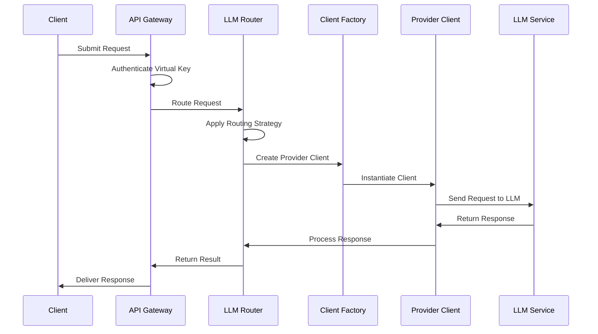
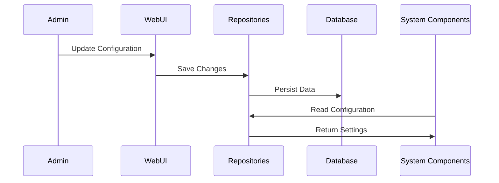
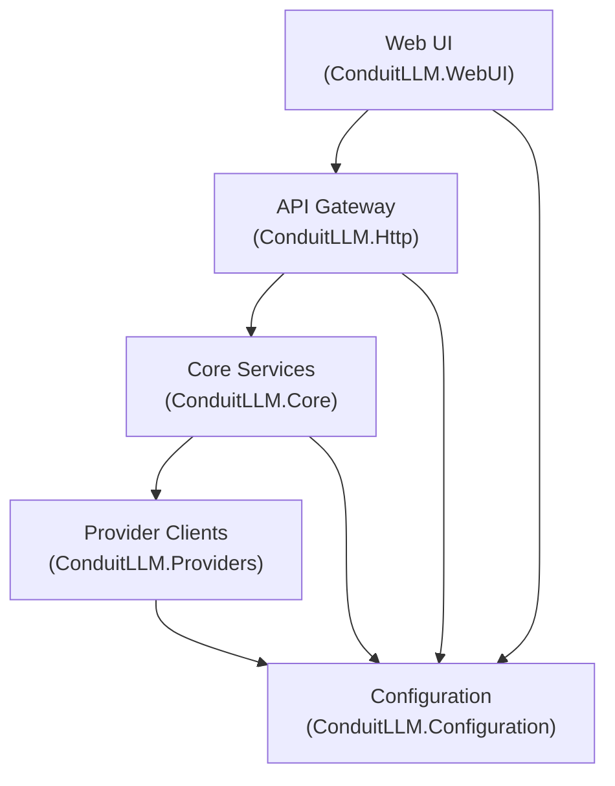

# Components

This document provides a detailed description of each component in the Conduit architecture and their interactions.

## Component Overview

Conduit is organized into several major components:

1. **API Gateway (ConduitLLM.Http)**
2. **Core Services (ConduitLLM.Core)**
3. **Provider Clients (ConduitLLM.Providers)**
4. **Configuration (ConduitLLM.Configuration)**
5. **Web UI (ConduitLLM.WebUI)**
6. **Supporting Services**

## API Gateway (ConduitLLM.Http)

The API Gateway serves as the entry point for all client requests to the LLM services.

### Key Classes

- **Program.cs**: Application startup and service configuration
- **LlmApiController**: Handles API requests for LLM operations
- **ProviderModelsController**: Exposes available models
- **HealthController**: Provides system health information

### Responsibilities

- **Authentication**: Validates virtual keys
- **Authorization**: Enforces permissions based on virtual key settings
- **Request Validation**: Ensures requests are well-formed
- **Rate Limiting**: Enforces usage limits for virtual keys
- **Request Tracking**: Logs requests for monitoring and billing
- **Health Reporting**: Provides system status information

### Interactions

- Communicates with **Core Services** to route requests
- Interacts with **Configuration** for authentication and settings
- Sends tracking data to the logging system

## Core Services (ConduitLLM.Core)

The Core Services module contains the central business logic of the system.

### Key Classes

- **ILLMRouter**: Interface for the routing service
- **DefaultLLMRouter**: Default implementation of the router
- **ILLMClientFactory**: Creates provider-specific clients
- **IContextManager**: Manages conversation context
- **ICostCalculationService**: Calculates request costs
- **ITokenCounter**: Counts tokens for various operations

### Responsibilities

- **Request Routing**: Determines which provider to use
- **Provider Selection**: Applies routing strategies
- **Token Counting**: Estimates token usage
- **Cost Calculation**: Determines the cost of requests
- **Context Management**: Handles conversation state
- **Error Handling**: Processes provider errors

### Interactions

- Uses **Provider Clients** to communicate with LLM services
- Reads configuration from **Configuration** services
- Provides routing and selection capabilities to the **API Gateway**

## Provider Clients (ConduitLLM.Providers)

The Provider Clients module contains the implementations for communicating with different LLM providers.

### Key Classes

- **BaseLLMClient**: Abstract base class for all providers
- **OpenAIClient**, **AnthropicClient**, etc.: Provider-specific implementations
- **ILLMClient**: Interface for all LLM clients
- **LLMClientFactory**: Creates appropriate clients based on provider
- **ResiliencePolicies**: Defines retry and circuit-breaker policies

### Responsibilities

- **API Communication**: Handles HTTP requests to provider APIs
- **Request Transformation**: Converts internal models to provider formats
- **Response Parsing**: Converts provider responses to standard format
- **Error Handling**: Processes provider-specific errors
- **Resilience**: Implements retries and circuit breakers
- **Streaming**: Handles streaming responses from providers

### Interactions

- Communicates directly with external **LLM Providers**
- Is instantiated and managed by **Core Services**
- Reads credentials from **Configuration**

## Configuration (ConduitLLM.Configuration)

The Configuration module manages all system settings and data storage.

### Key Classes

- **ConfigurationDbContext**: EF Core database context
- **IVirtualKeyRepository**: Repository for virtual key management
- **IProviderCredentialRepository**: Repository for provider credentials
- **IModelProviderMappingRepository**: Repository for model mappings
- **IRequestLogRepository**: Repository for request logs

### Responsibilities

- **Data Access**: Provides repositories for data access
- **Settings Management**: Stores and retrieves system settings
- **Credential Management**: Securely stores provider credentials
- **Model Mapping**: Manages virtual model to provider model mappings
- **Usage Tracking**: Stores request logs and usage statistics

### Interactions

- Used by all other components for configuration and data access
- Interacts with the database for persistent storage
- Exposes repositories used by the **Web UI** and other components

## Web UI (ConduitLLM.WebUI)

The Web UI provides a user-friendly interface for managing Conduit.

### Key Components

- **Pages**: Razor pages for UI views
- **Controllers**: Backend controllers for UI operations
- **Services**: UI-specific services for data processing
- **Components**: Reusable UI components

### Responsibilities

- **Configuration Management**: UI for system settings
- **Virtual Key Management**: Create and manage virtual keys
- **Provider Management**: Configure providers and credentials
- **Model Mapping**: Define model mappings
- **Monitoring**: View logs, costs, and usage statistics
- **Testing Interface**: Interactive chat interface for testing

### Interactions

- Communicates with **Configuration** for data access
- Uses **API Gateway** for test requests
- Provides user interface for all management operations

## Supporting Services

### Cache Service

- **ICacheService**: Interface for caching operations
- **RedisCacheService**: Redis implementation
- **CacheMetricsService**: Tracks cache performance

### Routing Strategies

- **IModelSelectionStrategy**: Interface for selection strategies
- Strategy implementations: **Priority**, **LeastCost**, **RoundRobin**, etc.
- **ModelSelectionStrategyFactory**: Creates appropriate strategies

### Token Counting

- **ITokenCounter**: Interface for token counting
- **TiktokenCounter**: Implementation using Tiktoken

### Health Monitoring

- **ProviderHealthService**: Monitors provider availability
- **HealthCheckService**: Performs system health checks

## Component Interactions

### Request Processing Flow

### Configuration Flow

## Component Dependencies

## Extension Points

Conduit is designed with several extension points for customization:

### Custom Providers

1. Implement the **ILLMClient** interface
2. Register in the **LLMClientFactory**
3. Add provider-specific configuration

### Custom Routing Strategies

1. Implement the **IModelSelectionStrategy** interface
2. Register in the **ModelSelectionStrategyFactory**
3. Configure as the active strategy

### Custom Cache Providers

1. Implement the **ICacheService** interface
2. Register in the dependency injection container
3. Configure as the active cache provider

## Next Steps

- [Repository Pattern](repository-pattern): How data access is implemented
- [API Gateway](../features/api-gateway): Details on the API Gateway
- [Model Routing](../features/model-routing): Deep dive into routing strategies