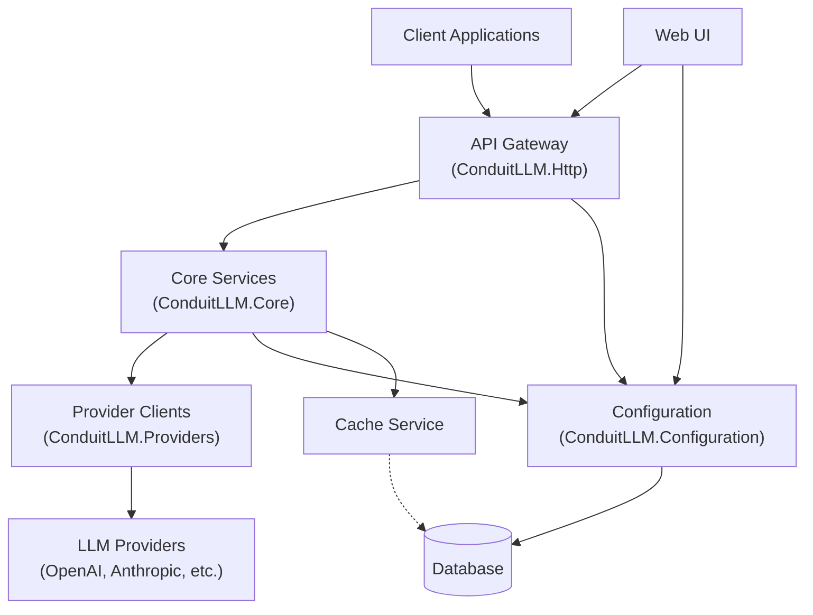
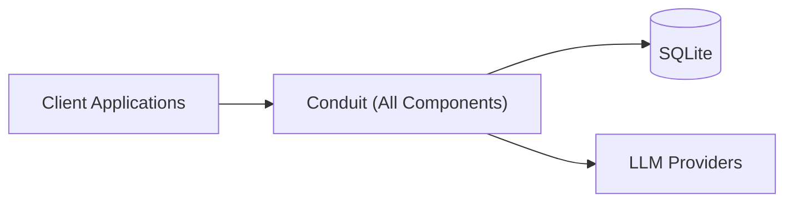
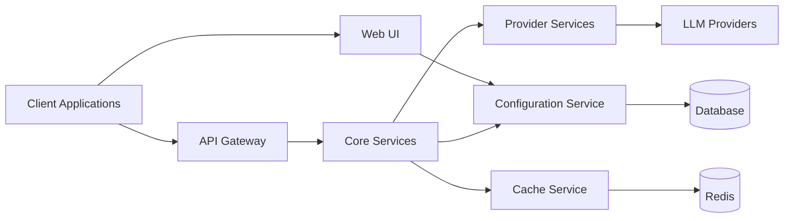

# Architecture Overview

Conduit is built with a modern, modular architecture that prioritizes maintainability, extensibility, and performance. This document provides a high-level overview of the system's architecture.

## System Architecture

## Key Components

### API Gateway (ConduitLLM.Http)

The API Gateway serves as the entry point for all client requests. It handles:

- Authentication and authorization
- Request validation
- Rate limiting
- Request logging
- Response formatting

### Core Services (ConduitLLM.Core)

The Core Services module contains the core business logic, including:

- Request routing
- Context management
- Token counting
- Cost calculation
- Router configuration

### Provider Clients (ConduitLLM.Providers)

The Provider Clients module handles communication with various LLM providers:

- Provider-specific API clients
- Request/response mapping
- Error handling and retries
- Model capability detection
- Token utilization tracking

### Configuration (ConduitLLM.Configuration)

The Configuration module manages all system settings and data storage:

- Model mappings
- Provider credentials
- Router settings
- Virtual keys
- Request logs
- Usage statistics

### Web UI (ConduitLLM.WebUI)

The Web UI provides a user-friendly interface for:

- System configuration
- Virtual key management
- Usage monitoring
- Cost tracking
- Request logging
- Testing capabilities

### Cache Service

The Cache Service improves performance and reduces costs by:

- Storing responses for identical requests
- Supporting multiple cache providers (in-memory, Redis)
- Implementing configurable TTL and cache strategies
- Tracking cache performance metrics

## Data Flow

1. **Request Flow**:
   - Client sends a request to the API Gateway
   - Gateway authenticates the request using a virtual key
   - Router selects the appropriate provider and model
   - Provider client communicates with the LLM service
   - Response is returned to the client

2. **Configuration Flow**:
   - Admin updates settings via Web UI
   - Configuration is stored in the database
   - Changes are applied immediately through in-memory cache
   - Components read configuration as needed

3. **Monitoring Flow**:
   - All requests are logged to the database
   - Usage metrics are calculated and stored
   - Cost data is aggregated for reporting
   - Health checks monitor provider availability

## Core Design Principles

### Abstraction and Standardization

Conduit abstracts the differences between LLM providers, presenting a unified API to client applications. This abstraction allows for:

- Provider independence
- Consistent interface
- Simplified client development
- Enhanced flexibility

### Modularity and Extensibility

The system is designed with a modular architecture that enables:

- Easy addition of new providers
- Customization of routing strategies
- Extensibility through plug-in mechanisms
- Clean separation of concerns

### Resilience and Reliability

Reliability features include:

- Fallback mechanisms for provider failures
- Circuit breakers to prevent cascading failures
- Comprehensive error handling
- Request retries with exponential backoff

### Security

Security is a primary concern, implemented through:

- Virtual key authentication
- Fine-grained permission control
- Secure credential storage
- Rate limiting and abuse prevention

## Technology Stack

Conduit is built using modern .NET technologies:

- **.NET 8**: Core runtime and framework
- **ASP.NET Core**: Web API and UI framework
- **Entity Framework Core**: Data access and ORM
- **Redis** (optional): Distributed caching
- **SQLite/PostgreSQL**: Data storage

## Deployment Architecture

Conduit can be deployed in various configurations:

### Single-Server Deployment

### Microservices Deployment

## Next Steps

- [Components](components): Detailed information about each component
- [Repository Pattern](repository-pattern): How data access is implemented
- [Virtual Keys](../features/virtual-keys): Authentication and authorization
- [Model Routing](../features/model-routing): Request routing mechanisms