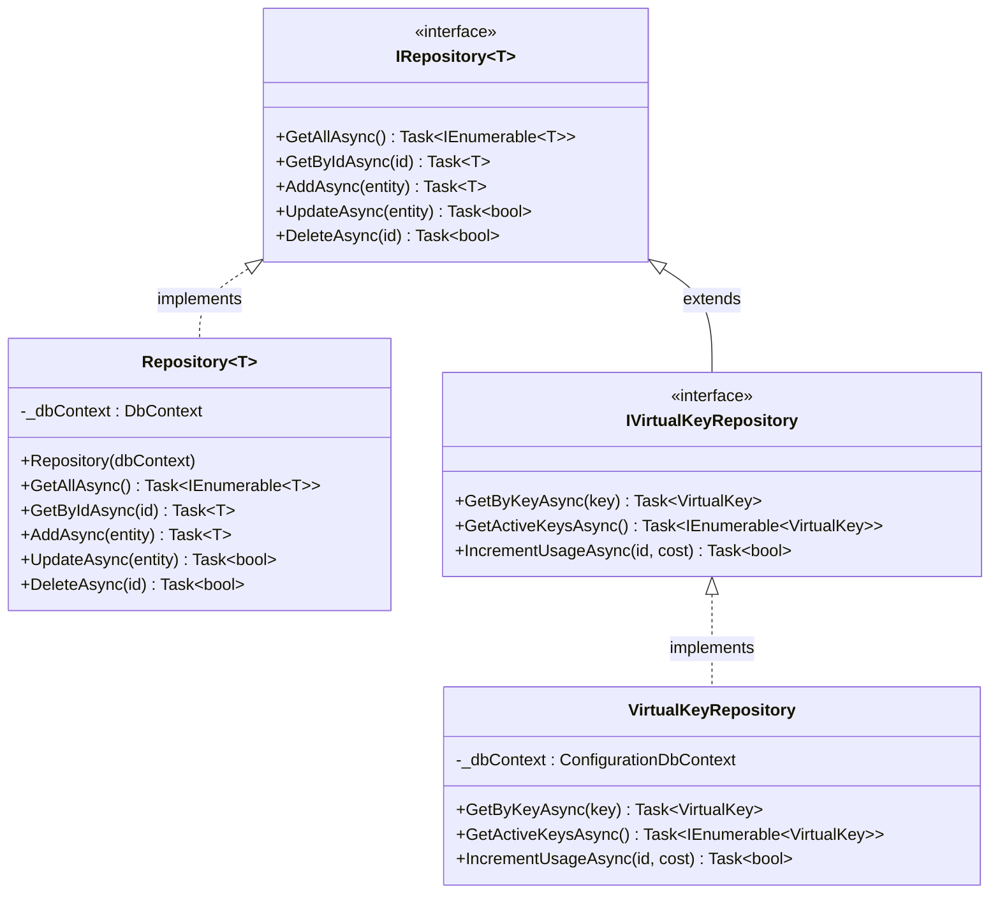

# Repository Pattern Implementation

Conduit implements the Repository Pattern to abstract and encapsulate data access logic. This approach provides a clean separation between the data access layer and business logic, making the code more maintainable and testable.

## Overview

The Repository Pattern provides several benefits:

- **Abstraction**: Hides data access implementation details
- **Decoupling**: Reduces dependencies between components
- **Testability**: Simplifies unit testing with mock repositories
- **Consistency**: Provides a uniform way to access data
- **Centralization**: Centralizes data access logic and validation

## Implementation Structure



## Core Interfaces

### Generic Repository Interface

The `IRepository<T>` interface defines standard CRUD operations:

```csharp
public interface IRepository<T> where T : class
{
    Task<IEnumerable<T>> GetAllAsync();
    Task<T> GetByIdAsync(string id);
    Task<T> AddAsync(T entity);
    Task<bool> UpdateAsync(T entity);
    Task<bool> DeleteAsync(string id);
}
```

### Entity-Specific Repositories

Entity-specific repositories extend the generic interface with specialized methods:

```csharp
public interface IVirtualKeyRepository : IRepository<VirtualKey>
{
    Task<VirtualKey> GetByKeyAsync(string key);
    Task<IEnumerable<VirtualKey>> GetActiveKeysAsync();
    Task<bool> IncrementUsageAsync(string id, decimal cost);
    // ...other specialized methods
}
```

## Repository Implementations

Each repository interface has a corresponding implementation that interacts with the database:

```csharp
public class VirtualKeyRepository : IVirtualKeyRepository
{
    private readonly ConfigurationDbContext _dbContext;

    public VirtualKeyRepository(ConfigurationDbContext dbContext)
    {
        _dbContext = dbContext;
    }

    public async Task<VirtualKey> GetByKeyAsync(string key)
    {
        return await _dbContext.VirtualKeys
            .Include(vk => vk.AllowedModels)
            .FirstOrDefaultAsync(vk => vk.Key == key && vk.IsActive);
    }

    // ...other method implementations
}
```

## Database Context

The repositories use Entity Framework Core's `DbContext` for data access:

```csharp
public class ConfigurationDbContext : DbContext, IConfigurationDbContext
{
    public ConfigurationDbContext(DbContextOptions<ConfigurationDbContext> options)
        : base(options)
    {
    }

    public DbSet<VirtualKey> VirtualKeys { get; set; }
    public DbSet<ProviderCredential> ProviderCredentials { get; set; }
    public DbSet<ModelProviderMapping> ModelProviderMappings { get; set; }
    public DbSet<RequestLog> RequestLogs { get; set; }
    // ...other entity sets

    protected override void OnModelCreating(ModelBuilder modelBuilder)
    {
        base.OnModelCreating(modelBuilder);
        
        // Configure entity relationships and constraints
        modelBuilder.ApplyConfigurationsFromAssembly(typeof(ConfigurationDbContext).Assembly);
    }
}
```

## Entity Configuration

Entity configurations are defined using the Fluent API:

```csharp
public class VirtualKeyConfiguration : IEntityTypeConfiguration<VirtualKey>
{
    public void Configure(EntityTypeBuilder<VirtualKey> builder)
    {
        builder.HasKey(vk => vk.Id);
        
        builder.Property(vk => vk.Key)
            .IsRequired()
            .HasMaxLength(100);
            
        builder.Property(vk => vk.Name)
            .IsRequired()
            .HasMaxLength(100);
            
        builder.HasIndex(vk => vk.Key)
            .IsUnique();
            
        builder.HasMany(vk => vk.AllowedModels)
            .WithOne(am => am.VirtualKey)
            .HasForeignKey(am => am.VirtualKeyId)
            .OnDelete(DeleteBehavior.Cascade);
    }
}
```

## Dependency Injection

Repositories are registered in the dependency injection container:

```csharp
public static class ServiceCollectionExtensions
{
    public static IServiceCollection AddRepositories(this IServiceCollection services, 
        RepositoryPatternOptions options)
    {
        // Register DB context
        services.AddDbContext<ConfigurationDbContext>(opt => 
            opt.UseSqlite(options.ConnectionString));
            
        // Register repositories
        services.AddScoped<IVirtualKeyRepository, VirtualKeyRepository>();
        services.AddScoped<IProviderCredentialRepository, ProviderCredentialRepository>();
        services.AddScoped<IModelProviderMappingRepository, ModelProviderMappingRepository>();
        services.AddScoped<IRequestLogRepository, RequestLogRepository>();
        // ...other repositories
        
        return services;
    }
}
```

## Using Repositories

Services depend on repository interfaces, not implementations:

```csharp
public class VirtualKeyService : IVirtualKeyService
{
    private readonly IVirtualKeyRepository _virtualKeyRepository;
    
    public VirtualKeyService(IVirtualKeyRepository virtualKeyRepository)
    {
        _virtualKeyRepository = virtualKeyRepository;
    }
    
    public async Task<VirtualKeyDto> CreateVirtualKeyAsync(CreateVirtualKeyRequestDto request)
    {
        // Business logic...
        
        var virtualKey = new VirtualKey
        {
            Name = request.Name,
            Description = request.Description,
            Key = GenerateKey(),
            // ...other properties
        };
        
        var result = await _virtualKeyRepository.AddAsync(virtualKey);
        
        // Map to DTO and return...
    }
    
    // ...other methods
}
```

## Unit Testing

The Repository Pattern simplifies unit testing by allowing repository interfaces to be mocked:

```csharp
public class VirtualKeyServiceTests
{
    private readonly Mock<IVirtualKeyRepository> _mockRepository;
    private readonly IVirtualKeyService _service;
    
    public VirtualKeyServiceTests()
    {
        _mockRepository = new Mock<IVirtualKeyRepository>();
        _service = new VirtualKeyService(_mockRepository.Object);
    }
    
    [Fact]
    public async Task CreateVirtualKey_WithValidRequest_ReturnsVirtualKey()
    {
        // Arrange
        var request = new CreateVirtualKeyRequestDto
        {
            Name = "Test Key",
            Description = "For testing"
        };
        
        _mockRepository
            .Setup(r => r.AddAsync(It.IsAny<VirtualKey>()))
            .ReturnsAsync((VirtualKey vk) => vk);
        
        // Act
        var result = await _service.CreateVirtualKeyAsync(request);
        
        // Assert
        Assert.NotNull(result);
        Assert.Equal(request.Name, result.Name);
        _mockRepository.Verify(r => r.AddAsync(It.IsAny<VirtualKey>()), Times.Once);
    }
}
```

## Advanced Features

### Generic Repository Base

A generic repository base class reduces code duplication:

```csharp
public abstract class RepositoryBase<T> : IRepository<T> where T : class
{
    protected readonly ConfigurationDbContext DbContext;
    
    protected RepositoryBase(ConfigurationDbContext dbContext)
    {
        DbContext = dbContext;
    }
    
    public virtual async Task<IEnumerable<T>> GetAllAsync()
    {
        return await DbContext.Set<T>().ToListAsync();
    }
    
    public virtual async Task<T> GetByIdAsync(string id)
    {
        return await DbContext.Set<T>().FindAsync(id);
    }
    
    public virtual async Task<T> AddAsync(T entity)
    {
        DbContext.Set<T>().Add(entity);
        await DbContext.SaveChangesAsync();
        return entity;
    }
    
    // ...other methods
}
```

### Specification Pattern

For complex queries, Conduit uses the Specification Pattern:

```csharp
public interface ISpecification<T>
{
    Expression<Func<T, bool>> Criteria { get; }
    List<Expression<Func<T, object>>> Includes { get; }
    List<string> IncludeStrings { get; }
}

public abstract class BaseSpecification<T> : ISpecification<T>
{
    public Expression<Func<T, bool>> Criteria { get; private set; }
    public List<Expression<Func<T, object>>> Includes { get; } = new List<Expression<Func<T, object>>>();
    public List<string> IncludeStrings { get; } = new List<string>();
    
    protected BaseSpecification(Expression<Func<T, bool>> criteria)
    {
        Criteria = criteria;
    }
    
    protected virtual void AddInclude(Expression<Func<T, object>> includeExpression)
    {
        Includes.Add(includeExpression);
    }
    
    protected virtual void AddInclude(string includeString)
    {
        IncludeStrings.Add(includeString);
    }
}
```

Usage example:

```csharp
public class ActiveVirtualKeysSpecification : BaseSpecification<VirtualKey>
{
    public ActiveVirtualKeysSpecification() 
        : base(vk => vk.IsActive)
    {
        AddInclude(vk => vk.AllowedModels);
    }
}
```

## Next Steps

- [API Gateway](../features/api-gateway): Learn about the API Gateway
- [Virtual Keys](../features/virtual-keys): Learn about virtual key management
- [Database Setup](../guides/environment-variables): Configure database settings