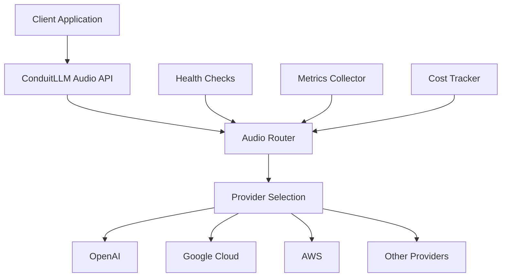

# Audio Services

ConduitLLM provides comprehensive audio processing capabilities through a unified API that supports Speech-to-Text (transcription), Text-to-Speech (TTS), and real-time bidirectional audio streaming across multiple providers.

## Overview

The audio services in ConduitLLM offer:

- **Unified Interface**: Single API for all audio operations across providers
- **Provider Flexibility**: Switch between providers without changing code
- **Advanced Features**: Real-time streaming, voice cloning, and conversational AI
- **Production Ready**: Built-in monitoring, health checks, and error handling
- **Cost Optimization**: Automatic routing based on cost, quality, or latency

## Supported Providers

### Currently Available

| Provider | Transcription | Text-to-Speech | Real-time Audio | Notes |
|----------|--------------|----------------|-----------------|-------|
| **OpenAI** | ✅ Whisper | ✅ TTS | ✅ GPT-4o Realtime | Industry standard, excellent quality |
| **Azure OpenAI** | ✅ Whisper | ✅ TTS | ✅ | Microsoft-hosted, enterprise SLAs |
| **Google Cloud** | ✅ Speech-to-Text | ✅ Text-to-Speech | ❌ | Wide language support |
| **AWS** | ✅ Transcribe | ✅ Polly | ❌ | Cost-effective, good integration |
| **ElevenLabs** | ❌ | ✅ Premium TTS | ✅ Conversational | Best-in-class voice quality |
| **Ultravox** | ❌ | ❌ | ✅ | Ultra-low latency telephony |
| **Groq** | ✅ Whisper | ❌ | ❌ | Fastest transcription available |
| **Deepgram** | ✅ | ❌ | ✅ | Real-time STT specialist |

## Core Capabilities

### Speech-to-Text (Transcription)

Convert audio files or streams into text with support for:
- 50+ languages with automatic detection
- Multiple output formats (text, JSON, SRT, VTT)
- Word-level timestamps and confidence scores
- Speaker diarization (provider-dependent)
- Custom vocabulary and acoustic models

### Text-to-Speech (TTS)

Generate natural-sounding speech from text:
- Multiple voices per provider (100+ total)
- Voice cloning capabilities (ElevenLabs)
- Emotional and style control
- SSML support for advanced control
- Streaming for low-latency applications

### Real-time Audio

Enable interactive voice conversations:
- Bidirectional audio streaming
- Sub-100ms latency options
- Voice activity detection (VAD)
- Interruption handling
- Function calling during conversations

## Architecture



## Key Features

### 1. Intelligent Routing

The audio router automatically selects the best provider based on:
- **Cost Optimization**: Choose the cheapest provider for the request
- **Quality Priority**: Select providers with highest accuracy
- **Latency Requirements**: Route to fastest responding provider
- **Language Expertise**: Match provider strengths to language
- **Availability**: Automatic failover when providers are down

### 2. Production Monitoring

Built-in observability features:
- **Health Checks**: Continuous provider availability monitoring
- **Metrics Collection**: Prometheus-compatible metrics
- **Distributed Tracing**: Correlation IDs across all requests
- **Performance Tracking**: Latency and throughput monitoring
- **Cost Attribution**: Per-request cost tracking

### 3. Security & Compliance

Enterprise-grade security features:
- **Audio Encryption**: AES-256-GCM for data at rest and in transit
- **PII Detection**: Automatic detection and redaction
- **Content Filtering**: Block inappropriate content
- **Audit Logging**: Complete audit trail for compliance
- **Access Control**: Virtual key-based permissions

### 4. Advanced Audio Processing

Additional capabilities:
- **Format Conversion**: Automatic audio format handling
- **Quality Enhancement**: Noise reduction and normalization
- **Caching**: Intelligent caching for repeated requests
- **Batch Processing**: Efficient handling of multiple files
- **Webhook Support**: Async processing with callbacks

## Quick Start

### Basic Transcription

```csharp
// Get a transcription client
var client = conduit.GetClient("whisper-1");
if (client is IAudioTranscriptionClient transcriptionClient)
{
    var request = new AudioTranscriptionRequest
    {
        AudioData = File.ReadAllBytes("audio.mp3"),
        Language = "en",
        ResponseFormat = TranscriptionFormat.Json
    };
    
    var response = await transcriptionClient.TranscribeAudioAsync(request);
    Console.WriteLine($"Transcription: {response.Text}");
}
```

### Text-to-Speech

```csharp
// Generate speech from text
var client = conduit.GetClient("tts-1");
if (client is ITextToSpeechClient ttsClient)
{
    var request = new TextToSpeechRequest
    {
        Input = "Hello, this is a test of the audio system.",
        Voice = "nova",
        ResponseFormat = AudioFormat.Mp3
    };
    
    var response = await ttsClient.CreateSpeechAsync(request);
    File.WriteAllBytes("output.mp3", response.AudioData);
}
```

### Real-time Conversation

```csharp
// Create an interactive voice session
var client = conduit.GetClient("gpt-4o-realtime");
if (client is IRealtimeAudioClient realtimeClient)
{
    var config = new RealtimeSessionConfig
    {
        Model = "gpt-4o-realtime-preview",
        Voice = "alloy",
        SystemPrompt = "You are a helpful assistant."
    };
    
    var session = await realtimeClient.CreateSessionAsync(config);
    // Stream audio in both directions...
}
```

## Best Practices

1. **Choose the Right Provider**: Match provider capabilities to your use case
2. **Handle Errors Gracefully**: Implement retry logic and fallback providers
3. **Optimize for Cost**: Use caching and batch processing where possible
4. **Monitor Performance**: Track latency and success rates
5. **Secure Your Audio**: Enable encryption for sensitive content

## Next Steps

- [Audio Provider Configuration](audio-providers.md) - Set up specific providers
- [Audio API Reference](../api-reference/audio.md) - Detailed API documentation
- [Monitoring Guide](../monitoring/metrics-monitoring.md) - Track audio service performance
- [Cost Management](../guides/budget-management.md) - Control audio processing costs