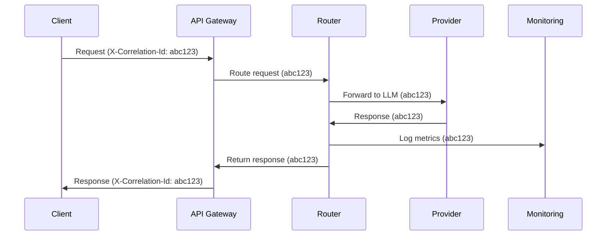

# Correlation ID Tracking and Distributed Tracing

ConduitLLM implements comprehensive distributed tracing through correlation IDs, enabling you to track requests across all services and components for debugging, monitoring, and auditing purposes.

## Overview

Correlation ID tracking provides:
- **End-to-end request tracing**: Follow a request through all components
- **Cross-service correlation**: Track requests across microservices
- **Enhanced debugging**: Quickly find related logs and events
- **Performance analysis**: Identify bottlenecks in request flow
- **Audit compliance**: Complete request history for regulatory needs

## How It Works

### Correlation ID Flow



### Automatic ID Generation

If a client doesn't provide a correlation ID, ConduitLLM automatically generates one:

```csharp
public class CorrelationIdMiddleware
{
    public async Task InvokeAsync(HttpContext context, RequestDelegate next)
    {
        var correlationId = context.Request.Headers["X-Correlation-Id"].FirstOrDefault()
            ?? context.Request.Headers["X-Request-Id"].FirstOrDefault()
            ?? Guid.NewGuid().ToString();
        
        context.Items["CorrelationId"] = correlationId;
        context.Response.Headers.Add("X-Correlation-Id", correlationId);
        
        using (_logger.BeginScope(new Dictionary<string, object>
        {
            ["CorrelationId"] = correlationId
        }))
        {
            await next(context);
        }
    }
}
```

## Using Correlation IDs

### Client-Side Implementation

#### Providing Correlation ID

```bash
# Using curl
curl -X POST https://api.conduit.example.com/v1/chat/completions \
  -H "X-Virtual-Key: your-key" \
  -H "X-Correlation-Id: user-123-session-456-req-789" \
  -d '{"model": "gpt-4", "messages": [{"role": "user", "content": "Hello"}]}'
```

#### Python Client

```python
import requests
import uuid

def make_request_with_correlation(prompt, correlation_id=None):
    if correlation_id is None:
        correlation_id = f"py-{uuid.uuid4()}"
    
    headers = {
        "X-Virtual-Key": "your-key",
        "X-Correlation-Id": correlation_id
    }
    
    response = requests.post(
        "https://api.conduit.example.com/v1/chat/completions",
        headers=headers,
        json={
            "model": "gpt-4",
            "messages": [{"role": "user", "content": prompt}]
        }
    )
    
    # Correlation ID is returned in response headers
    response_correlation_id = response.headers.get("X-Correlation-Id")
    print(f"Request tracked with ID: {response_correlation_id}")
    
    return response.json()
```

#### JavaScript/TypeScript Client

```typescript
class ConduitClient {
    private baseUrl: string;
    private apiKey: string;
    
    async createCompletion(
        messages: Message[], 
        correlationId?: string
    ): Promise<CompletionResponse> {
        const headers = {
            'Content-Type': 'application/json',
            'X-Virtual-Key': this.apiKey,
            'X-Correlation-Id': correlationId || `js-${crypto.randomUUID()}`
        };
        
        const response = await fetch(`${this.baseUrl}/v1/chat/completions`, {
            method: 'POST',
            headers,
            body: JSON.stringify({ model: 'gpt-4', messages })
        });
        
        // Extract correlation ID from response
        const responseCorrelationId = response.headers.get('X-Correlation-Id');
        console.log(`Request tracked: ${responseCorrelationId}`);
        
        return response.json();
    }
}
```

### Server-Side Access

#### Accessing in Controllers

```csharp
[ApiController]
[Route("v1")]
public class ChatController : ControllerBase
{
    [HttpPost("chat/completions")]
    public async Task<IActionResult> CreateCompletion(
        [FromBody] ChatCompletionRequest request)
    {
        var correlationId = HttpContext.Items["CorrelationId"]?.ToString();
        
        _logger.LogInformation(
            "Processing chat completion request. CorrelationId: {CorrelationId}",
            correlationId);
        
        var response = await _chatService.ProcessRequestAsync(request, correlationId);
        
        return Ok(response);
    }
}
```

#### Propagating to Services

```csharp
public class ChatService
{
    private readonly ICorrelationContextAccessor _correlationContext;
    
    public async Task<ChatCompletionResponse> ProcessRequestAsync(
        ChatCompletionRequest request,
        string correlationId)
    {
        using (_logger.BeginScope(new { CorrelationId = correlationId }))
        {
            _logger.LogInformation("Routing request to provider");
            
            // Correlation ID is automatically included in outgoing HTTP requests
            var response = await _httpClient.PostAsJsonAsync(
                providerUrl, 
                request);
            
            return response;
        }
    }
}
```

## Structured Logging

### Log Format

All logs include the correlation ID in structured format:

```json
{
  "timestamp": "2024-01-15T10:30:45.123Z",
  "level": "Information",
  "correlationId": "user-123-session-456-req-789",
  "message": "Chat completion request processed",
  "properties": {
    "provider": "openai",
    "model": "gpt-4",
    "duration": 1234,
    "inputTokens": 150,
    "outputTokens": 200,
    "cost": 0.0105
  }
}
```

### Querying Logs

#### Using Elasticsearch

```json
GET /conduit-logs/_search
{
  "query": {
    "term": {
      "correlationId": "user-123-session-456-req-789"
    }
  },
  "sort": [
    { "timestamp": "asc" }
  ]
}
```

#### Using CloudWatch Insights

```sql
fields @timestamp, level, message, correlationId, provider, duration
| filter correlationId = "user-123-session-456-req-789"
| sort @timestamp asc
```

#### Using Grafana Loki

```logql
{app="conduit"} |= "user-123-session-456-req-789" | json
```

## Distributed Tracing

### OpenTelemetry Integration

ConduitLLM supports OpenTelemetry for distributed tracing:

```csharp
services.AddOpenTelemetryTracing(builder =>
{
    builder
        .SetResourceBuilder(ResourceBuilder.CreateDefault()
            .AddService("conduit-api"))
        .AddAspNetCoreInstrumentation()
        .AddHttpClientInstrumentation()
        .AddRedisInstrumentation()
        .AddNpgsqlInstrumentation()
        .AddSource("ConduitLLM")
        .AddJaegerExporter(options =>
        {
            options.AgentHost = "jaeger";
            options.AgentPort = 6831;
        });
});
```

### Creating Custom Spans

```csharp
public class AudioTranscriptionService
{
    private readonly ActivitySource _activitySource = 
        new ActivitySource("ConduitLLM.Audio");
    
    public async Task<TranscriptionResult> TranscribeAsync(
        byte[] audioData,
        string correlationId)
    {
        using var activity = _activitySource.StartActivity(
            "TranscribeAudio",
            ActivityKind.Internal);
        
        activity?.SetTag("correlation.id", correlationId);
        activity?.SetTag("audio.size", audioData.Length);
        activity?.SetTag("audio.format", DetectAudioFormat(audioData));
        
        try
        {
            var result = await _provider.TranscribeAsync(audioData);
            
            activity?.SetTag("transcription.words", result.WordCount);
            activity?.SetTag("transcription.confidence", result.Confidence);
            
            return result;
        }
        catch (Exception ex)
        {
            activity?.SetStatus(ActivityStatusCode.Error, ex.Message);
            throw;
        }
    }
}
```

### Trace Visualization

Access traces in Jaeger UI at `http://jaeger.example.com:16686`

Features available:
- Service dependency graph
- Request flow visualization
- Latency breakdown by component
- Error tracking and analysis

## Database Tracking

### Storing Correlation IDs

```sql
-- Request logs table includes correlation ID
CREATE TABLE request_logs (
    id BIGSERIAL PRIMARY KEY,
    correlation_id VARCHAR(128) NOT NULL,
    timestamp TIMESTAMPTZ NOT NULL,
    virtual_key_id INTEGER,
    provider VARCHAR(50),
    model VARCHAR(100),
    request_type VARCHAR(50),
    status_code INTEGER,
    response_time_ms INTEGER,
    input_tokens INTEGER,
    output_tokens INTEGER,
    cost DECIMAL(10, 6),
    error_message TEXT,
    INDEX idx_correlation_id (correlation_id),
    INDEX idx_timestamp (timestamp)
);
```

### Querying Related Requests

```sql
-- Find all requests for a correlation ID
SELECT 
    timestamp,
    provider,
    model,
    request_type,
    status_code,
    response_time_ms,
    error_message
FROM request_logs
WHERE correlation_id = 'user-123-session-456-req-789'
ORDER BY timestamp;

-- Find slow requests in a session
SELECT 
    correlation_id,
    COUNT(*) as request_count,
    AVG(response_time_ms) as avg_response_time,
    MAX(response_time_ms) as max_response_time
FROM request_logs
WHERE correlation_id LIKE 'user-123-session-456%'
GROUP BY correlation_id
HAVING MAX(response_time_ms) > 5000;
```

## Monitoring and Alerting

### Prometheus Metrics

Correlation IDs are included as labels in metrics:

```prometheus
# Request duration by correlation pattern
histogram_quantile(0.95,
  sum(rate(conduit_request_duration_seconds_bucket[5m])) 
  by (correlation_id, le)
)

# Error rate for specific user session
rate(conduit_requests_total{
  correlation_id=~"user-123-.*",
  status="error"
}[5m])
```

### Alert Examples

```yaml
groups:
  - name: correlation_alerts
    rules:
      - alert: HighErrorRateForSession
        expr: |
          rate(conduit_requests_total{status="error"}[5m]) 
          by (correlation_id) > 0.1
        for: 5m
        annotations:
          summary: "High error rate for session {{ $labels.correlation_id }}"
          
      - alert: SlowRequestChain
        expr: |
          histogram_quantile(0.95,
            rate(conduit_request_duration_seconds_bucket[5m])
          ) by (correlation_id) > 10
        annotations:
          summary: "Slow requests in session {{ $labels.correlation_id }}"
```

## Best Practices

### Correlation ID Format

Use meaningful correlation IDs that include:
- User identifier
- Session identifier
- Request sequence number
- Timestamp (optional)

Example: `user-123-session-456-req-789-20240115103045`

### ID Propagation

1. **Always forward IDs**: Pass correlation IDs to all downstream services
2. **Log at boundaries**: Log when receiving and sending requests
3. **Include in errors**: Always include correlation ID in error responses
4. **Store with data**: Save correlation IDs with any persisted data

### Security Considerations

1. **Don't include PII**: Avoid personal information in correlation IDs
2. **Use UUIDs for external**: Use random UUIDs for external-facing APIs
3. **Rotate regularly**: Don't reuse correlation IDs across sessions
4. **Access control**: Limit who can query by correlation ID

## Troubleshooting

### Missing Correlation IDs

If correlation IDs aren't appearing:

1. Check middleware registration:
   ```csharp
   app.UseMiddleware<CorrelationIdMiddleware>();
   ```

2. Verify header names:
   ```bash
   curl -I https://api.example.com/health
   # Look for X-Correlation-Id header
   ```

3. Check log configuration:
   ```json
   {
     "Serilog": {
       "Enrich": ["FromLogContext", "WithCorrelationId"]
     }
   }
   ```

### Performance Impact

Correlation ID tracking has minimal overhead:
- ~0.1ms per request for ID generation
- No significant memory usage
- Indexed database columns for fast queries

## Next Steps

- [Metrics Monitoring](../monitoring/metrics-monitoring.md) - Use correlation IDs in metrics
- [Health Checks](../monitoring/health-checks.md) - Track health check correlations
- [Troubleshooting Guide](../troubleshooting/common-issues.md) - Debug with correlation IDs